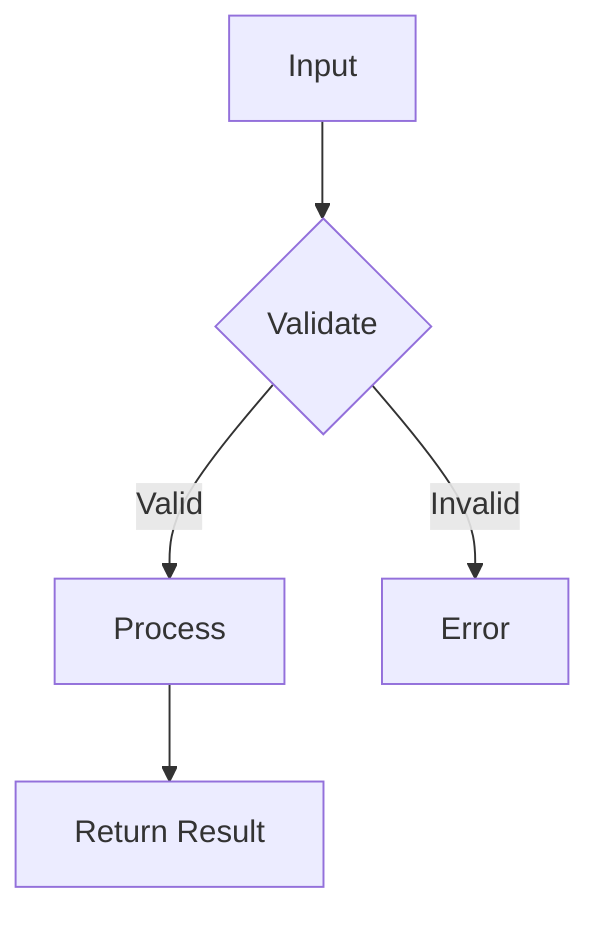

# Contributing to ThinkCraft

**Author:** chronosnehal

Thank you for contributing to ThinkCraft! This guide will help you add new problems and solutions following our standards.

**Quick Links:**
- [README.md](../README.md) - Repository overview and quick start
- [Templates](../docs/templates/) - All solution templates
- [Technical Guides](../docs/) - Formatting, complexity, FastAPI, agentic systems

## Table of Contents
1. [Quick Start](#quick-start)
2. [Problem Categories](#problem-categories)
3. [Directory Structure](#directory-structure)
4. [Adding New Problems](#adding-new-problems)
5. [Code Standards](#code-standards)
6. [Documentation Requirements](#documentation-requirements)
7. [Testing Guidelines](#testing-guidelines)

---

## Quick Start

### Prerequisites
- Python 3.9+
- Git
- Virtual environment tool (venv, conda)

### Setup
```bash
git clone <repository-url>
cd thinkcraft
python -m venv venv
source venv/bin/activate  # On Windows: venv\Scripts\activate
pip install -r requirements.txt
```

---

## Problem Categories

### 1. Basic Python (15-20 minutes)
**Location:** `/app/basic/`
- One-liner solutions
- Pythonic approaches
- Built-in function mastery
- List/dict comprehensions
- Lambda functions
- **No separate directories per problem** - all in single files

### 2. Advanced Python (20-35 minutes)
**Location:** `/app/python/<problem_name>/`
- Algorithms (sorting, searching, graph algorithms)
- Data structures (trees, heaps, tries)
- System design patterns
- Concurrency and async programming
- **Each problem gets its own directory**

### 3. MLOps (25-45 minutes)
**Location:** `/app/mlops/<problem_name>/`
- Model training pipelines
- Feature engineering
- Model evaluation and metrics
- Hyperparameter tuning
- Model deployment patterns
- **Each problem gets its own directory**

### 4. GenAI (20-40 minutes)
**Location:** `/app/genai/<problem_name>/`
- LLM integration
- Prompt engineering
- Text generation
- NLP tasks
- Content generation
- ML + LLM hybrid solutions
- **Each problem gets its own directory**

### 5. Agentic Systems (30-45 minutes)
**Location:** `/app/agentic/<usecase_name>/`
- Multi-step reasoning agents
- Task automation
- Multi-agent collaboration
- Workflow orchestration
- LangGraph/LangFuse implementations
- **Each use case is a full FastAPI application**

---

## Directory Structure

### Basic Python Structure
```
/app/basic/
├── one_liners.py              # Collection of one-liner solutions
├── comprehensions.py          # List/dict comprehension examples
├── functional_programming.py  # Lambda, map, filter, reduce
└── README.md                  # Index of all basic problems
```

### Advanced Python Structure
```
/app/python/<problem_name>/
├── question_<problem_name>.md
├── <problem_name>.py
└── tests/                     # Optional
    └── test_<problem_name>.py
```

### MLOps Structure
```
/app/mlops/<problem_name>/
├── question_<problem_name>.md
├── <problem_name>.py
├── requirements.txt           # Problem-specific dependencies
└── README.md                  # Detailed explanation
```

### GenAI Structure
```
/app/genai/<problem_name>/
├── question_<problem_name>.md
├── <problem_name>.py
├── prompts.py                 # Prompt templates (if needed)
└── README.md                  # Approach and examples
```

### Agentic Structure
```
/app/agentic/<usecase_name>/
├── main.py                    # FastAPI app initialization
├── router.py                  # API routes
├── solution.py                # Core agent logic
├── models.py                  # Pydantic models
├── question_<usecase_name>.md
├── README.md                  # Use case documentation
├── requirements.txt
└── tests/
    └── test_agent.py
```

---

## Adding New Problems

### Step 1: Classify Your Problem
Ask yourself:
- Is it a one-liner or simple Pythonic solution? → **Basic Python**
- Is it an algorithm or data structure? → **Advanced Python**
- Does it involve ML model training/deployment? → **MLOps**
- Does it use LLMs or NLP? → **GenAI**
- Does it involve multi-step agent reasoning? → **Agentic**

### Step 2: Create Directory Structure
```bash
# For Advanced Python, MLOps, GenAI
mkdir -p app/<category>/<problem_name>
cd app/<category>/<problem_name>

# For Agentic
mkdir -p app/agentic/<usecase_name>
cd app/agentic/<usecase_name>
```

### Step 3: Use the Appropriate Template
See `/docs/templates/` for category-specific templates.

### Step 4: Write the Problem Statement
Create `question_<problem_name>.md` using the template in `/docs/templates/question_template.md`

### Step 5: Implement the Solution
- Follow code standards (see below)
- Include complexity analysis
- Add comprehensive docstrings
- Handle edge cases
- Validate inputs

### Step 6: Update Documentation
- Add entry to root `README.md` problem catalog
- Update category-specific README if needed
- Ensure all links work

### Step 7: Quality Check
```bash
# Format code
black app/<category>/<problem_name>/*.py

# Lint code
flake8 app/<category>/<problem_name>/*.py
pylint app/<category>/<problem_name>/*.py

# Type check
mypy app/<category>/<problem_name>/*.py
```

---

## Code Standards

### Python Style
- **PEP 8 compliance** - Use `black` for formatting
- **Type hints** - All function parameters and return types
- **Docstrings** - Google or NumPy style
- **Naming conventions**:
  - `snake_case` for functions and variables
  - `PascalCase` for classes
  - `UPPER_CASE` for constants

### Error Handling
```python
def process_data(data: list[int]) -> int:
    """Process data with proper validation."""
    if not data:
        raise ValueError("Data cannot be empty")
    if not all(isinstance(x, int) for x in data):
        raise TypeError("All elements must be integers")
    
    try:
        result = sum(data) / len(data)
    except ZeroDivisionError as e:
        logger.error(f"Division error: {e}")
        raise
    
    return result
```

### Logging
```python
import logging

logging.basicConfig(level=logging.INFO)
logger = logging.getLogger(__name__)

def process():
    logger.info("Starting process")
    logger.debug("Debug information")
    logger.warning("Warning message")
    logger.error("Error occurred")
```

### Complexity Analysis
Every function must document:
- **Time Complexity**: O(?) notation
- **Space Complexity**: O(?) notation
- **Explanation**: Brief reasoning for non-obvious cases

```python
def binary_search(arr: list[int], target: int) -> int:
    """
    Perform binary search on sorted array.
    
    Args:
        arr: Sorted list of integers
        target: Value to find
    
    Returns:
        Index of target or -1 if not found
    
    Time Complexity: O(log n) - Halves search space each iteration
    Space Complexity: O(1) - Only uses constant extra space
    """
    left, right = 0, len(arr) - 1
    # ... implementation
```

---

## Documentation Requirements

### Problem Statement Format
Every `question_<problem_name>.md` must include:
1. **Title and Difficulty**
2. **Problem Description**
3. **Input/Output Specifications**
4. **Examples** (at least 2)
5. **Constraints**
6. **Edge Cases**
7. **Expected Time to Solve**

### Solution Documentation
Every solution file must include:
1. **File-level docstring** with overview
2. **Function docstrings** with Args, Returns, Complexity
3. **Inline comments** for complex logic
4. **Example usage** in `main()` or `if __name__ == "__main__"`

### Mermaid Diagrams
Use Mermaid diagrams for:
- Algorithm flow
- System architecture (agentic systems)
- Data flow
- Decision trees

```markdown
## Solution Approach


\```
```

---

## Testing Guidelines

### Unit Tests (Optional but Recommended)
```python
import pytest
from solution import solve_problem

def test_basic_case():
    assert solve_problem([1, 2, 3]) == 6

def test_edge_case_empty():
    with pytest.raises(ValueError):
        solve_problem([])

def test_edge_case_single():
    assert solve_problem([5]) == 5
```

### Manual Testing
Every solution must include a `main()` function with example usage:
```python
def main():
    """Demonstrate solution with examples."""
    # Example 1
    input1 = [1, 2, 3, 4, 5]
    print(f"Input: {input1}")
    print(f"Output: {solve_problem(input1)}")
    
    # Example 2
    input2 = []
    try:
        print(f"Input: {input2}")
        print(f"Output: {solve_problem(input2)}")
    except ValueError as e:
        print(f"Error: {e}")

if __name__ == "__main__":
    main()
```

---

## LLMClientManager Usage

For GenAI and Agentic problems, use the centralized LLMClientManager:

```python
from app.utils.llm_client_manager import LLMClientManager

# Initialize manager
manager = LLMClientManager()

# Synchronous call
response = manager.generate(
    provider="openai",
    prompt="Your prompt here",
    model="gpt-4",
    temperature=0.7
)

# Asynchronous call
response = await manager.generate_async(
    provider="openai",
    prompt="Your prompt here",
    model="gpt-4"
)
```

---

## Commit Message Format

Use conventional commits:
```
<type>(<scope>): <subject>

<body>

<footer>
```

Types:
- `feat`: New problem/solution
- `fix`: Bug fix
- `docs`: Documentation update
- `style`: Code formatting
- `refactor`: Code restructuring
- `test`: Adding tests
- `chore`: Maintenance

Examples:
```
feat(python): add binary search tree implementation

- Implemented BST with insert, delete, search
- Added complexity analysis
- Included edge case handling

Time to solve: 25 minutes
Difficulty: Medium
```

---

## Review Checklist

Before submitting:
- [ ] Code passes `black`, `flake8`, `pylint`
- [ ] All functions have type hints
- [ ] All functions have docstrings with complexity analysis
- [ ] Problem statement is clear and complete
- [ ] Solution includes example usage
- [ ] Edge cases are handled
- [ ] Root README.md is updated
- [ ] All links work
- [ ] Time to solve is within 15-45 minutes
- [ ] No hardcoded credentials or sensitive data

---

## Getting Help

- Check `/docs` for detailed guides
- Review existing problems for examples
- Open an issue for questions
- Join discussions for complex topics

---

## License

By contributing, you agree that your contributions will be licensed under the repository's license.

