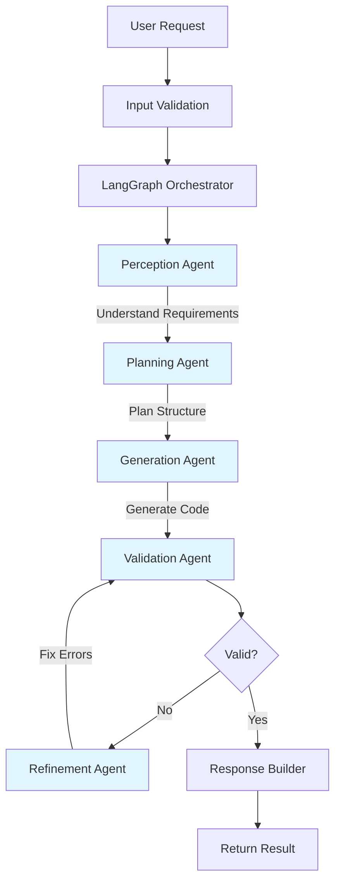
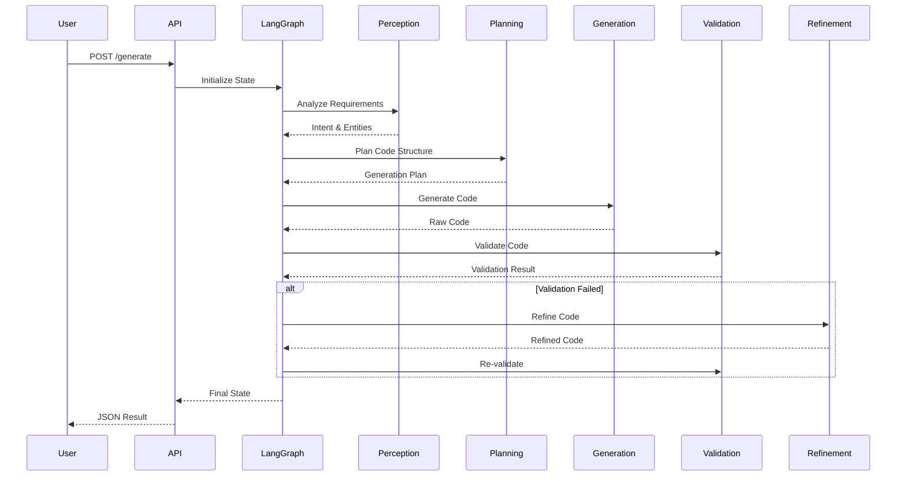

# AI-Powered Code Generation System

**Difficulty:** Advanced  
**Time to Solve:** 35-40 minutes  
**Category:** Agentic

---

## Problem Description

Build a comprehensive code generation system that leverages Large Language Models (LLMs) to generate high-quality code from natural language descriptions. The system must be production-ready with proper error handling, validation, and support for multiple programming languages and complexity levels.

The system should act as an intelligent coding assistant that can:
- Generate code snippets from natural language prompts
- Support multiple programming languages (Python, JavaScript, Java, Go, Rust, etc.)
- Handle various complexity levels (simple functions to complex classes)
- Provide proper documentation and comments
- Validate generated code syntax
- Handle edge cases and errors gracefully
- Support streaming responses for better UX

---

## Input Specification

### Code Generation Request

**Type:** JSON Object  
**Format:**
```json
{
  "prompt": "string (required)",
  "language": "string (required)",
  "complexity": "string (optional)",
  "style": "string (optional)",
  "include_tests": "boolean (optional)",
  "include_docs": "boolean (optional)",
  "framework": "string (optional)",
  "additional_context": "string (optional)"
}
```

**Constraints:**
- `prompt`: 10-2000 characters, clear description of desired code
- `language`: One of [python, javascript, typescript, java, go, rust, cpp, csharp, ruby, php]
- `complexity`: One of [simple, medium, advanced] (default: medium)
- `style`: One of [functional, oop, procedural] (default: based on language)
- `include_tests`: Boolean (default: false)
- `include_docs`: Boolean (default: true)
- `framework`: Optional framework/library context (e.g., "FastAPI", "React", "Spring Boot")

---

## Output Specification

### Code Generation Response

**Type:** JSON Object  
**Format:**
```json
{
  "success": "boolean",
  "code": "string",
  "language": "string",
  "explanation": "string",
  "documentation": "string",
  "test_code": "string (optional)",
  "complexity_analysis": {
    "time_complexity": "string",
    "space_complexity": "string"
  },
  "suggestions": ["string"],
  "warnings": ["string"],
  "metadata": {
    "tokens_used": "integer",
    "generation_time": "float",
    "model_used": "string"
  }
}
```

---

## Examples

### Example 1: Simple Function Generation

**Input:**
```json
{
  "prompt": "Create a function to calculate fibonacci numbers using memoization",
  "language": "python",
  "complexity": "medium",
  "include_tests": true,
  "include_docs": true
}
```

**Output:**
```json
{
  "success": true,
  "code": "def fibonacci(n: int, memo: dict = None) -> int:\n    if memo is None:\n        memo = {}\n    if n in memo:\n        return memo[n]\n    if n <= 1:\n        return n\n    memo[n] = fibonacci(n-1, memo) + fibonacci(n-2, memo)\n    return memo[n]",
  "language": "python",
  "explanation": "This function calculates Fibonacci numbers using memoization...",
  "documentation": "Calculates the nth Fibonacci number using dynamic programming...",
  "test_code": "def test_fibonacci():\n    assert fibonacci(0) == 0\n    assert fibonacci(1) == 1...",
  "complexity_analysis": {
    "time_complexity": "O(n)",
    "space_complexity": "O(n)"
  },
  "suggestions": ["Consider using iterative approach for better space efficiency"],
  "warnings": [],
  "metadata": {
    "tokens_used": 450,
    "generation_time": 2.3,
    "model_used": "gpt-4"
  }
}
```

### Example 2: Class Generation with Framework

**Input:**
```json
{
  "prompt": "Create a REST API endpoint for user authentication",
  "language": "python",
  "complexity": "advanced",
  "framework": "FastAPI",
  "include_docs": true
}
```

**Output:**
```json
{
  "success": true,
  "code": "from fastapi import APIRouter, HTTPException, Depends\nfrom pydantic import BaseModel\n\nrouter = APIRouter()\n\nclass LoginRequest(BaseModel):\n    username: str\n    password: str\n\n@router.post('/auth/login')\nasync def login(request: LoginRequest):\n    # Authentication logic here\n    return {'token': 'jwt_token'}",
  "language": "python",
  "explanation": "FastAPI endpoint with proper request validation...",
  "documentation": "Authentication endpoint using FastAPI and Pydantic...",
  "complexity_analysis": {
    "time_complexity": "O(1)",
    "space_complexity": "O(1)"
  },
  "suggestions": [
    "Add JWT token generation",
    "Implement password hashing",
    "Add rate limiting"
  ],
  "warnings": ["Remember to add proper authentication logic"],
  "metadata": {
    "tokens_used": 680,
    "generation_time": 3.1,
    "model_used": "gpt-4"
  }
}
```

### Example 3: Algorithm with Multiple Languages

**Input:**
```json
{
  "prompt": "Implement binary search algorithm",
  "language": "javascript",
  "complexity": "simple",
  "style": "functional",
  "include_tests": true
}
```

**Output:**
```json
{
  "success": true,
  "code": "const binarySearch = (arr, target) => {\n  let left = 0;\n  let right = arr.length - 1;\n  \n  while (left <= right) {\n    const mid = Math.floor((left + right) / 2);\n    if (arr[mid] === target) return mid;\n    if (arr[mid] < target) left = mid + 1;\n    else right = mid - 1;\n  }\n  return -1;\n};",
  "language": "javascript",
  "explanation": "Binary search implementation using iterative approach...",
  "test_code": "describe('binarySearch', () => {\n  test('finds element', () => {\n    expect(binarySearch([1,2,3,4,5], 3)).toBe(2);\n  });\n});",
  "complexity_analysis": {
    "time_complexity": "O(log n)",
    "space_complexity": "O(1)"
  },
  "suggestions": ["Array must be sorted before using binary search"],
  "warnings": [],
  "metadata": {
    "tokens_used": 520,
    "generation_time": 2.1,
    "model_used": "gpt-4"
  }
}
```

---

## Edge Cases

1. **Invalid Language**: Request for unsupported programming language
2. **Ambiguous Prompt**: Vague or unclear code requirements
3. **Complex Requirements**: Prompt requiring multiple interconnected components
4. **Syntax Errors**: Generated code with potential syntax issues
5. **Security Concerns**: Code that might have security vulnerabilities
6. **Performance Issues**: Generated code with poor time/space complexity
7. **Missing Context**: Insufficient information to generate complete code
8. **Framework Conflicts**: Incompatible framework/language combinations

---

## Constraints

- Prompt length: 10-2000 characters
- Response time: < 10 seconds for simple requests, < 30 seconds for complex
- Maximum tokens per request: 4000
- Supported languages: 10+ major programming languages
- Code quality: Must pass basic syntax validation
- Documentation: Must include docstrings/comments
- Error handling: Graceful degradation with helpful error messages

---

## Solution Approach

### Agentic Architecture (LangGraph)

This implementation uses **LangGraph** to orchestrate multiple specialized agents in a stateful workflow:



### Agent Workflow Sequence



### Agent Components

1. **Perception Agent** (`agents.py::PerceptionAgent`)
   - Analyzes user requirements and intent
   - Extracts key entities and concepts
   - Identifies implicit requirements
   - Outputs structured perception data

2. **Planning Agent** (`agents.py::PlanningAgent`)
   - Creates detailed code generation plan
   - Designs code structure and components
   - Identifies dependencies
   - Defines testing and documentation strategy

3. **Generation Agent** (`agents.py::GenerationAgent`)
   - Generates code using LLM with optimized prompts
   - Applies language-specific patterns
   - Includes documentation and tests (if requested)
   - Extracts code blocks from LLM response

4. **Validation Agent** (`agents.py::ValidationAgent`)
   - Performs basic syntax validation
   - Uses LLM for advanced code quality checks
   - Identifies issues and provides suggestions
   - Determines if refinement is needed

5. **Refinement Agent** (`agents.py::RefinementAgent`)
   - Refines code when validation fails
   - Fixes syntax errors and quality issues
   - Iterates until code passes validation
   - Explains changes made

### Key Components

1. **LangGraph Orchestrator** (`solution.py::CodeGeneratorAgent`)
   - Manages stateful workflow
   - Coordinates agent execution
   - Handles conditional routing
   - Tracks execution steps

2. **State Management** (`agent_state.py::AgentState`)
   - TypedDict for type safety
   - Tracks state across agents
   - Stores intermediate results
   - Manages error accumulation

3. **LLM Integration**
   - Multi-provider support (OpenAI, Anthropic, Gemini)
   - LangChain LLM wrappers
   - Provider-specific optimizations
   - Token management

4. **Response Builder**
   - Extracts sections from LLM responses
   - Formats code properly
   - Generates complexity analysis
   - Provides suggestions and warnings

---

## Complexity Requirements

- **Time Complexity:** O(k) where k = number of agent steps (typically 4-10 steps)
  - Each agent step: O(1) for processing + O(n) for LLM call
  - Total: O(k × n) where n = prompt/response complexity
- **Space Complexity:** O(m) where m = size of generated code + state data
  - State storage: O(m) for code and intermediate results
  - Agent memory: O(1) per agent instance

---

## Implementation Notes

### LangGraph Setup
- Use `langgraph.graph.StateGraph` for workflow orchestration
- Define `AgentState` TypedDict for state management
- Create agent nodes as async functions
- Use conditional edges for refinement loop
- Compile graph for execution

### Agent Implementation
- Each agent is a class with async methods
- Agents receive and return `AgentState`
- Use LangChain LLM wrappers (ChatOpenAI, ChatAnthropic, etc.)
- Implement proper error handling in each agent
- Log agent execution for debugging

### LLM Provider Selection
- Use LangChain LLM wrappers (not direct LLMClientManager)
- Default to GPT-4 for best code quality
- Support OpenAI, Anthropic Claude, Google Gemini
- Configure via `AgentNodeFactory.create_llm()`

### State Management
- Use TypedDict for type safety
- Annotate lists with `Annotated[List[str], add]` for accumulation
- Track step count and current step
- Store errors and warnings in lists
- Pass state between agents via LangGraph

### Prompt Engineering Best Practices
- Each agent has specialized prompts
- Perception: Focus on understanding and parsing
- Planning: Focus on structure and approach
- Generation: Focus on code quality and completeness
- Validation: Focus on error detection
- Refinement: Focus on fixing specific issues

### Error Handling
- LLM API failures → Propagate to orchestrator
- Invalid code generation → Trigger refinement agent
- Validation failures → Automatic refinement loop
- Max refinement attempts → Return with warnings
- State errors → Log and continue with fallbacks
- Timeout errors → Return partial results with warning
- Rate limiting → Queue requests or return 429 status

### Security Considerations
- Sanitize all user inputs
- Validate generated code for common vulnerabilities
- Rate limit requests per user
- Log all generations for audit trail
- Never execute generated code server-side

---

## Testing Strategy

1. **Unit Tests**
   - Test each component independently
   - Mock LLM responses
   - Validate parsing logic

2. **Integration Tests**
   - Test full generation pipeline
   - Test with real LLM providers
   - Validate response format

3. **Edge Case Tests**
   - Invalid inputs
   - Malformed prompts
   - LLM failures
   - Timeout scenarios

4. **Performance Tests**
   - Response time benchmarks
   - Token usage optimization
   - Concurrent request handling

---

## Extensions & Future Enhancements

1. **Code Refinement**: Allow users to refine generated code with follow-up prompts
2. **Multi-file Generation**: Generate complete project structures
3. **Code Explanation**: Explain existing code snippets
4. **Code Translation**: Convert code between languages
5. **Code Review**: Analyze code for issues and improvements
6. **Version Control Integration**: Generate git-ready commits
7. **IDE Integration**: Plugin support for popular IDEs
8. **Collaborative Features**: Share and improve generated code

---

## Success Metrics

- **Code Quality**: 90%+ syntactically correct on first generation
- **Response Time**: < 5 seconds average for simple requests
- **User Satisfaction**: 85%+ positive feedback
- **Token Efficiency**: Optimal token usage per request
- **Error Rate**: < 5% system errors
- **Documentation Quality**: 95%+ of code includes proper docs

