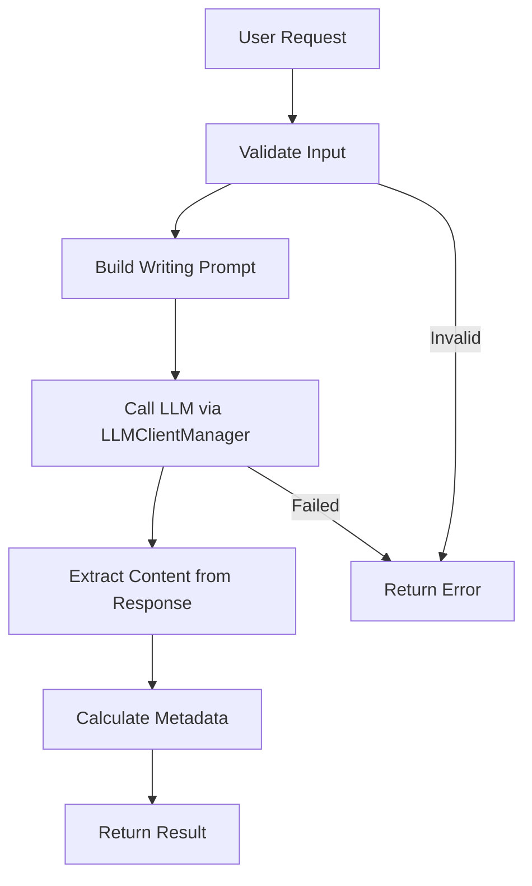

# Creative Writing System

**Difficulty:** Medium  
**Time to Solve:** 25-30 minutes  
**Category:** GenAI

---

## Problem Description

Build a comprehensive creative writing system that uses LLM integration to generate creative content based on prompts, themes, and style requirements. The system must support multiple content types, adapt to different writing styles, and provide structured output formatting.

The system should:
- Generate creative content from prompts and themes
- Support multiple content types (stories, poems, articles, etc.)
- Adapt to different writing styles (formal, casual, poetic, etc.)
- Provide structured output formatting
- Use LLMClientManager for LLM integration

---

## Input Specification

### Creative Writing Request

**Type:** Dictionary/JSON Object  
**Format:**
```python
{
    "prompt": "string (required)",  # Main writing prompt or topic
    "content_type": "string (required)",  # Type of content to generate
    "theme": "string (optional)",  # Theme or mood
    "style": "string (optional)",  # Writing style
    "length": "string (optional)",  # Desired length
    "tone": "string (optional)",  # Tone of writing
    "additional_requirements": "string (optional)"  # Extra instructions
}
```

**Constraints:**
- `prompt`: 10-500 characters, clear description of desired content
- `content_type`: One of ["story", "poem", "article", "essay", "dialogue", "description"]
- `theme`: Optional theme (e.g., "adventure", "romance", "mystery", "sci-fi")
- `style`: One of ["formal", "casual", "poetic", "narrative", "descriptive", "conversational"]
- `length`: One of ["short", "medium", "long"] (default: "medium")
- `tone`: Optional tone (e.g., "humorous", "serious", "melancholic", "inspiring")
- `additional_requirements`: Optional extra instructions (max 200 characters)

---

## Output Specification

### Creative Writing Response

**Type:** Dictionary/JSON Object  
**Format:**
```python
{
    "success": bool,
    "content": str,  # Generated creative content
    "content_type": str,  # Type of content generated
    "metadata": {
        "theme": str | None,
        "style": str | None,
        "length": str | None,
        "tone": str | None,
        "word_count": int,
        "character_count": int
    },
    "error": str | None  # Error message if generation failed
}
```

---

## Examples

### Example 1: Short Story

**Input:**
```python
{
    "prompt": "A young explorer discovers a hidden city in the mountains",
    "content_type": "story",
    "theme": "adventure",
    "style": "narrative",
    "length": "short",
    "tone": "mysterious"
}
```

**Output:**
```python
{
    "success": True,
    "content": "[Generated short story about the explorer...]",
    "content_type": "story",
    "metadata": {
        "theme": "adventure",
        "style": "narrative",
        "length": "short",
        "tone": "mysterious",
        "word_count": 450,
        "character_count": 2450
    },
    "error": None
}
```

### Example 2: Poem

**Input:**
```python
{
    "prompt": "The changing seasons",
    "content_type": "poem",
    "theme": "nature",
    "style": "poetic",
    "length": "short",
    "tone": "contemplative"
}
```

**Output:**
```python
{
    "success": True,
    "content": "[Generated poem about seasons...]",
    "content_type": "poem",
    "metadata": {
        "theme": "nature",
        "style": "poetic",
        "length": "short",
        "tone": "contemplative",
        "word_count": 120,
        "character_count": 680
    },
    "error": None
}
```

### Example 3: Article

**Input:**
```python
{
    "prompt": "The benefits of reading",
    "content_type": "article",
    "style": "formal",
    "length": "medium",
    "tone": "informative"
}
```

**Output:**
```python
{
    "success": True,
    "content": "[Generated article about reading benefits...]",
    "content_type": "article",
    "metadata": {
        "theme": None,
        "style": "formal",
        "length": "medium",
        "tone": "informative",
        "word_count": 800,
        "character_count": 4200
    },
    "error": None
}
```

---

## Edge Cases

1. **Empty prompt** - Should return error
2. **Invalid content_type** - Should return error
3. **Very long prompt** - Should truncate or handle gracefully
4. **Conflicting style and content_type** - Should handle gracefully (e.g., "poetic" style with "article")
5. **LLM API failure** - Should return error with helpful message
6. **Empty content generation** - Should handle gracefully

---

## Constraints

- Must use `LLMClientManager` from `app.utils.llm_client_manager`
- Support 6 content types: story, poem, article, essay, dialogue, description
- Support 6 writing styles: formal, casual, poetic, narrative, descriptive, conversational
- Provide word and character count in metadata
- Include example usage in `main()` function

---

## Solution Approach

### High-Level Flow



### Key Components

1. **Input Validation** - Validate prompt, content_type, and style
2. **Prompt Engineering** - Build content-type and style-specific prompts
3. **LLM Integration** - Use LLMClientManager to generate content
4. **Content Extraction** - Extract clean content from LLM response
5. **Metadata Calculation** - Count words and characters
6. **Error Handling** - Handle failures gracefully

---

## Complexity Requirements

- **Time Complexity:** O(1) for processing + O(n) for LLM generation (where n = prompt complexity)
- **Space Complexity:** O(m) where m = size of generated content

---

## Implementation Notes

### Content Type Guidelines
- **Story**: Narrative with characters, plot, setting
- **Poem**: Verse with rhythm, imagery, emotional expression
- **Article**: Informative, structured, factual
- **Essay**: Argumentative or expository, structured
- **Dialogue**: Conversation between characters
- **Description**: Vivid, detailed scene or object description

### Style Guidelines
- **Formal**: Professional, structured, academic tone
- **Casual**: Conversational, relaxed, friendly
- **Poetic**: Figurative language, imagery, rhythm
- **Narrative**: Storytelling, chronological flow
- **Descriptive**: Vivid details, sensory language
- **Conversational**: Dialogue-like, engaging

### Length Guidelines
- **Short**: 200-500 words
- **Medium**: 500-1000 words
- **Long**: 1000-2000 words

---

## Testing Strategy

Test with:
1. Each content type (story, poem, article, etc.)
2. Different style combinations
3. Various themes and tones
4. Error cases (empty prompt, invalid type)
5. Edge cases (conflicting styles, very long prompts)

---

## Success Criteria

- ✅ Generates creative content for all 6 content types
- ✅ Adapts to different writing styles
- ✅ Provides accurate metadata (word/character count)
- ✅ Handles errors gracefully
- ✅ Uses LLMClientManager correctly
- ✅ Includes example usage in main()

