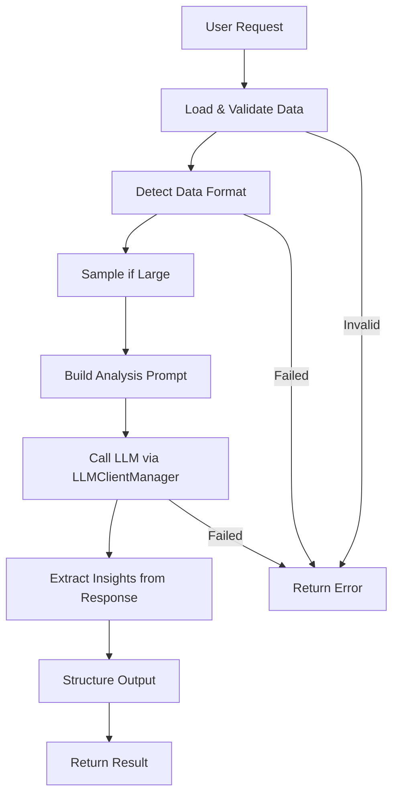

# Data Analysis System

**Difficulty:** Medium  
**Time to Solve:** 25-30 minutes  
**Category:** GenAI

---

## Problem Description

Build a comprehensive data analysis system that uses LLM integration to analyze datasets and generate natural language insights, summaries, and recommendations. The system must process various data formats, identify patterns, produce structured analytical reports, and provide actionable business intelligence.

The system should:
- Analyze datasets from various formats (CSV, JSON, dictionaries, lists)
- Generate natural language insights and summaries
- Identify patterns and trends in data
- Produce structured analytical reports
- Provide actionable recommendations
- Use LLMClientManager for LLM integration

---

## Input Specification

### Data Analysis Request

**Type:** Dictionary/JSON Object  
**Format:**
```python
{
    "data": "dict | list | str (required)",  # Dataset to analyze (dict/list/CSV path)
    "analysis_type": "string (required)",  # Type of analysis to perform
    "data_format": "string (optional)",  # Format of data (csv, json, dict, list)
    "focus_areas": "list[str] (optional)",  # Specific areas to focus on
    "include_recommendations": "boolean (optional)",  # Whether to include recommendations
    "include_visualizations": "boolean (optional)",  # Whether to suggest visualizations
    "context": "string (optional)"  # Additional context about the data
}
```

**Constraints:**
- `data`: Dataset in dict/list format or path to CSV file
- `analysis_type`: One of ["summary", "patterns", "trends", "comparison", "anomalies", "comprehensive"]
- `data_format`: One of ["csv", "json", "dict", "list"] (auto-detected if not provided)
- `focus_areas`: List of specific columns/fields to analyze (optional)
- `include_recommendations`: Boolean (default: True)
- `include_visualizations`: Boolean (default: False)
- `context`: Optional context about the data (max 200 characters)

---

## Output Specification

### Data Analysis Response

**Type:** Dictionary/JSON Object  
**Format:**
```python
{
    "success": bool,
    "summary": str,  # Natural language summary
    "insights": list[str],  # Key insights
    "patterns": list[str],  # Identified patterns
    "trends": list[str],  # Trend observations
    "anomalies": list[str],  # Anomalies detected (if applicable)
    "recommendations": list[str],  # Actionable recommendations
    "visualization_suggestions": list[str],  # Visualization suggestions (if requested)
    "metadata": {
        "data_shape": tuple,  # (rows, columns) or (length,) for lists
        "columns": list[str] | None,  # Column names (if applicable)
        "analysis_type": str,
        "data_types": dict | None  # Data types per column
    },
    "error": str | None  # Error message if analysis failed
}
```

---

## Examples

### Example 1: Sales Data Summary

**Input:**
```python
{
    "data": {
        "month": ["Jan", "Feb", "Mar", "Apr", "May"],
        "sales": [10000, 12000, 15000, 14000, 18000],
        "region": ["North", "South", "North", "South", "North"]
    },
    "analysis_type": "summary",
    "include_recommendations": True,
    "context": "Monthly sales data for Q1-Q2"
}
```

**Output:**
```python
{
    "success": True,
    "summary": "The dataset shows monthly sales data with a positive trend...",
    "insights": [
        "Sales increased by 80% from January to May",
        "North region shows stronger performance",
        "Peak sales occurred in May"
    ],
    "patterns": [
        "Consistent month-over-month growth",
        "Regional variation in performance"
    ],
    "trends": [
        "Upward trend in sales over the period",
        "North region outperforming South region"
    ],
    "anomalies": [],
    "recommendations": [
        "Investigate factors driving North region success",
        "Apply successful strategies to South region",
        "Maintain momentum with targeted marketing"
    ],
    "visualization_suggestions": [],
    "metadata": {
        "data_shape": (5, 3),
        "columns": ["month", "sales", "region"],
        "analysis_type": "summary",
        "data_types": {"month": "object", "sales": "int64", "region": "object"}
    },
    "error": None
}
```

### Example 2: Pattern Analysis

**Input:**
```python
{
    "data": [
        {"age": 25, "salary": 50000, "department": "Engineering"},
        {"age": 30, "salary": 70000, "department": "Engineering"},
        {"age": 28, "salary": 45000, "department": "Marketing"},
        {"age": 35, "salary": 80000, "department": "Engineering"}
    ],
    "analysis_type": "patterns",
    "focus_areas": ["salary", "department"],
    "include_recommendations": True
}
```

**Output:**
```python
{
    "success": True,
    "summary": "Analysis reveals patterns in salary distribution...",
    "insights": [
        "Engineering department has higher average salary",
        "Salary correlates with age and department"
    ],
    "patterns": [
        "Engineering salaries range from 50k to 80k",
        "Age appears to influence salary levels",
        "Department is a key factor in compensation"
    ],
    "trends": [],
    "anomalies": [],
    "recommendations": [
        "Review salary equity across departments",
        "Consider experience-based compensation structure"
    ],
    "visualization_suggestions": [],
    "metadata": {
        "data_shape": (4, 3),
        "columns": ["age", "salary", "department"],
        "analysis_type": "patterns",
        "data_types": {"age": "int64", "salary": "int64", "department": "object"}
    },
    "error": None
}
```

### Example 3: CSV File Analysis

**Input:**
```python
{
    "data": "datasets/sample/sales_data.csv",
    "analysis_type": "comprehensive",
    "data_format": "csv",
    "include_recommendations": True,
    "include_visualizations": True
}
```

**Output:**
```python
{
    "success": True,
    "summary": "[Comprehensive analysis summary...]",
    "insights": ["...", "...", "..."],
    "patterns": ["...", "..."],
    "trends": ["...", "..."],
    "anomalies": ["..."],
    "recommendations": ["...", "..."],
    "visualization_suggestions": [
        "Line chart: Sales trend over time",
        "Bar chart: Sales by region",
        "Scatter plot: Correlation analysis"
    ],
    "metadata": {
        "data_shape": (100, 5),
        "columns": ["date", "product", "sales", "region", "profit"],
        "analysis_type": "comprehensive",
        "data_types": {...}
    },
    "error": None
}
```

---

## Edge Cases

1. **Empty dataset** - Should return error
2. **Invalid data format** - Should return error
3. **CSV file not found** - Should return error
4. **Invalid analysis_type** - Should return error
5. **Very large dataset** - Should sample or summarize before analysis
6. **LLM API failure** - Should return error with helpful message
7. **Non-numeric data** - Should handle categorical data appropriately

---

## Constraints

- Must use `LLMClientManager` from `app.utils.llm_client_manager`
- Support 6 analysis types: summary, patterns, trends, comparison, anomalies, comprehensive
- Support CSV, JSON, dict, and list data formats
- Provide structured output with insights, patterns, and recommendations
- Include example usage in `main()` function
- Handle data sampling for large datasets (>1000 rows)

---

## Solution Approach

### High-Level Flow



### Key Components

1. **Data Loading** - Load data from various formats (CSV, JSON, dict, list)
2. **Data Validation** - Validate data structure and format
3. **Data Sampling** - Sample large datasets for efficient analysis
4. **Prompt Engineering** - Build analysis-specific prompts
5. **LLM Integration** - Use LLMClientManager to generate insights
6. **Response Parsing** - Extract structured insights from LLM response
7. **Metadata Calculation** - Calculate data shape, types, columns

---

## Complexity Requirements

- **Time Complexity:** O(n) for data loading + O(1) for processing + O(m) for LLM generation
  - n = dataset size, m = prompt complexity
- **Space Complexity:** O(n) where n = dataset size (sampled if large)

---

## Implementation Notes

### Analysis Types
- **Summary**: High-level overview of the dataset
- **Patterns**: Identify patterns and correlations
- **Trends**: Analyze trends over time or categories
- **Comparison**: Compare different segments or groups
- **Anomalies**: Detect outliers and unusual values
- **Comprehensive**: Full analysis with all components

### Data Format Handling
- **CSV**: Read using pandas or csv module
- **JSON**: Parse JSON string or file
- **Dict**: Use directly (assume list of dicts or single dict)
- **List**: Convert to DataFrame for analysis

### Large Dataset Handling
- Sample datasets with >1000 rows
- Provide summary statistics before detailed analysis
- Mention sampling in metadata

---

## Testing Strategy

Test with:
1. Each analysis type (summary, patterns, trends, etc.)
2. Different data formats (CSV, JSON, dict, list)
3. Various dataset sizes (small, medium, large)
4. Error cases (empty data, invalid format, file not found)
5. Edge cases (non-numeric data, missing values, single row)

---

## Success Criteria

- ✅ Analyzes datasets from all supported formats
- ✅ Generates insights for all 6 analysis types
- ✅ Provides structured output with insights and recommendations
- ✅ Handles large datasets with sampling
- ✅ Handles errors gracefully
- ✅ Uses LLMClientManager correctly
- ✅ Includes example usage in main()

