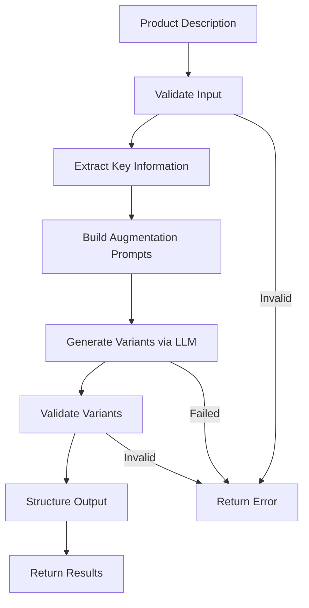

# Prompt-Based Data Augmentation System

**Difficulty:** Medium  
**Time to Solve:** 25-30 minutes  
**Category:** GenAI

---

## Problem Description

Develop a prompt-based data augmentation system that takes product descriptions and generates diverse variants using GenAI. The system should create formal and casual versions of each description, demonstrating how LLMs can be used for systematic content variation and dataset expansion.

The system should:
- Take product descriptions as input
- Generate multiple variants (formal, casual, detailed, concise)
- Create diverse versions while maintaining core information
- Support different augmentation strategies
- Use LLMClientManager for LLM integration
- Provide structured output for dataset expansion

---

## Input Specification

### Data Augmentation Request

**Type:** Dictionary/JSON Object  
**Format:**
```python
{
    "description": "string (required)",  # Original product description
    "variants": "int (optional)",  # Number of variants to generate (default: 3)
    "styles": "list[str] (optional)",  # List of styles to generate
    "preserve_key_info": "boolean (optional)",  # Whether to preserve key information (default: True)
    "length_variation": "string (optional)",  # Length variation (short, medium, long, mixed)
    "tone_variation": "boolean (optional)"  # Whether to vary tone (default: True)
}
```

**Constraints:**
- `description`: 20-1000 characters, product description text
- `variants`: Integer between 1-10 (default: 3)
- `styles`: List of style options: ["formal", "casual", "detailed", "concise", "marketing", "technical"]
- `preserve_key_info`: Boolean (default: True)
- `length_variation`: One of ["short", "medium", "long", "mixed"] (default: "mixed")
- `tone_variation`: Boolean (default: True)

---

## Output Specification

### Data Augmentation Response

**Type:** Dictionary/JSON Object  
**Format:**
```python
{
    "success": bool,
    "original": str,  # Original description
    "variants": list[dict],  # List of generated variants
    "metadata": {
        "total_variants": int,
        "styles_used": list[str],
        "average_length": float,
        "key_info_preserved": bool
    },
    "error": str | None  # Error message if generation failed
}
```

**Variant Format:**
```python
{
    "text": str,  # Generated variant text
    "style": str,  # Style of the variant
    "length": str,  # Length category (short, medium, long)
    "word_count": int,  # Word count
    "key_info_preserved": bool  # Whether key info was preserved
}
```

---

## Examples

### Example 1: Basic Augmentation

**Input:**
```python
{
    "description": "Wireless Bluetooth headphones with noise cancellation, 30-hour battery life, and premium sound quality.",
    "variants": 3,
    "styles": ["formal", "casual", "marketing"]
}
```

**Output:**
```python
{
    "success": True,
    "original": "Wireless Bluetooth headphones with noise cancellation, 30-hour battery life, and premium sound quality.",
    "variants": [
        {
            "text": "Premium wireless Bluetooth headphones featuring active noise cancellation technology, extended 30-hour battery capacity, and exceptional audio fidelity.",
            "style": "formal",
            "length": "medium",
            "word_count": 18,
            "key_info_preserved": True
        },
        {
            "text": "Awesome wireless headphones with noise canceling! Battery lasts 30 hours and the sound is amazing.",
            "style": "casual",
            "length": "short",
            "word_count": 16,
            "key_info_preserved": True
        },
        {
            "text": "Experience crystal-clear audio with our wireless Bluetooth headphones! Advanced noise cancellation blocks distractions, while the 30-hour battery keeps you immersed in premium sound quality all day long.",
            "style": "marketing",
            "length": "long",
            "word_count": 28,
            "key_info_preserved": True
        }
    ],
    "metadata": {
        "total_variants": 3,
        "styles_used": ["formal", "casual", "marketing"],
        "average_length": 20.7,
        "key_info_preserved": True
    },
    "error": None
}
```

### Example 2: Multiple Styles

**Input:**
```python
{
    "description": "Smart fitness tracker with heart rate monitor and sleep tracking.",
    "variants": 4,
    "styles": ["formal", "casual", "technical", "concise"],
    "length_variation": "mixed"
}
```

**Output:**
```python
{
    "success": True,
    "original": "Smart fitness tracker with heart rate monitor and sleep tracking.",
    "variants": [
        {
            "text": "Advanced smart fitness tracking device equipped with continuous heart rate monitoring and comprehensive sleep analysis capabilities.",
            "style": "formal",
            "length": "medium",
            "word_count": 14,
            "key_info_preserved": True
        },
        {
            "text": "Cool fitness tracker that tracks your heart rate and sleep!",
            "style": "casual",
            "length": "short",
            "word_count": 10,
            "key_info_preserved": True
        },
        {
            "text": "Wearable device featuring photoplethysmography (PPG) sensors for real-time heart rate measurement and accelerometer-based sleep stage detection.",
            "style": "technical",
            "length": "long",
            "word_count": 19,
            "key_info_preserved": True
        },
        {
            "text": "Fitness tracker: heart rate + sleep tracking.",
            "style": "concise",
            "length": "short",
            "word_count": 7,
            "key_info_preserved": True
        }
    ],
    "metadata": {
        "total_variants": 4,
        "styles_used": ["formal", "casual", "technical", "concise"],
        "average_length": 12.5,
        "key_info_preserved": True
    },
    "error": None
}
```

---

## Edge Cases

1. **Empty description** - Should return error
2. **Very short description** - Should handle gracefully
3. **Very long description** - Should truncate or handle appropriately
4. **Invalid style** - Should return error
5. **LLM API failure** - Should return error with helpful message
6. **No variants generated** - Should handle gracefully

---

## Constraints

- Must use `LLMClientManager` from `app.utils.llm_client_manager`
- Support 6 styles: formal, casual, detailed, concise, marketing, technical
- Preserve key product information (features, specifications)
- Generate diverse variants while maintaining accuracy
- Include example usage in `main()` function

---

## Solution Approach

### High-Level Flow



### Key Components

1. **Input Validation** - Validate description and parameters
2. **Key Information Extraction** - Identify important product details
3. **Prompt Engineering** - Build style-specific augmentation prompts
4. **LLM Integration** - Use LLMClientManager to generate variants
5. **Variant Validation** - Check if key info is preserved
6. **Metadata Calculation** - Calculate statistics and metrics

---

## Complexity Requirements

- **Time Complexity:** O(n) where n = number of variants to generate
- **Space Complexity:** O(m) where m = total size of generated variants

---

## Implementation Notes

### Style Guidelines
- **Formal**: Professional, structured, business language
- **Casual**: Conversational, friendly, relaxed tone
- **Detailed**: Comprehensive, thorough descriptions
- **Concise**: Brief, to-the-point versions
- **Marketing**: Persuasive, benefit-focused language
- **Technical**: Specification-focused, precise terminology

### Key Information Preservation
- Product features and specifications
- Key numbers (battery life, dimensions, etc.)
- Core functionality
- Important attributes

### Length Variation
- **Short**: 50-100 words
- **Medium**: 100-200 words
- **Long**: 200-300 words
- **Mixed**: Varies across variants

---

## Testing Strategy

Test with:
1. Each style type (formal, casual, detailed, etc.)
2. Different product categories (electronics, clothing, food, etc.)
3. Various description lengths
4. Error cases (empty description, invalid style)
5. Edge cases (very short/long descriptions)

---

## Success Criteria

- ✅ Generates diverse variants for all supported styles
- ✅ Preserves key product information
- ✅ Creates formal and casual versions
- ✅ Supports multiple augmentation strategies
- ✅ Handles errors gracefully
- ✅ Uses LLMClientManager correctly
- ✅ Includes example usage in main()

---

## Use Cases

1. **Dataset Expansion**: Generate training data for NLP models
2. **A/B Testing**: Create variations for marketing tests
3. **Content Localization**: Adapt descriptions for different audiences
4. **SEO Optimization**: Create multiple versions for search optimization
5. **Product Catalog**: Maintain consistent but varied product descriptions

