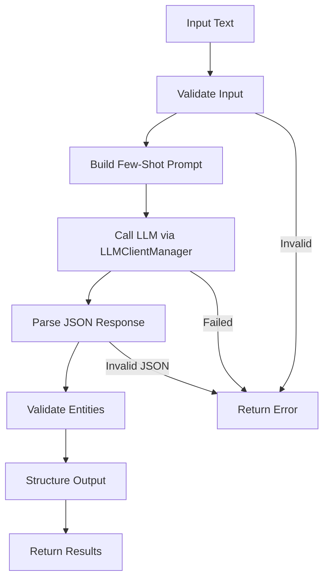

# Prompt-Based Entity Extraction System

**Difficulty:** Medium  
**Time to Solve:** 25-30 minutes  
**Category:** GenAI

---

## Problem Description

Design and implement a prompt-based entity extraction system that can identify and extract person names and dates from meeting descriptions and other narrative text. The system should use few-shot prompting techniques to guide an LLM in consistently extracting entities in a structured format.

The system should:
- Extract person names from text
- Extract dates from text
- Use few-shot prompting with examples
- Return structured output (JSON format)
- Handle various text formats (meetings, narratives, emails)
- Support different date formats
- Use LLMClientManager for LLM integration

---

## Input Specification

### Entity Extraction Request

**Type:** Dictionary/JSON Object  
**Format:**
```python
{
    "text": "string (required)",  # Text to extract entities from
    "entity_types": "list[str] (optional)",  # Types to extract (default: ["person", "date"])
    "context": "string (optional)",  # Additional context about the text
    "strict_mode": "boolean (optional)"  # Whether to use strict extraction (default: False)
}
```

**Constraints:**
- `text`: 50-5000 characters, narrative text or meeting description
- `entity_types`: List containing "person", "date", or both (default: ["person", "date"])
- `context`: Optional context (max 200 characters)
- `strict_mode`: Boolean (default: False)

---

## Output Specification

### Entity Extraction Response

**Type:** Dictionary/JSON Object  
**Format:**
```python
{
    "success": bool,
    "entities": {
        "persons": list[str],  # List of person names found
        "dates": list[str]  # List of dates found
    },
    "metadata": {
        "total_persons": int,
        "total_dates": int,
        "text_length": int,
        "extraction_confidence": str  # "high", "medium", "low"
    },
    "raw_response": str,  # Raw LLM response (for debugging)
    "error": str | None  # Error message if extraction failed
}
```

---

## Examples

### Example 1: Meeting Description

**Input:**
```python
{
    "text": "The quarterly review meeting was scheduled for March 15, 2024. John Smith, Sarah Johnson, and Michael Chen attended the meeting. We discussed the Q1 results and planned the next steps. The follow-up meeting is set for April 20, 2024.",
    "entity_types": ["person", "date"]
}
```

**Output:**
```python
{
    "success": True,
    "entities": {
        "persons": ["John Smith", "Sarah Johnson", "Michael Chen"],
        "dates": ["March 15, 2024", "April 20, 2024"]
    },
    "metadata": {
        "total_persons": 3,
        "total_dates": 2,
        "text_length": 185,
        "extraction_confidence": "high"
    },
    "raw_response": "...",
    "error": None
}
```

### Example 2: Narrative Text

**Input:**
```python
{
    "text": "On December 25, 2023, Alice Williams and Bob Martinez met with the team. They discussed the project timeline and set deadlines for January 10, 2024 and February 5, 2024.",
    "entity_types": ["person", "date"]
}
```

**Output:**
```python
{
    "success": True,
    "entities": {
        "persons": ["Alice Williams", "Bob Martinez"],
        "dates": ["December 25, 2023", "January 10, 2024", "February 5, 2024"]
    },
    "metadata": {
        "total_persons": 2,
        "total_dates": 3,
        "text_length": 145,
        "extraction_confidence": "high"
    },
    "raw_response": "...",
    "error": None
}
```

### Example 3: Date Only Extraction

**Input:**
```python
{
    "text": "The conference is scheduled for 2024-06-15. Registration opens on 05/01/2024 and closes on May 30th, 2024.",
    "entity_types": ["date"]
}
```

**Output:**
```python
{
    "success": True,
    "entities": {
        "persons": [],
        "dates": ["2024-06-15", "05/01/2024", "May 30th, 2024"]
    },
    "metadata": {
        "total_persons": 0,
        "total_dates": 3,
        "text_length": 108,
        "extraction_confidence": "high"
    },
    "raw_response": "...",
    "error": None
}
```

---

## Edge Cases

1. **Empty text** - Should return error
2. **No entities found** - Should return empty lists
3. **Ambiguous names** - Should handle gracefully (e.g., "John" vs "John Smith")
4. **Multiple date formats** - Should extract all formats (ISO, US, written)
5. **Very long text** - Should handle or truncate appropriately
6. **LLM API failure** - Should return error with helpful message
7. **Invalid entity types** - Should return error

---

## Constraints

- Must use `LLMClientManager` from `app.utils.llm_client_manager`
- Support entity types: "person" and "date"
- Use few-shot prompting with at least 3 examples
- Return structured JSON output
- Handle various date formats (ISO, US, written)
- Include example usage in `main()` function

---

## Solution Approach

### High-Level Flow



### Key Components

1. **Input Validation** - Validate text and entity types
2. **Few-Shot Prompt Engineering** - Build prompts with examples
3. **LLM Integration** - Use LLMClientManager for extraction
4. **Response Parsing** - Parse JSON from LLM response
5. **Entity Validation** - Validate extracted entities
6. **Structured Output** - Format results consistently

---

## Complexity Requirements

- **Time Complexity:** O(1) for processing + O(n) for LLM generation (where n = text length)
- **Space Complexity:** O(m) where m = size of text + extracted entities

---

## Implementation Notes

### Few-Shot Prompting
- Include 3-5 examples in the prompt
- Show various formats and edge cases
- Demonstrate expected output format
- Use consistent structure across examples

### Entity Extraction Guidelines
- **Person Names**: Full names (first + last), handle titles (Mr., Dr., etc.)
- **Dates**: Support multiple formats:
  - ISO: 2024-03-15
  - US: 03/15/2024, March 15, 2024
  - Written: "March 15th, 2024", "15th of March 2024"
  - Relative: "next Monday", "tomorrow" (if context available)

### Output Format
- Always return JSON structure
- Include empty lists if no entities found
- Provide metadata for confidence assessment
- Include raw response for debugging

---

## Testing Strategy

Test with:
1. Meeting descriptions with multiple people and dates
2. Narrative text with embedded entities
3. Various date formats (ISO, US, written)
4. Edge cases (no entities, ambiguous names, multiple formats)
5. Error cases (empty text, invalid entity types)

---

## Success Criteria

- ✅ Extracts person names accurately
- ✅ Extracts dates in various formats
- ✅ Uses few-shot prompting effectively
- ✅ Returns structured JSON output
- ✅ Handles edge cases gracefully
- ✅ Uses LLMClientManager correctly
- ✅ Includes example usage in main()

---

## Use Cases

1. **Meeting Notes Processing**: Extract attendees and dates from meeting notes
2. **Email Analysis**: Identify people and dates mentioned in emails
3. **Document Processing**: Extract entities from narrative documents
4. **Calendar Integration**: Extract dates for calendar events
5. **Contact Management**: Extract person names for contact lists

