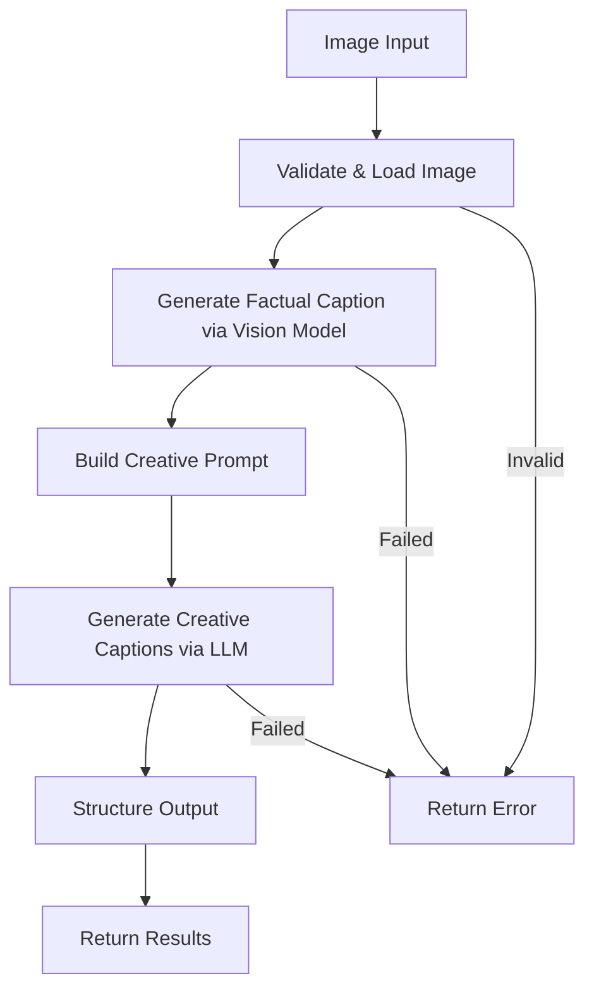

# Image Captioning System

**Difficulty:** Medium  
**Time to Solve:** 25-30 minutes  
**Category:** GenAI

---

## Problem Description

Develop an image captioning system that generates both factual and creative descriptions for images. The system should use a pre-trained vision model to generate an initial descriptive caption, then enhance it with creative or humorous variations using a GenAI API. This demonstrates the combination of specialized computer vision models with general language models.

The system should:
- Generate factual captions from images using vision models
- Create creative and humorous variations using LLM enhancement
- Support multiple image input formats (file path, URL, base64)
- Use vision-capable LLM providers (GPT-4 Vision, Claude 3, Gemini Pro Vision)
- Use LLMClientManager for creative enhancements
- Return structured output with multiple caption styles

---

## Input Specification

### Image Captioning Request

**Type:** Dictionary/JSON Object  
**Format:**
```python
{
    "image": "string (required)",  # Image path, URL, or base64 string
    "image_type": "string (optional)",  # "path", "url", or "base64" (auto-detected)
    "styles": "list[str] (optional)",  # Caption styles to generate
    "include_factual": "boolean (optional)",  # Whether to include factual caption (default: True)
    "creativity_level": "string (optional)"  # "low", "medium", "high" (default: "medium")
}
```

**Constraints:**
- `image`: Image file path, URL, or base64-encoded string
- `image_type`: One of ["path", "url", "base64"] (auto-detected if not provided)
- `styles`: List of styles: ["creative", "humorous", "poetic", "technical", "marketing"]
- `include_factual`: Boolean (default: True)
- `creativity_level`: One of ["low", "medium", "high"] (default: "medium")

---

## Output Specification

### Image Captioning Response

**Type:** Dictionary/JSON Object  
**Format:**
```python
{
    "success": bool,
    "factual_caption": str,  # Initial factual description
    "creative_captions": list[dict],  # Creative variations
    "metadata": {
        "image_source": str,  # "path", "url", or "base64"
        "vision_model": str,  # Model used for initial caption
        "styles_generated": list[str],
        "total_captions": int
    },
    "error": str | None  # Error message if generation failed
}
```

**Creative Caption Format:**
```python
{
    "style": str,  # Style name
    "caption": str,  # Generated caption
    "word_count": int  # Word count
}
```

---

## Examples

### Example 1: Basic Captioning

**Input:**
```python
{
    "image": "path/to/image.jpg",
    "image_type": "path",
    "include_factual": True,
    "styles": ["creative", "humorous"]
}
```

**Output:**
```python
{
    "success": True,
    "factual_caption": "A golden retriever dog playing in a park with a frisbee on a sunny day.",
    "creative_captions": [
        {
            "style": "creative",
            "caption": "A joyful golden retriever dances through sunbeams, catching dreams in the form of a frisbee.",
            "word_count": 15
        },
        {
            "style": "humorous",
            "caption": "This dog thinks he's a professional frisbee player, but he's really just having the time of his life!",
            "word_count": 18
        }
    ],
    "metadata": {
        "image_source": "path",
        "vision_model": "gpt-4-vision-preview",
        "styles_generated": ["creative", "humorous"],
        "total_captions": 3
    },
    "error": None
}
```

### Example 2: Multiple Styles

**Input:**
```python
{
    "image": "https://example.com/image.jpg",
    "image_type": "url",
    "styles": ["poetic", "technical", "marketing"],
    "creativity_level": "high"
}
```

**Output:**
```python
{
    "success": True,
    "factual_caption": "A modern city skyline at sunset with tall buildings and orange sky.",
    "creative_captions": [
        {
            "style": "poetic",
            "caption": "Steel giants reach for the heavens as the sun paints the sky in hues of fire and gold.",
            "word_count": 17
        },
        {
            "style": "technical",
            "caption": "Urban architectural landscape featuring high-rise structures during golden hour, approximately 18:00 hours.",
            "word_count": 13
        },
        {
            "style": "marketing",
            "caption": "Experience the breathtaking beauty of modern urban living - where dreams meet the sky!",
            "word_count": 13
        }
    ],
    "metadata": {
        "image_source": "url",
        "vision_model": "gpt-4-vision-preview",
        "styles_generated": ["poetic", "technical", "marketing"],
        "total_captions": 4
    },
    "error": None
}
```

---

## Edge Cases

1. **Invalid image path** - Should return error
2. **Invalid image URL** - Should return error
3. **Unsupported image format** - Should return error
4. **No vision model available** - Should return error
5. **LLM API failure** - Should return error with helpful message
6. **Empty creative captions** - Should handle gracefully

---

## Constraints

- Must use `LLMClientManager` from `app.utils.llm_client_manager`
- Support vision-capable providers (GPT-4 Vision, Claude 3, Gemini Pro Vision)
- Support image formats: JPEG, PNG, WebP
- Generate factual caption first, then creative variations
- Include example usage in `main()` function

---

## Solution Approach

### High-Level Flow



### Key Components

1. **Image Loading** - Load image from path, URL, or base64
2. **Vision Model Integration** - Use vision-capable LLM for initial caption
3. **Prompt Engineering** - Build style-specific prompts for creative captions
4. **LLM Integration** - Use LLMClientManager for creative enhancements
5. **Output Structuring** - Format results consistently

---

## Complexity Requirements

- **Time Complexity:** O(1) for processing + O(n) for LLM generation
- **Space Complexity:** O(m) where m = image size + caption text

---

## Implementation Notes

### Vision Models
- **GPT-4 Vision**: Use `gpt-4-vision-preview` or `gpt-4o` with image support
- **Claude 3**: Use `claude-3-opus-20240229` or `claude-3-sonnet-20240229` with vision
- **Gemini Pro Vision**: Use `gemini-pro-vision` for image understanding

### Image Handling
- Support local file paths
- Support image URLs
- Support base64-encoded images
- Validate image format (JPEG, PNG, WebP)

### Creative Styles
- **Creative**: Imaginative, descriptive, engaging
- **Humorous**: Funny, witty, entertaining
- **Poetic**: Artistic, metaphorical, lyrical
- **Technical**: Precise, detailed, factual
- **Marketing**: Persuasive, benefit-focused, compelling

---

## Testing Strategy

Test with:
1. Local image files (JPEG, PNG)
2. Image URLs
3. Base64-encoded images
4. Different image types (photos, illustrations, diagrams)
5. Error cases (invalid path, unsupported format)
6. Various creative styles

---

## Success Criteria

- ✅ Generates factual captions from images
- ✅ Creates creative variations in multiple styles
- ✅ Supports multiple image input formats
- ✅ Uses vision-capable LLM providers
- ✅ Uses LLMClientManager for enhancements
- ✅ Handles errors gracefully
- ✅ Includes example usage in main()

---

## Use Cases

1. **Content Creation**: Generate captions for social media posts
2. **Accessibility**: Provide image descriptions for visually impaired users
3. **E-commerce**: Create product descriptions from images
4. **Documentation**: Generate captions for technical documentation
5. **Creative Writing**: Use as inspiration for creative content

