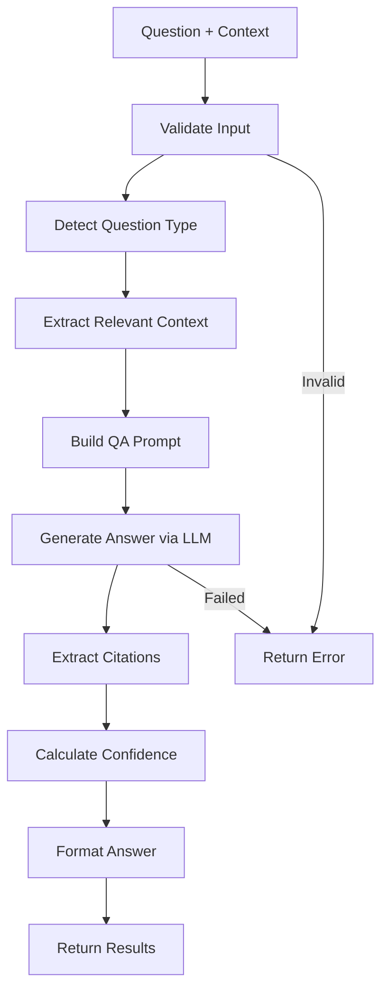

# Question Answering System

**Difficulty:** Medium  
**Time to Solve:** 25-30 minutes  
**Category:** GenAI

---

## Problem Description

Build a comprehensive question answering system that uses LLM integration to answer questions based on provided context documents. The system must handle various question types, provide confidence scoring, support different answer formats, implement citation mechanisms, and handle complex multi-part questions.

The system should:
- Answer questions based on provided context documents
- Handle various question types (factual, analytical, comparative, etc.)
- Provide confidence scoring for answers
- Support different answer formats (short, detailed, bullet points)
- Implement citation mechanisms (reference source documents)
- Handle complex multi-part questions
- Use LLMClientManager for LLM integration

---

## Input Specification

### Question Answering Request

**Type:** Dictionary/JSON Object  
**Format:**
```python
{
    "question": "string (required)",  # Question to answer
    "context": "string | list[str] (required)",  # Context document(s)
    "answer_format": "string (optional)",  # Format: "short", "detailed", "bullets" (default: "detailed")
    "include_citations": "boolean (optional)",  # Whether to include citations (default: True)
    "max_length": "int (optional)",  # Maximum answer length in words (default: 200)
    "question_type": "string (optional)"  # Type hint: "factual", "analytical", "comparative", "multi_part"
}
```

**Constraints:**
- `question`: 10-500 characters, clear question text
- `context`: String or list of strings (each 50-10000 characters)
- `answer_format`: One of ["short", "detailed", "bullets"] (default: "detailed")
- `include_citations`: Boolean (default: True)
- `max_length`: Integer between 20-1000 (default: 200)
- `question_type`: Optional hint (default: auto-detected)

---

## Output Specification

### Question Answering Response

**Type:** Dictionary/JSON Object  
**Format:**
```python
{
    "success": bool,
    "answer": str,  # Generated answer
    "confidence": float,  # Confidence score (0.0 to 1.0)
    "citations": list[dict],  # Source citations
    "question_type": str,  # Detected question type
    "metadata": {
        "context_sources": int,  # Number of context documents used
        "answer_length": int,  # Answer length in words
        "answer_format": str,
        "processing_time": float  # Processing time in seconds
    },
    "error": str | None  # Error message if generation failed
}
```

**Citation Format:**
```python
{
    "source_index": int,  # Index of context document (0-based)
    "text": str,  # Relevant excerpt from source
    "relevance_score": float  # Relevance score (0.0 to 1.0)
}
```

---

## Examples

### Example 1: Factual Question

**Input:**
```python
{
    "question": "What is the capital of France?",
    "context": "France is a country in Western Europe. Its capital city is Paris, which is also the largest city in the country.",
    "answer_format": "short",
    "include_citations": True
}
```

**Output:**
```python
{
    "success": True,
    "answer": "The capital of France is Paris.",
    "confidence": 0.95,
    "citations": [
        {
            "source_index": 0,
            "text": "Its capital city is Paris, which is also the largest city in the country.",
            "relevance_score": 1.0
        }
    ],
    "question_type": "factual",
    "metadata": {
        "context_sources": 1,
        "answer_length": 6,
        "answer_format": "short",
        "processing_time": 1.2
    },
    "error": None
}
```

### Example 2: Multi-Part Question

**Input:**
```python
{
    "question": "What are the main features of Python and how does it compare to Java?",
    "context": [
        "Python is a high-level programming language known for its simplicity and readability.",
        "Java is an object-oriented programming language designed for portability.",
        "Python features dynamic typing, while Java uses static typing."
    ],
    "answer_format": "bullets",
    "include_citations": True
}
```

**Output:**
```python
{
    "success": True,
    "answer": "Python Features:\n- Simplicity and readability\n- Dynamic typing\n- High-level language\n\nComparison with Java:\n- Python uses dynamic typing; Java uses static typing\n- Python emphasizes readability; Java emphasizes portability",
    "confidence": 0.85,
    "citations": [
        {
            "source_index": 0,
            "text": "Python is a high-level programming language known for its simplicity and readability.",
            "relevance_score": 0.9
        },
        {
            "source_index": 2,
            "text": "Python features dynamic typing, while Java uses static typing.",
            "relevance_score": 1.0
        }
    ],
    "question_type": "multi_part",
    "metadata": {
        "context_sources": 3,
        "answer_length": 35,
        "answer_format": "bullets",
        "processing_time": 2.1
    },
    "error": None
}
```

### Example 3: Analytical Question

**Input:**
```python
{
    "question": "Why is machine learning important for modern businesses?",
    "context": "Machine learning enables businesses to analyze large datasets, automate decision-making, and gain competitive advantages through predictive analytics.",
    "answer_format": "detailed",
    "include_citations": True
}
```

**Output:**
```python
{
    "success": True,
    "answer": "Machine learning is important for modern businesses because it enables them to analyze large datasets efficiently, automate decision-making processes, and gain competitive advantages through predictive analytics. This technology allows businesses to extract valuable insights from data that would be difficult or impossible to obtain through traditional methods.",
    "confidence": 0.88,
    "citations": [
        {
            "source_index": 0,
            "text": "Machine learning enables businesses to analyze large datasets, automate decision-making, and gain competitive advantages through predictive analytics.",
            "relevance_score": 1.0
        }
    ],
    "question_type": "analytical",
    "metadata": {
        "context_sources": 1,
        "answer_length": 48,
        "answer_format": "detailed",
        "processing_time": 1.8
    },
    "error": None
}
```

---

## Edge Cases

1. **Question not answerable from context** - Should indicate low confidence
2. **Empty context** - Should return error
3. **Very long context** - Should truncate or summarize
4. **Ambiguous question** - Should handle gracefully
5. **Multiple valid answers** - Should provide best answer with citations
6. **LLM API failure** - Should return error with helpful message

---

## Constraints

- Must use `LLMClientManager` from `app.utils.llm_client_manager`
- Support 3 answer formats: short, detailed, bullets
- Provide confidence scores (0.0 to 1.0)
- Implement citation mechanism with source references
- Handle multi-part questions
- Include example usage in `main()` function

---

## Solution Approach

### High-Level Flow



### Key Components

1. **Input Validation** - Validate question and context
2. **Question Type Detection** - Identify question type (factual, analytical, etc.)
3. **Context Extraction** - Extract relevant parts of context
4. **Prompt Engineering** - Build format-specific QA prompts
5. **LLM Integration** - Use LLMClientManager to generate answers
6. **Citation Extraction** - Identify source references
7. **Confidence Calculation** - Estimate answer confidence
8. **Answer Formatting** - Format answer according to requested format

---

## Complexity Requirements

- **Time Complexity:** O(n) where n = context length + question length
- **Space Complexity:** O(m) where m = context size + answer size

---

## Implementation Notes

### Question Types
- **Factual**: Direct facts ("What is...", "Who is...")
- **Analytical**: "Why", "How", "Explain"
- **Comparative**: "Compare", "Difference between"
- **Multi-part**: Multiple questions in one

### Answer Formats
- **Short**: 1-2 sentences, concise answer
- **Detailed**: Comprehensive explanation with context
- **Bullets**: Structured bullet points

### Citation Mechanism
- Reference source document index
- Include relevant excerpt
- Calculate relevance score
- Support multiple citations

### Confidence Scoring
- Based on answer quality
- Context relevance
- Answer completeness
- Question complexity

---

## Testing Strategy

Test with:
1. Each question type (factual, analytical, comparative, multi-part)
2. Each answer format (short, detailed, bullets)
3. Single and multiple context documents
4. Edge cases (no answer, ambiguous, very long context)
5. Error cases (empty context, invalid format)

---

## Success Criteria

- ✅ Answers questions based on context
- ✅ Handles various question types
- ✅ Provides confidence scores
- ✅ Supports multiple answer formats
- ✅ Implements citation mechanism
- ✅ Handles multi-part questions
- ✅ Uses LLMClientManager correctly
- ✅ Includes example usage in main()

---

## Use Cases

1. **Document Q&A**: Answer questions about documents
2. **Knowledge Base**: Query knowledge bases with context
3. **Research Assistance**: Answer research questions from sources
4. **Customer Support**: Answer questions from documentation
5. **Educational**: Answer questions from course materials

