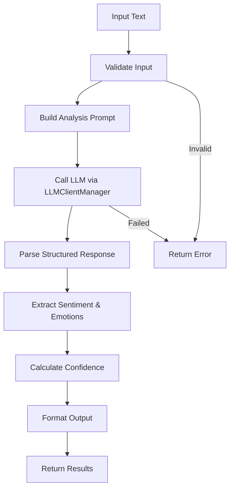

# Sentiment Analysis System

**Difficulty:** Medium  
**Time to Solve:** 25-30 minutes  
**Category:** GenAI

---

## Problem Description

Build a comprehensive sentiment analysis system that uses LLM integration to analyze text sentiment, emotion detection, and provide detailed reasoning. The system must handle various text formats, provide confidence scoring, and support batch processing with structured output.

The system should:
- Analyze text sentiment (positive, negative, neutral)
- Detect emotions (joy, sadness, anger, fear, surprise, etc.)
- Provide detailed reasoning for sentiment classification
- Handle various text formats (reviews, comments, tweets, etc.)
- Provide confidence scoring for predictions
- Support batch processing of multiple texts
- Use LLMClientManager for LLM integration

---

## Input Specification

### Sentiment Analysis Request

**Type:** Dictionary/JSON Object  
**Format:**
```python
{
    "text": "string | list[str] (required)",  # Text(s) to analyze
    "analysis_type": "string (optional)",  # "sentiment", "emotion", "comprehensive" (default: "comprehensive")
    "include_reasoning": "boolean (optional)",  # Whether to include reasoning (default: True)
    "granularity": "string (optional)"  # "sentence", "paragraph", "document" (default: "document")
}
```

**Constraints:**
- `text`: String or list of strings (each 10-5000 characters)
- `analysis_type`: One of ["sentiment", "emotion", "comprehensive"] (default: "comprehensive")
- `include_reasoning`: Boolean (default: True)
- `granularity`: One of ["sentence", "paragraph", "document"] (default: "document")

---

## Output Specification

### Sentiment Analysis Response

**Type:** Dictionary/JSON Object  
**Format:**
```python
{
    "success": bool,
    "results": list[dict],  # Analysis results (one per text)
    "summary": dict,  # Summary statistics (for batch processing)
    "metadata": {
        "total_texts": int,
        "analysis_type": str,
        "processing_time": float
    },
    "error": str | None  # Error message if analysis failed
}
```

**Result Format (per text):**
```python
{
    "text": str,  # Original text
    "sentiment": str,  # "positive", "negative", "neutral"
    "sentiment_score": float,  # -1.0 to 1.0
    "emotions": dict,  # Emotion scores
    "confidence": float,  # 0.0 to 1.0
    "reasoning": str,  # Detailed reasoning (if requested)
    "key_phrases": list[str]  # Key phrases influencing sentiment
}
```

**Emotions Format:**
```python
{
    "joy": float,  # 0.0 to 1.0
    "sadness": float,
    "anger": float,
    "fear": float,
    "surprise": float,
    "disgust": float,
    "neutral": float
}
```

---

## Examples

### Example 1: Single Text Analysis

**Input:**
```python
{
    "text": "I absolutely love this product! It's amazing and exceeded my expectations.",
    "analysis_type": "comprehensive",
    "include_reasoning": True
}
```

**Output:**
```python
{
    "success": True,
    "results": [
        {
            "text": "I absolutely love this product! It's amazing and exceeded my expectations.",
            "sentiment": "positive",
            "sentiment_score": 0.9,
            "emotions": {
                "joy": 0.85,
                "sadness": 0.05,
                "anger": 0.02,
                "fear": 0.01,
                "surprise": 0.15,
                "disgust": 0.0,
                "neutral": 0.1
            },
            "confidence": 0.92,
            "reasoning": "The text expresses strong positive sentiment through words like 'absolutely love', 'amazing', and 'exceeded expectations'. The emotional tone is primarily joyful with elements of surprise.",
            "key_phrases": ["absolutely love", "amazing", "exceeded my expectations"]
        }
    ],
    "summary": {
        "average_sentiment": 0.9,
        "sentiment_distribution": {"positive": 1, "negative": 0, "neutral": 0}
    },
    "metadata": {
        "total_texts": 1,
        "analysis_type": "comprehensive",
        "processing_time": 1.5
    },
    "error": None
}
```

### Example 2: Batch Processing

**Input:**
```python
{
    "text": [
        "This is the worst service I've ever experienced.",
        "The product is okay, nothing special.",
        "Fantastic! Highly recommend to everyone!"
    ],
    "analysis_type": "comprehensive"
}
```

**Output:**
```python
{
    "success": True,
    "results": [
        {
            "text": "This is the worst service I've ever experienced.",
            "sentiment": "negative",
            "sentiment_score": -0.85,
            "emotions": {"anger": 0.7, "disgust": 0.6, ...},
            "confidence": 0.88,
            "reasoning": "...",
            "key_phrases": ["worst service", "ever experienced"]
        },
        {
            "text": "The product is okay, nothing special.",
            "sentiment": "neutral",
            "sentiment_score": 0.1,
            "emotions": {"neutral": 0.8, ...},
            "confidence": 0.75,
            "reasoning": "...",
            "key_phrases": ["okay", "nothing special"]
        },
        {
            "text": "Fantastic! Highly recommend to everyone!",
            "sentiment": "positive",
            "sentiment_score": 0.9,
            "emotions": {"joy": 0.85, "surprise": 0.2, ...},
            "confidence": 0.91,
            "reasoning": "...",
            "key_phrases": ["Fantastic", "Highly recommend"]
        }
    ],
    "summary": {
        "average_sentiment": 0.05,
        "sentiment_distribution": {"positive": 1, "negative": 1, "neutral": 1}
    },
    "metadata": {
        "total_texts": 3,
        "analysis_type": "comprehensive",
        "processing_time": 4.2
    },
    "error": None
}
```

### Example 3: Emotion-Only Analysis

**Input:**
```python
{
    "text": "I'm so excited about this opportunity!",
    "analysis_type": "emotion",
    "include_reasoning": False
}
```

**Output:**
```python
{
    "success": True,
    "results": [
        {
            "text": "I'm so excited about this opportunity!",
            "sentiment": "positive",
            "sentiment_score": 0.8,
            "emotions": {
                "joy": 0.9,
                "surprise": 0.3,
                "neutral": 0.1,
                ...
            },
            "confidence": 0.85,
            "reasoning": "",
            "key_phrases": ["excited", "opportunity"]
        }
    ],
    "summary": {...},
    "metadata": {...},
    "error": None
}
```

---

## Edge Cases

1. **Empty text** - Should return error
2. **Very short text** - Should handle gracefully
3. **Mixed sentiment** - Should identify dominant sentiment
4. **Sarcasm** - Should attempt to detect (may be challenging)
5. **Neutral text** - Should classify as neutral
6. **LLM API failure** - Should return error with helpful message
7. **Very long text** - Should truncate or handle appropriately

---

## Constraints

- Must use `LLMClientManager` from `app.utils.llm_client_manager`
- Support 3 analysis types: sentiment, emotion, comprehensive
- Provide sentiment scores (-1.0 to 1.0)
- Detect 7 emotions: joy, sadness, anger, fear, surprise, disgust, neutral
- Support batch processing (multiple texts)
- Include example usage in `main()` function

---

## Solution Approach

### High-Level Flow



### Key Components

1. **Input Validation** - Validate text and parameters
2. **Prompt Engineering** - Build analysis-specific prompts
3. **LLM Integration** - Use LLMClientManager for sentiment analysis
4. **Response Parsing** - Extract structured sentiment and emotion data
5. **Confidence Calculation** - Estimate prediction confidence
6. **Batch Processing** - Handle multiple texts efficiently
7. **Summary Generation** - Aggregate statistics for batches

---

## Complexity Requirements

- **Time Complexity:** O(n) where n = number of texts × text length
- **Space Complexity:** O(m) where m = total text size + analysis results

---

## Implementation Notes

### Sentiment Classification
- **Positive**: Sentiment score > 0.3
- **Negative**: Sentiment score < -0.3
- **Neutral**: -0.3 ≤ sentiment score ≤ 0.3

### Emotion Detection
- 7 basic emotions: joy, sadness, anger, fear, surprise, disgust, neutral
- Scores range from 0.0 to 1.0
- Sum of emotion scores ≈ 1.0

### Confidence Scoring
- Based on sentiment strength
- Text clarity and specificity
- Emotion consistency
- LLM response quality

---

## Testing Strategy

Test with:
1. Each analysis type (sentiment, emotion, comprehensive)
2. Various text formats (reviews, tweets, comments)
3. Different sentiment polarities (positive, negative, neutral)
4. Batch processing (single and multiple texts)
5. Edge cases (empty text, sarcasm, mixed sentiment)

---

## Success Criteria

- ✅ Analyzes sentiment accurately
- ✅ Detects multiple emotions
- ✅ Provides detailed reasoning
- ✅ Handles various text formats
- ✅ Provides confidence scores
- ✅ Supports batch processing
- ✅ Uses LLMClientManager correctly
- ✅ Includes example usage in main()

---

## Use Cases

1. **Social Media Monitoring**: Analyze customer sentiment on social platforms
2. **Product Reviews**: Analyze review sentiment and emotions
3. **Customer Feedback**: Process customer feedback at scale
4. **Content Moderation**: Identify negative or harmful content
5. **Market Research**: Analyze public opinion and trends

