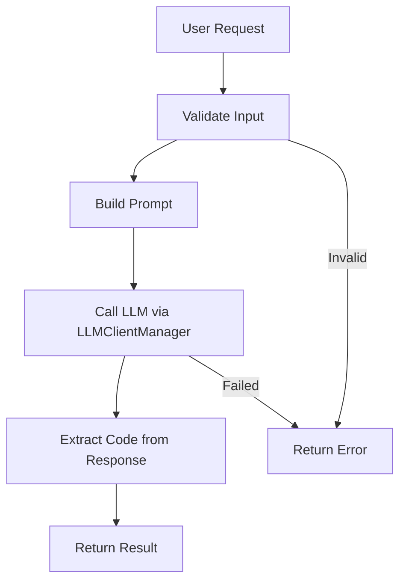

# Simple Code Generator

**Difficulty:** Medium  
**Time to Solve:** 20-25 minutes  
**Category:** GenAI

---

## Problem Description

Build a simple code generation system that uses LLM integration to generate code snippets from natural language prompts. The system should support Python and JavaScript, handle basic error cases, and provide clear explanations of generated code.

Unlike the agentic version, this implementation uses direct LLM calls without multi-agent orchestration, making it simpler and faster for basic code generation tasks.

The system should:
- Generate code snippets from natural language descriptions
- Support Python and JavaScript languages
- Provide explanations for generated code
- Handle basic validation and error cases
- Use LLMClientManager for LLM integration

---

## Input Specification

### Code Generation Request

**Type:** Dictionary/JSON Object  
**Format:**
```python
{
    "prompt": "string (required)",  # Description of code to generate
    "language": "string (required)",  # "python" or "javascript"
    "include_explanation": "boolean (optional)",  # Default: True
    "include_comments": "boolean (optional)"  # Default: True
}
```

**Constraints:**
- `prompt`: 10-500 characters, clear description of desired code
- `language`: One of ["python", "javascript"]
- `include_explanation`: Boolean (default: True)
- `include_comments`: Boolean (default: True)

---

## Output Specification

### Code Generation Response

**Type:** Dictionary/JSON Object  
**Format:**
```python
{
    "success": bool,
    "code": str,  # Generated code
    "language": str,  # Programming language
    "explanation": str,  # Explanation of the code (if requested)
    "error": str | None  # Error message if generation failed
}
```

---

## Examples

### Example 1: Simple Python Function

**Input:**
```python
{
    "prompt": "Create a function to calculate factorial of a number",
    "language": "python",
    "include_explanation": True,
    "include_comments": True
}
```

**Output:**
```python
{
    "success": True,
    "code": "def factorial(n: int) -> int:\n    \"\"\"Calculate factorial of n.\"\"\"\n    if n <= 1:\n        return 1\n    return n * factorial(n - 1)",
    "language": "python",
    "explanation": "This function calculates the factorial using recursion. Base case: factorial of 0 or 1 is 1. Recursive case: n * factorial(n-1).",
    "error": None
}
```

### Example 2: JavaScript Function

**Input:**
```python
{
    "prompt": "Create a function to reverse a string",
    "language": "javascript",
    "include_explanation": True
}
```

**Output:**
```python
{
    "success": True,
    "code": "function reverseString(str) {\n    return str.split('').reverse().join('');\n}",
    "language": "javascript",
    "explanation": "This function splits the string into an array of characters, reverses the array, then joins it back into a string.",
    "error": None
}
```

---

## Edge Cases

1. **Empty prompt** - Should return error
2. **Invalid language** - Should return error
3. **Very long prompt** - Should truncate or handle gracefully
4. **LLM API failure** - Should return error with helpful message
5. **Invalid code generation** - Should handle gracefully

---

## Constraints

- Must use `LLMClientManager` from `app.utils.llm_client_manager`
- Support only Python and JavaScript
- Keep implementation simple (no multi-agent workflow)
- Provide clear error messages
- Include example usage in `main()` function

---

## Solution Approach

### High-Level Flow



### Key Components

1. **Input Validation** - Validate prompt and language
2. **Prompt Engineering** - Build language-specific prompts
3. **LLM Integration** - Use LLMClientManager to generate code
4. **Response Parsing** - Extract code from LLM response
5. **Error Handling** - Handle failures gracefully

---

## Complexity Requirements

- **Time Complexity:** O(1) for processing + O(n) for LLM generation (where n = prompt complexity)
- **Space Complexity:** O(m) where m = size of generated code

---

## Implementation Notes

### LLM Provider Selection
- Use `LLMClientManager` from `app.utils.llm_client_manager`
- Default to OpenAI GPT-4 for best code quality
- Support fallback to other providers if configured

### Prompt Engineering
- Include language-specific syntax hints
- Request code with comments if `include_comments=True`
- Request explanation if `include_explanation=True`
- Use clear, structured prompts

### Error Handling
- LLM API failures → Return error with retry suggestion
- Invalid input → Return validation error
- Empty code generation → Return error

---

## Testing Strategy

Test with:
1. Simple function generation (Python)
2. Simple function generation (JavaScript)
3. Error cases (empty prompt, invalid language)
4. LLM API failure simulation
5. Edge cases (very long prompts, special characters)

---

## Success Criteria

- ✅ Generates valid Python code from prompts
- ✅ Generates valid JavaScript code from prompts
- ✅ Provides explanations when requested
- ✅ Handles errors gracefully
- ✅ Uses LLMClientManager correctly
- ✅ Includes example usage in main()

