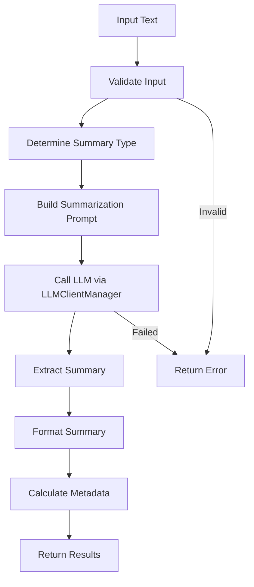

# Text Summarization System

**Difficulty:** Medium  
**Time to Solve:** 25-30 minutes  
**Category:** GenAI

---

## Problem Description

Build a comprehensive text summarization system that uses LLM integration to generate summaries of various lengths and formats. The system must handle different content types, provide customizable summary styles, and support both extractive and abstractive summarization approaches.

The system should:
- Generate summaries of various lengths (short, medium, long)
- Support different summary formats (paragraph, bullets, structured)
- Handle various content types (articles, documents, conversations, etc.)
- Provide customizable summary styles (concise, detailed, executive, technical)
- Support extractive summarization (key sentences extraction)
- Support abstractive summarization (paraphrased summaries)
- Use LLMClientManager for LLM integration

---

## Input Specification

### Text Summarization Request

**Type:** Dictionary/JSON Object  
**Format:**
```python
{
    "text": "string (required)",  # Text to summarize
    "summary_type": "string (optional)",  # "extractive" or "abstractive" (default: "abstractive")
    "length": "string (optional)",  # "short", "medium", "long", or word count (default: "medium")
    "format": "string (optional)",  # "paragraph", "bullets", "structured" (default: "paragraph")
    "style": "string (optional)",  # "concise", "detailed", "executive", "technical" (default: "concise")
    "focus_areas": "list[str] (optional)",  # Specific topics to focus on
    "max_sentences": "int (optional)"  # Maximum sentences for extractive (default: 5)
}
```

**Constraints:**
- `text`: 100-50000 characters, text to summarize
- `summary_type`: One of ["extractive", "abstractive"] (default: "abstractive")
- `length`: One of ["short", "medium", "long"] or integer word count (default: "medium")
- `format`: One of ["paragraph", "bullets", "structured"] (default: "paragraph")
- `style`: One of ["concise", "detailed", "executive", "technical"] (default: "concise")
- `focus_areas`: List of topics to emphasize (optional)
- `max_sentences`: Integer between 1-20 (default: 5, for extractive only)

---

## Output Specification

### Text Summarization Response

**Type:** Dictionary/JSON Object  
**Format:**
```python
{
    "success": bool,
    "summary": str,  # Generated summary
    "summary_type": str,  # "extractive" or "abstractive"
    "metadata": {
        "original_length": int,  # Original text length in words
        "summary_length": int,  # Summary length in words
        "compression_ratio": float,  # Summary/original ratio
        "length_category": str,  # "short", "medium", "long"
        "format": str,
        "style": str
    },
    "key_points": list[str],  # Key points extracted (if applicable)
    "error": str | None  # Error message if generation failed
}
```

---

## Examples

### Example 1: Abstractive Summary

**Input:**
```python
{
    "text": "Machine learning is a subset of artificial intelligence that enables systems to learn and improve from experience without being explicitly programmed. It uses algorithms to analyze data, identify patterns, and make decisions. Common applications include image recognition, natural language processing, and recommendation systems. The field has grown rapidly due to increased data availability and computational power.",
    "summary_type": "abstractive",
    "length": "short",
    "format": "paragraph",
    "style": "concise"
}
```

**Output:**
```python
{
    "success": True,
    "summary": "Machine learning is an AI subset that enables systems to learn from data and improve automatically. It uses algorithms to identify patterns and make decisions, with applications in image recognition, NLP, and recommendations.",
    "summary_type": "abstractive",
    "metadata": {
        "original_length": 65,
        "summary_length": 28,
        "compression_ratio": 0.43,
        "length_category": "short",
        "format": "paragraph",
        "style": "concise"
    },
    "key_points": [
        "Machine learning is a subset of AI",
        "Enables learning from experience",
        "Applications in image recognition, NLP, recommendations"
    ],
    "error": None
}
```

### Example 2: Extractive Summary

**Input:**
```python
{
    "text": "[Long article text...]",
    "summary_type": "extractive",
    "length": "medium",
    "format": "bullets",
    "max_sentences": 5
}
```

**Output:**
```python
{
    "success": True,
    "summary": "• Machine learning enables systems to learn from experience\n• Uses algorithms to analyze data and identify patterns\n• Applications include image recognition and NLP\n• Field has grown due to increased data availability\n• Computational power improvements drive advancement",
    "summary_type": "extractive",
    "metadata": {
        "original_length": 500,
        "summary_length": 45,
        "compression_ratio": 0.09,
        "length_category": "medium",
        "format": "bullets",
        "style": "concise"
    },
    "key_points": [
        "Machine learning enables systems to learn from experience",
        "Uses algorithms to analyze data and identify patterns",
        "Applications include image recognition and NLP"
    ],
    "error": None
}
```

### Example 3: Executive Summary

**Input:**
```python
{
    "text": "[Long business report...]",
    "summary_type": "abstractive",
    "length": "medium",
    "format": "structured",
    "style": "executive"
}
```

**Output:**
```python
{
    "success": True,
    "summary": "EXECUTIVE SUMMARY\n\nKey Findings:\n- [Main finding 1]\n- [Main finding 2]\n\nRecommendations:\n- [Recommendation 1]\n- [Recommendation 2]\n\nNext Steps:\n- [Action item 1]",
    "summary_type": "abstractive",
    "metadata": {...},
    "key_points": [...],
    "error": None
}
```

---

## Edge Cases

1. **Very short text** - Should return error or minimal summary
2. **Very long text** - Should truncate or handle appropriately
3. **Empty text** - Should return error
4. **No key information** - Should handle gracefully
5. **LLM API failure** - Should return error with helpful message
6. **Invalid parameters** - Should return validation error

---

## Constraints

- Must use `LLMClientManager` from `app.utils.llm_client_manager`
- Support 2 summary types: extractive, abstractive
- Support 3 lengths: short, medium, long (or custom word count)
- Support 3 formats: paragraph, bullets, structured
- Support 4 styles: concise, detailed, executive, technical
- Include example usage in `main()` function

---

## Solution Approach

### High-Level Flow



### Key Components

1. **Input Validation** - Validate text and parameters
2. **Summary Type Selection** - Choose extractive or abstractive approach
3. **Prompt Engineering** - Build style and format-specific prompts
4. **LLM Integration** - Use LLMClientManager for summarization
5. **Summary Extraction** - Extract and clean summary from response
6. **Formatting** - Format summary according to requested format
7. **Metadata Calculation** - Calculate compression ratios and statistics

---

## Complexity Requirements

- **Time Complexity:** O(n) where n = text length
- **Space Complexity:** O(m) where m = summary size

---

## Implementation Notes

### Summary Types
- **Extractive**: Selects and extracts key sentences from original text
- **Abstractive**: Generates new summary text (paraphrased)

### Length Guidelines
- **Short**: 20-50 words (or 1-2 sentences)
- **Medium**: 50-150 words (or 3-5 sentences)
- **Long**: 150-300 words (or 6-10 sentences)

### Formats
- **Paragraph**: Continuous prose
- **Bullets**: Bullet point list
- **Structured**: Organized sections (e.g., Executive Summary format)

### Styles
- **Concise**: Brief, to-the-point
- **Detailed**: Comprehensive with context
- **Executive**: High-level, decision-focused
- **Technical**: Precise, terminology-focused

---

## Testing Strategy

Test with:
1. Each summary type (extractive, abstractive)
2. Each length (short, medium, long)
3. Each format (paragraph, bullets, structured)
4. Each style (concise, detailed, executive, technical)
5. Various content types (articles, reports, conversations)
6. Edge cases (very short/long text, empty text)

---

## Success Criteria

- ✅ Generates summaries of various lengths
- ✅ Supports extractive and abstractive approaches
- ✅ Handles different content types
- ✅ Provides customizable styles
- ✅ Formats summaries correctly
- ✅ Uses LLMClientManager correctly
- ✅ Includes example usage in main()

---

## Use Cases

1. **Document Summarization**: Summarize long documents and reports
2. **Article Summarization**: Create article summaries for quick reading
3. **Meeting Notes**: Summarize meeting transcripts
4. **Research Papers**: Generate paper abstracts and summaries
5. **Content Curation**: Create summaries for content aggregation

