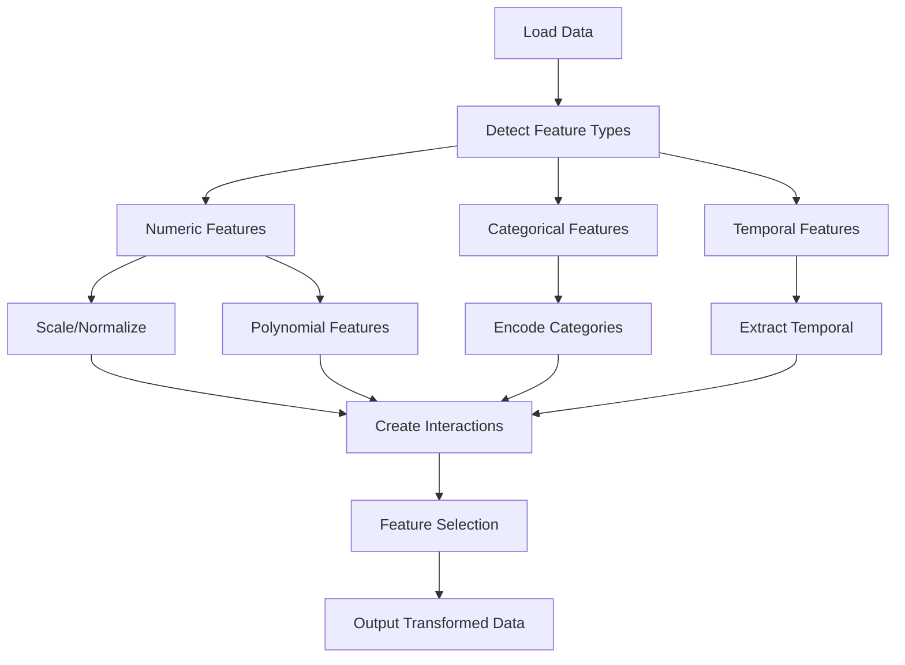

# Feature Engineering

**Difficulty:** Medium-Advanced  
**Time to Solve:** 30-35 min  
**Category:** MLOps

---

## Problem Description

Build a comprehensive feature engineering pipeline that automatically creates, transforms, and selects features from raw data. The pipeline should support various feature engineering techniques including:

- **Numeric transformations**: Scaling, normalization, polynomial features
- **Categorical encoding**: One-hot, label, target encoding
- **Temporal features**: Date/time extraction, time-based aggregations
- **Interaction features**: Feature combinations and interactions
- **Feature selection**: Statistical methods, correlation-based, importance-based

This problem demonstrates essential MLOps skills for preparing data for machine learning models.

---

## Input Specification

- **Type:** pandas DataFrame
- **Format:** 
  - Mixed data types (numeric, categorical, datetime)
  - May contain missing values
  - No specific column requirements
- **Constraints:**
  - DataFrame must not be empty
  - At least one column required
  - Columns can be of any type

---

## Output Specification

- **Type:** Transformed DataFrame with engineered features
- **Format:** 
  - All features as numeric (ready for ML models)
  - No missing values (imputed or removed)
  - Feature names descriptive of transformations
- **Requirements:**
  - Must preserve original data shape (rows)
  - Must output feature importance scores
  - Must log all transformations applied

---

## Examples

### Example 1: Numeric Feature Engineering
**Input:**
```python
df = pd.DataFrame({
    'age': [25, 30, 35, 40, 45],
    'income': [50000, 60000, 70000, 80000, 90000],
    'category': ['A', 'B', 'A', 'C', 'B']
})
```

**Output:**
```python
# Transformed DataFrame with:
# - Scaled numeric features
# - One-hot encoded categories
# - Polynomial features (age^2, income^2)
# - Interaction features (age * income)
```

**Explanation:**  
The pipeline scales numeric features, encodes categories, creates polynomial and interaction features.

---

### Example 2: Temporal Feature Engineering
**Input:**
```python
df = pd.DataFrame({
    'timestamp': pd.date_range('2024-01-01', periods=100, freq='D'),
    'value': np.random.randn(100)
})
```

**Output:**
```python
# Transformed DataFrame with:
# - Year, month, day, weekday extracted
# - Cyclical encoding (sin/cos for periodic features)
# - Time-based aggregations
```

**Explanation:**  
The pipeline extracts temporal features and creates cyclical encodings for periodic patterns.

---

## Edge Cases to Consider

1. **All missing values in a column:**
   - Expected behavior: Drop column or fill with constant

2. **Constant columns (zero variance):**
   - Expected behavior: Remove constant columns

3. **High cardinality categorical:**
   - Expected behavior: Use target encoding or limit one-hot encoding

4. **Mixed data types in single column:**
   - Expected behavior: Convert to string or separate handling

5. **Very large number of features:**
   - Expected behavior: Apply feature selection to reduce dimensionality

---

## Constraints

- Must support at least 5 feature engineering techniques
- Must handle missing values appropriately
- Must prevent data leakage (fit on train, transform on test)
- Must provide feature importance/selection
- Must log all transformations for reproducibility
- Must handle both numeric and categorical features

---

## Solution Approach

The solution should follow a scikit-learn transformer pattern:

1. **Fit Phase**: Learn parameters from training data
2. **Transform Phase**: Apply transformations to new data
3. **Feature Selection**: Rank and select important features

### Suggested Algorithm Flow



---

## Complexity Requirements

- **Target Time Complexity:** O(n*m) for basic transformations, O(n*m²) for interactions
- **Target Space Complexity:** O(n*m) for transformed data
- **Justification:** Feature engineering typically scales with data size and feature count.

---

## Additional Notes

- Use scikit-learn transformers (StandardScaler, OneHotEncoder, etc.)
- Implement fit/transform pattern for train/test splits
- Store transformation parameters for reproducibility
- Provide feature importance scores
- Log all transformations for audit trail

---

## Related Concepts

- Feature Engineering
- Data Preprocessing
- Feature Selection
- Dimensionality Reduction
- Scikit-learn Transformers

---

## Testing Hints

1. Test with mixed data types
2. Test with missing values
3. Test with high cardinality categories
4. Test fit/transform separately
5. Test feature selection

---

## Success Criteria

Your solution should:
- [ ] Handle numeric, categorical, and temporal features
- [ ] Apply multiple transformation techniques
- [ ] Support fit/transform pattern
- [ ] Provide feature selection
- [ ] Handle edge cases gracefully
- [ ] Include comprehensive logging
- [ ] Have proper type hints and docstrings
- [ ] Include example usage in main()

