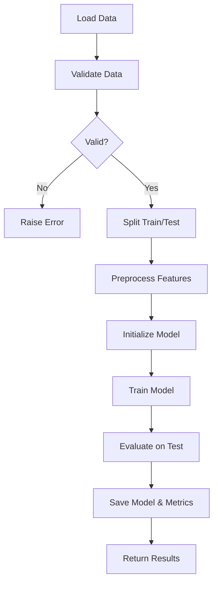

# Model Training Pipeline

**Difficulty:** Medium-Advanced  
**Time to Solve:** 30-35 min  
**Category:** MLOps

---

## Problem Description

Build a complete end-to-end machine learning training pipeline that handles data loading, preprocessing, model training, validation, and model persistence. The pipeline should be flexible enough to support different model types (classification and regression) and provide comprehensive logging and error handling.

This problem demonstrates production-ready MLOps practices including:
- Data validation and preprocessing
- Train/validation/test splits
- Model training with configurable hyperparameters
- Model evaluation and metrics
- Model serialization and versioning
- Reproducibility through random seeds

---

## Input Specification

- **Type:** CSV file path or pandas DataFrame
- **Format:** 
  - CSV file with features and target column
  - Target column name: `target` (for classification) or `price` (for regression)
  - Features: numeric columns (categorical should be pre-encoded)
- **Constraints:**
  - File must exist and be readable
  - At least 100 samples required for training
  - Target column must be present
  - No missing values in target column

---

## Output Specification

- **Type:** Trained model object and evaluation metrics dictionary
- **Format:** 
  - Model saved to disk (`.pkl` or `.joblib` format)
  - Metrics dictionary with keys: `accuracy`, `precision`, `recall`, `f1_score` (classification) or `mse`, `mae`, `r2_score` (regression)
- **Requirements:**
  - Model must be serializable
  - Metrics must be computed on test set
  - Training history/logs must be saved

---

## Examples

### Example 1: Classification Pipeline
**Input:**
```python
data_path = "datasets/mlops/classification/iris.csv"
config = ModelConfig(
    model_type="random_forest",
    task_type="classification",
    hyperparameters={"n_estimators": 100, "max_depth": 10}
)
```

**Output:**
```python
metrics = {
    'accuracy': 0.95,
    'precision': 0.94,
    'recall': 0.95,
    'f1_score': 0.94
}
# Model saved to: models/random_forest_classifier_v1.pkl
```

**Explanation:**  
The pipeline loads the iris dataset, splits it into train/test sets, trains a Random Forest classifier, evaluates on test set, and saves the model with metrics.

---

### Example 2: Regression Pipeline
**Input:**
```python
data_path = "datasets/mlops/regression/housing.csv"
config = ModelConfig(
    model_type="gradient_boosting",
    task_type="regression",
    hyperparameters={"n_estimators": 200, "learning_rate": 0.1}
)
```

**Output:**
```python
metrics = {
    'mse': 0.023,
    'mae': 0.12,
    'r2_score': 0.87
}
# Model saved to: models/gradient_boosting_regressor_v1.pkl
```

**Explanation:**  
The pipeline trains a regression model on housing data, evaluates using regression metrics, and persists the model.

---

## Edge Cases to Consider

1. **Missing data in features:**
   - Expected behavior: Impute missing values (mean for numeric, mode for categorical)

2. **Imbalanced classes (classification):**
   - Expected behavior: Log class distribution and optionally use class weights

3. **Single class in target (classification):**
   - Expected behavior: Raise ValueError with informative message

4. **Invalid model type:**
   - Expected behavior: Raise ValueError listing supported types

5. **Insufficient data:**
   - Expected behavior: Raise ValueError if less than minimum required samples

---

## Constraints

- Must support at least 3 model types (Random Forest, Logistic Regression, Gradient Boosting)
- Must handle both classification and regression tasks
- Must use train/test split (80/20) with random seed for reproducibility
- Must save model with version number
- Must log all training steps
- Must validate data before training

---

## Solution Approach

The solution should follow a structured pipeline pattern:

1. **Data Loading:** Load and validate data from CSV
2. **Data Splitting:** Split into train/test sets with stratification for classification
3. **Preprocessing:** Handle missing values, scale features if needed
4. **Model Training:** Train model with provided hyperparameters
5. **Evaluation:** Compute appropriate metrics based on task type
6. **Persistence:** Save model and metrics to disk

### Suggested Algorithm Flow



---

## Complexity Requirements

- **Target Time Complexity:** O(n*m*k) where n=samples, m=features, k=iterations (model-dependent)
- **Target Space Complexity:** O(n*m) for data storage + O(m) for model parameters
- **Justification:** Training complexity depends on algorithm. Data must be loaded into memory.

---

## Additional Notes

- Use scikit-learn for models and metrics
- Use joblib or pickle for model serialization
- Include random_state in all random operations for reproducibility
- Log important steps (data shape, model type, training time, metrics)
- Create `models/` directory if it doesn't exist
- Version models using timestamp or version number

---

## Related Concepts

- Machine Learning Pipeline
- Model Training
- Cross-validation
- Model Evaluation
- Model Serialization
- MLOps Best Practices

---

## Testing Hints

1. Test with small synthetic dataset
2. Test with real dataset (iris, housing)
3. Test with missing values
4. Test with invalid configurations
5. Test model loading after saving

---

## Success Criteria

Your solution should:
- [ ] Load and validate data correctly
- [ ] Split data appropriately
- [ ] Train models for both classification and regression
- [ ] Compute correct metrics for each task type
- [ ] Save and load models successfully
- [ ] Handle edge cases gracefully
- [ ] Include comprehensive logging
- [ ] Have proper type hints and docstrings
- [ ] Include example usage in main()

