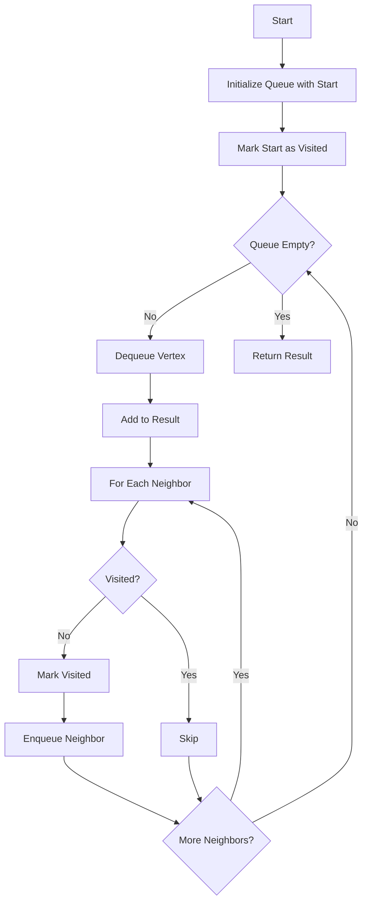

# BFS Traversal

**Difficulty:** Medium  
**Time to Solve:** 20-25 min  
**Category:** Advanced Python

---

## Problem Description

Implement Breadth-First Search (BFS) traversal for graphs. BFS explores all vertices at the current depth level before moving to vertices at the next depth level. It uses a queue data structure to maintain the order of exploration.

This problem demonstrates understanding of:
- Graph traversal algorithms
- Queue data structure
- Level-order processing

---

## Input Specification

- **Type:** `Dict[int, List[int]]`, `int`
- **Format:**
  - `graph`: Adjacency list representation {vertex: [neighbors]}
  - `start`: Starting vertex for traversal
- **Constraints:**
  - `1 ≤ len(graph) ≤ 1000`
  - `0 ≤ vertex ≤ 1000`
  - Graph can be directed or undirected
  - Graph may be disconnected

---

## Output Specification

- **Type:** `List[int]`
- **Format:**
  - List of vertices visited in BFS order
- **Requirements:**
  - Start vertex must be first
  - Vertices at same level can be in any order
  - Only vertices reachable from start are included

---

## Examples

### Example 1: Basic BFS
**Input:**
```python
graph = {
    0: [1, 2],
    1: [0, 3, 4],
    2: [0, 5],
    3: [1],
    4: [1],
    5: [2]
}
start = 0
```

**Output:**
```python
[0, 1, 2, 3, 4, 5]
```

**Explanation:**  
BFS visits level by level:
- Level 0: [0]
- Level 1: [1, 2] (neighbors of 0)
- Level 2: [3, 4, 5] (neighbors of 1 and 2)

---

### Example 2: Disconnected Graph
**Input:**
```python
graph = {
    0: [1],
    1: [0],
    2: [3],
    3: [2]
}
start = 0
```

**Output:**
```python
[0, 1]
```

**Explanation:**  
Only vertices in the connected component containing vertex 0 are visited.

---

## Edge Cases to Consider

1. **Single vertex:**
   - Expected behavior: Return [start]

2. **Disconnected graph:**
   - Expected behavior: Return only vertices reachable from start

3. **Start vertex not in graph:**
   - Expected behavior: Raise ValueError

4. **Empty graph:**
   - Expected behavior: Raise ValueError if start not found

---

## Constraints

- Must use queue data structure
- Must handle disconnected graphs
- Must visit each vertex at most once
- Must maintain level order

---

## Solution Approach

### BFS Algorithm

1. **Initialize**: Queue with start vertex, visited set
2. **While queue not empty**:
   - Dequeue vertex
   - Mark as visited
   - Enqueue all unvisited neighbors
3. **Return**: List of visited vertices

### Algorithm Flow



---

## Complexity Requirements

- **Target Time Complexity:** O(V + E)
- **Target Space Complexity:** O(V)
- **Justification:** Visit each vertex once, check each edge once

---

## Additional Notes

- Classic graph traversal algorithm
- Guarantees shortest path in unweighted graphs
- Used in many applications (shortest path, level-order tree traversal)
- Can be extended to find shortest paths

---

## Related Concepts

- Graph Traversal
- Queue Data Structure
- Level-Order Processing
- Shortest Path (unweighted graphs)

---

## Testing Hints

1. Test with simple connected graph
2. Test with disconnected graph
3. Test with single vertex
4. Verify level order is maintained
5. Test with directed and undirected graphs

---

## Success Criteria

Your solution should:
- [ ] Perform BFS traversal correctly
- [ ] Use queue data structure
- [ ] Handle disconnected graphs
- [ ] Maintain level order
- [ ] Handle edge cases
- [ ] Include comprehensive docstrings
- [ ] Have proper type hints
- [ ] Include example usage in main()

