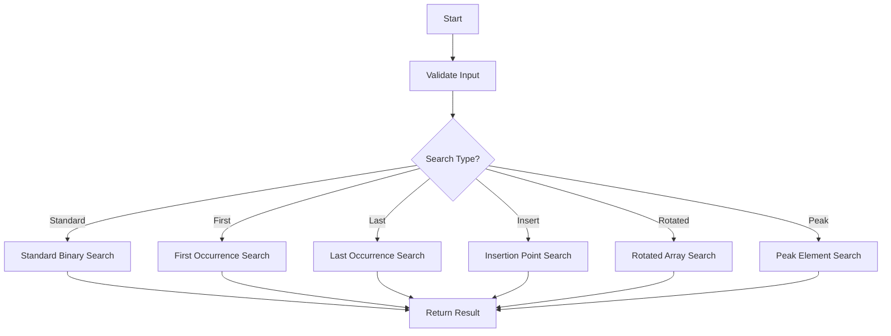

# Binary Search Variations

**Difficulty:** Medium-Advanced  
**Time to Solve:** 25-30 minutes  
**Category:** Advanced Python

---

## Problem Description

Implement a comprehensive binary search system that handles multiple search scenarios beyond the basic binary search. The system should support finding exact matches, first/last occurrences, insertion points, and searching in rotated sorted arrays. This demonstrates advanced understanding of binary search algorithm variations and their applications.

The problem requires implementing:
1. Standard binary search (exact match)
2. Finding first occurrence of a target
3. Finding last occurrence of a target
4. Finding insertion point for a target
5. Searching in rotated sorted array
6. Finding peak element in array

---

## Input Specification

### Standard Binary Search

**Type:** `List[int]`, `int`  
**Format:**
- `arr`: Sorted array of integers (ascending order)
- `target`: Integer to search for

**Constraints:**
- `1 ≤ len(arr) ≤ 10^6`
- `-10^9 ≤ arr[i] ≤ 10^9`
- `-10^9 ≤ target ≤ 10^9`
- Array is sorted in ascending order

### First/Last Occurrence

**Type:** `List[int]`, `int`  
**Format:** Same as standard binary search  
**Constraints:** Array may contain duplicates

### Rotated Array Search

**Type:** `List[int]`, `int`  
**Format:**
- `arr`: Rotated sorted array (originally sorted, then rotated)
- `target`: Integer to search for

**Constraints:**
- Array contains distinct integers
- Array was originally sorted in ascending order, then rotated

---

## Output Specification

### Standard Binary Search

**Type:** `int` or `None`  
**Returns:** Index of target if found, `None` if not found

### First Occurrence

**Type:** `int` or `None`  
**Returns:** Index of first occurrence of target, `None` if not found

### Last Occurrence

**Type:** `int` or `None`  
**Returns:** Index of last occurrence of target, `None` if not found

### Insertion Point

**Type:** `int`  
**Returns:** Index where target should be inserted to maintain sorted order

### Rotated Array Search

**Type:** `int` or `None`  
**Returns:** Index of target if found, `None` if not found

### Peak Element

**Type:** `int`  
**Returns:** Index of any peak element (element greater than neighbors)

---

## Examples

### Example 1: Standard Binary Search

**Input:**
```python
arr = [1, 3, 5, 7, 9, 11, 13]
target = 7
```

**Output:**
```python
3
```

**Explanation:**  
Target 7 is found at index 3 in the sorted array.

---

### Example 2: First Occurrence

**Input:**
```python
arr = [1, 2, 2, 2, 3, 4, 5]
target = 2
```

**Output:**
```python
1
```

**Explanation:**  
The first occurrence of 2 is at index 1 (not index 2 or 3).

---

### Example 3: Last Occurrence

**Input:**
```python
arr = [1, 2, 2, 2, 3, 4, 5]
target = 2
```

**Output:**
```python
3
```

**Explanation:**  
The last occurrence of 2 is at index 3.

---

### Example 4: Insertion Point

**Input:**
```python
arr = [1, 3, 5, 7, 9]
target = 6
```

**Output:**
```python
3
```

**Explanation:**  
6 should be inserted at index 3 to maintain sorted order: [1, 3, 5, 6, 7, 9]

---

### Example 5: Rotated Array Search

**Input:**
```python
arr = [4, 5, 6, 7, 0, 1, 2]
target = 0
```

**Output:**
```python
4
```

**Explanation:**  
Array was rotated from [0, 1, 2, 4, 5, 6, 7]. Target 0 is at index 4.

---

### Example 6: Peak Element

**Input:**
```python
arr = [1, 2, 3, 1]
```

**Output:**
```python
2
```

**Explanation:**  
Element at index 2 (value 3) is a peak (greater than neighbors 2 and 1).

---

## Edge Cases to Consider

1. **Empty array**: Should raise ValueError
2. **Single element**: Should handle correctly
3. **Target not found**: Should return None (or appropriate value)
4. **Target at boundaries**: First or last element
5. **All elements identical**: For first/last occurrence
6. **Target smaller/larger than all elements**: For insertion point
7. **Fully rotated array**: For rotated search
8. **No peak (monotonic array)**: Should return boundary index

---

## Constraints

- Must use binary search algorithm (O(log n) time complexity)
- Space complexity should be O(1) (iterative) or O(log n) (recursive)
- Handle all edge cases gracefully
- No external libraries except standard library
- Array validation required

---

## Solution Approach

### Standard Binary Search
Use two pointers (left, right) and narrow down the search space by comparing middle element with target.

### First/Last Occurrence
Modify standard binary search to continue searching even after finding a match:
- For first: If found, search left half
- For last: If found, search right half

### Insertion Point
Find the leftmost position where target can be inserted while maintaining sorted order.

### Rotated Array Search
1. Find the pivot point (where rotation occurred)
2. Determine which half is sorted
3. Search in the appropriate half

### Peak Element
Use binary search to find any peak by comparing middle element with neighbors and moving towards the larger neighbor.

### Suggested Algorithm Flow



---

## Complexity Requirements

- **Time Complexity:** O(log n) for all operations
- **Space Complexity:** O(1) for iterative, O(log n) for recursive
- **Justification:** Binary search divides search space in half each iteration, resulting in logarithmic time complexity.

---

## Additional Notes

- Consider using iterative approach for better space efficiency
- Handle integer overflow when calculating mid: `mid = left + (right - left) // 2`
- For rotated arrays, identify which half is sorted before searching
- Peak element problem can have multiple valid answers (any peak)

---

## Related Concepts

- Binary search algorithm
- Divide and conquer
- Two-pointer technique
- Array manipulation
- Search algorithms

---

## Testing Hints

1. Test with arrays of size 1, 2, and large arrays
2. Test with target at first, middle, and last positions
3. Test with duplicates for first/last occurrence
4. Test with various rotation points for rotated arrays
5. Test insertion point with targets smaller/larger than all elements
6. Test peak element with various array patterns

---

## Success Criteria

Your solution should:
- [ ] Implement all 6 binary search variations
- [ ] Handle all edge cases correctly
- [ ] Achieve O(log n) time complexity
- [ ] Use O(1) space complexity (iterative approach)
- [ ] Include proper error handling
- [ ] Have comprehensive docstrings with complexity analysis
- [ ] Include type hints
- [ ] Be well-tested with example usage

