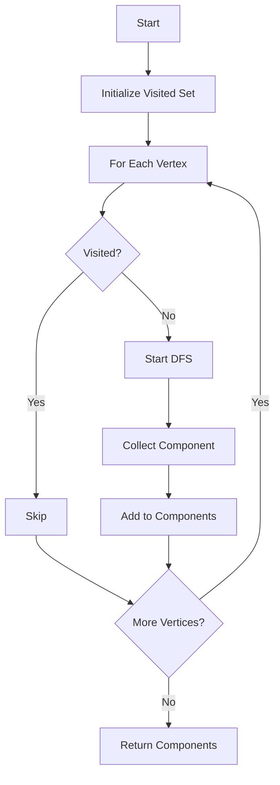

# Connected Components

**Difficulty:** Medium-Advanced  
**Time to Solve:** 20-25 min  
**Category:** Advanced Python

---

## Problem Description

Find all connected components in an undirected graph using DFS. A connected component is a maximal set of vertices where there's a path between any two vertices. This is useful for analyzing graph connectivity and finding isolated subgraphs.

This problem demonstrates understanding of:
- Graph connectivity
- DFS traversal
- Component identification
- Disconnected graphs

---

## Input Specification

- **Type:** `Dict[int, List[int]]`
- **Format:**
  - `graph`: Undirected adjacency list {vertex: [neighbors]}
- **Constraints:**
  - `0 ≤ len(graph) ≤ 1000`
  - `0 ≤ vertex ≤ 1000`
  - Graph is undirected
  - Graph may be disconnected

---

## Output Specification

- **Type:** `List[List[int]]`
- **Format:**
  - List of components, each component is a list of vertices
- **Requirements:**
  - All vertices must be included
  - Each vertex appears in exactly one component
  - Components are maximal (cannot add more vertices)

---

## Examples

### Example 1: Multiple Components
**Input:**
```python
graph = {
    0: [1],
    1: [0],
    2: [3],
    3: [2],
    4: [5],
    5: [4]
}
```

**Output:**
```python
[[0, 1], [2, 3], [4, 5]]
```

**Explanation:**  
Three separate connected components:
- Component 1: vertices 0, 1
- Component 2: vertices 2, 3
- Component 3: vertices 4, 5

---

### Example 2: Single Component
**Input:**
```python
graph = {
    0: [1],
    1: [0, 2],
    2: [1]
}
```

**Output:**
```python
[[0, 1, 2]]
```

**Explanation:**  
All vertices are connected, single component.

---

### Example 3: Isolated Vertices
**Input:**
```python
graph = {
    0: [],
    1: [],
    2: []
}
```

**Output:**
```python
[[0], [1], [2]]
```

**Explanation:**  
Each isolated vertex is its own component.

---

## Edge Cases to Consider

1. **Empty graph:**
   - Expected behavior: Return []

2. **Single vertex:**
   - Expected behavior: Return [[vertex]]

3. **All vertices isolated:**
   - Expected behavior: Each vertex is its own component

4. **Fully connected:**
   - Expected behavior: Single component with all vertices

---

## Constraints

- Must use DFS or BFS
- Must find all components
- Must include all vertices
- Must handle disconnected graphs

---

## Solution Approach

### DFS-Based Algorithm

1. **Initialize**: Visited set, components list
2. **For each unvisited vertex**:
   - Start DFS from vertex
   - Collect all vertices reachable
   - Add as new component
3. **Return**: List of all components

### Algorithm Flow



---

## Complexity Requirements

- **Target Time Complexity:** O(V + E)
- **Target Space Complexity:** O(V)
- **Justification:** Visit each vertex once, check each edge once

---

## Additional Notes

- Classic graph connectivity problem
- Used in network analysis, social networks
- Can be extended to find strongly connected components (directed graphs)
- Union-Find is alternative approach

---

## Related Concepts

- Graph Connectivity
- DFS/BFS Traversal
- Component Analysis
- Union-Find (alternative)

---

## Testing Hints

1. Test with simple disconnected graph
2. Test with single component
3. Test with isolated vertices
4. Test with empty graph
5. Verify all vertices are included

---

## Success Criteria

Your solution should:
- [ ] Find all connected components correctly
- [ ] Use DFS or BFS approach
- [ ] Include all vertices
- [ ] Handle edge cases
- [ ] Include comprehensive docstrings
- [ ] Have proper type hints
- [ ] Include example usage in main()

