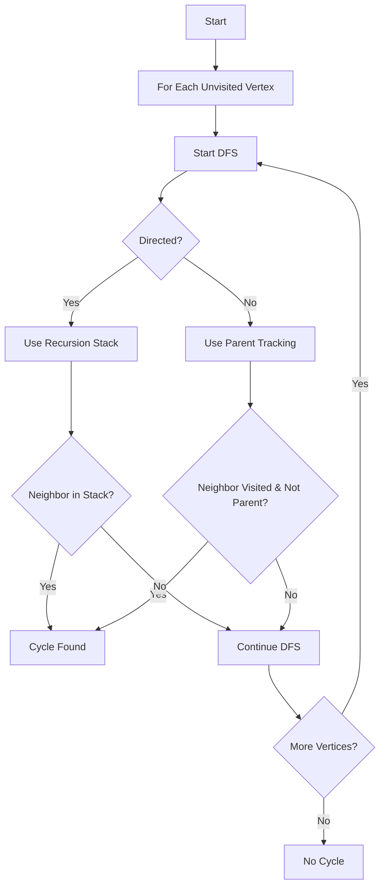

# Cycle Detection

**Difficulty:** Advanced  
**Time to Solve:** 25-30 min  
**Category:** Advanced Python

---

## Problem Description

Detect cycles in directed and undirected graphs using DFS. A cycle exists if there's a path from a vertex back to itself. Different approaches are needed for directed vs undirected graphs.

This problem demonstrates understanding of:
- Graph cycle detection
- DFS with coloring/recursion stack
- Parent tracking for undirected graphs
- Back edges

---

## Input Specification

- **Type:** `Dict[int, List[int]]`
- **Format:**
  - `graph`: Adjacency list {vertex: [neighbors]}
- **Constraints:**
  - `1 ≤ len(graph) ≤ 1000`
  - `0 ≤ vertex ≤ 1000`
  - Graph can be directed or undirected
  - Graph may be disconnected

---

## Output Specification

- **Type:** `bool`
- **Format:**
  - True if cycle exists, False otherwise
- **Requirements:**
  - Must correctly detect cycles in both directed and undirected graphs
  - Must handle disconnected graphs

---

## Examples

### Example 1: Directed Graph with Cycle
**Input:**
```python
graph = {
    0: [1],
    1: [2],
    2: [0]  # Cycle: 0 -> 1 -> 2 -> 0
}
```

**Output:**
```python
True
```

**Explanation:**  
There's a cycle: 0 → 1 → 2 → 0

---

### Example 2: Directed Graph without Cycle
**Input:**
```python
graph = {
    0: [1],
    1: [2],
    2: []
}
```

**Output:**
```python
False
```

**Explanation:**  
No cycle exists, it's a DAG.

---

### Example 3: Undirected Graph with Cycle
**Input:**
```python
graph = {
    0: [1, 2],
    1: [0, 2],  # Cycle: 0 - 1 - 2 - 0
    2: [0, 1]
}
```

**Output:**
```python
True
```

**Explanation:**  
Triangle forms a cycle.

---

## Edge Cases to Consider

1. **Self-loop:**
   - Expected behavior: Return True (cycle)

2. **No edges:**
   - Expected behavior: Return False

3. **Single vertex:**
   - Expected behavior: Return False (unless self-loop)

4. **Disconnected graph:**
   - Expected behavior: Check all components

---

## Constraints

- Must use DFS approach
- Must handle both directed and undirected graphs
- Must handle disconnected graphs
- Must be efficient

---

## Solution Approach

### Directed Graph (Recursion Stack)

1. **Three states**: White (unvisited), Gray (in recursion stack), Black (processed)
2. **DFS**: If neighbor is Gray, back edge found → cycle exists
3. **Mark**: Remove from recursion stack when backtracking

### Undirected Graph (Parent Tracking)

1. **Two states**: Visited, Unvisited
2. **DFS**: If neighbor is visited and not parent, back edge found → cycle exists
3. **Track**: Pass parent to avoid false positives

### Algorithm Flow



---

## Complexity Requirements

- **Target Time Complexity:** O(V + E)
- **Target Space Complexity:** O(V)
- **Justification:** Visit each vertex once, check each edge once

---

## Additional Notes

- Classic graph problem
- Used in topological sort, DAG validation
- Different algorithms for directed vs undirected
- Union-Find can also detect cycles in undirected graphs

---

## Related Concepts

- Graph Cycles
- DFS Coloring
- Back Edges
- Recursion Stack
- Union-Find (alternative for undirected)

---

## Testing Hints

1. Test with simple cycles first
2. Test directed vs undirected separately
3. Test with self-loops
4. Test with disconnected graphs
5. Test with trees (no cycles)

---

## Success Criteria

Your solution should:
- [ ] Detect cycles in directed graphs
- [ ] Detect cycles in undirected graphs
- [ ] Use DFS approach
- [ ] Handle edge cases (self-loops, disconnected)
- [ ] Include comprehensive docstrings
- [ ] Have proper type hints
- [ ] Include example usage in main()

