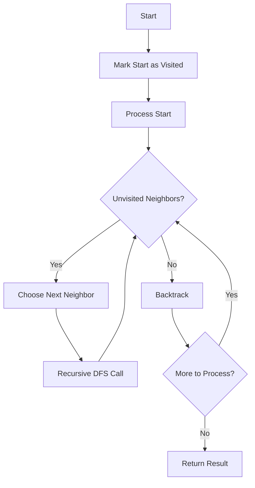

# DFS Traversal

**Difficulty:** Medium  
**Time to Solve:** 20-25 min  
**Category:** Advanced Python

---

## Problem Description

Implement Depth-First Search (DFS) traversal for graphs. DFS explores as far as possible along each branch before backtracking. It uses either recursion (implicit stack) or an explicit stack data structure.

This problem demonstrates understanding of:
- Graph traversal algorithms
- Stack data structure / recursion
- Backtracking concepts

---

## Input Specification

- **Type:** `Dict[int, List[int]]`, `int`
- **Format:**
  - `graph`: Adjacency list representation {vertex: [neighbors]}
  - `start`: Starting vertex for traversal
- **Constraints:**
  - `1 ≤ len(graph) ≤ 1000`
  - `0 ≤ vertex ≤ 1000`
  - Graph can be directed or undirected
  - Graph may be disconnected

---

## Output Specification

- **Type:** `List[int]`
- **Format:**
  - List of vertices visited in DFS order
- **Requirements:**
  - Start vertex must be first
  - Only vertices reachable from start are included
  - Order may vary based on implementation

---

## Examples

### Example 1: Basic DFS
**Input:**
```python
graph = {
    0: [1, 2],
    1: [0, 3, 4],
    2: [0, 5],
    3: [1],
    4: [1],
    5: [2]
}
start = 0
```

**Output:**
```python
[0, 1, 3, 4, 2, 5]  # One possible DFS order
```

**Explanation:**  
DFS explores deeply before backtracking:
- Start at 0
- Go to 1, then 3 (deep), backtrack to 1, go to 4
- Backtrack to 0, go to 2, then 5

---

### Example 2: Disconnected Graph
**Input:**
```python
graph = {
    0: [1],
    1: [0],
    2: [3],
    3: [2]
}
start = 0
```

**Output:**
```python
[0, 1]
```

**Explanation:**  
Only vertices in the connected component containing vertex 0 are visited.

---

## Edge Cases to Consider

1. **Single vertex:**
   - Expected behavior: Return [start]

2. **Disconnected graph:**
   - Expected behavior: Return only vertices reachable from start

3. **Start vertex not in graph:**
   - Expected behavior: Raise ValueError

4. **Empty graph:**
   - Expected behavior: Raise ValueError if start not found

---

## Constraints

- Must use stack (recursive or iterative)
- Must handle disconnected graphs
- Must visit each vertex at most once
- Can implement both recursive and iterative versions

---

## Solution Approach

### DFS Algorithm (Recursive)

1. **Mark current vertex as visited**
2. **Process current vertex**
3. **For each unvisited neighbor**:
   - Recursively call DFS
4. **Backtrack** when no more neighbors

### DFS Algorithm (Iterative)

1. **Initialize**: Stack with start vertex, visited set
2. **While stack not empty**:
   - Pop vertex
   - Mark as visited
   - Push all unvisited neighbors
3. **Return**: List of visited vertices

### Algorithm Flow



---

## Complexity Requirements

- **Target Time Complexity:** O(V + E)
- **Target Space Complexity:** O(V) for recursion stack or explicit stack
- **Justification:** Visit each vertex once, check each edge once

---

## Additional Notes

- Classic graph traversal algorithm
- Used in many applications (path finding, cycle detection, topological sort)
- Recursive version is simpler but may cause stack overflow for deep graphs
- Iterative version uses explicit stack, more control over memory

---

## Related Concepts

- Graph Traversal
- Stack Data Structure
- Recursion
- Backtracking

---

## Testing Hints

1. Test with simple connected graph
2. Test with disconnected graph
3. Test with single vertex
4. Compare recursive vs iterative results
5. Test with directed and undirected graphs

---

## Success Criteria

Your solution should:
- [ ] Perform DFS traversal correctly
- [ ] Use stack/recursion
- [ ] Handle disconnected graphs
- [ ] Handle edge cases
- [ ] Include both recursive and iterative versions (optional)
- [ ] Include comprehensive docstrings
- [ ] Have proper type hints
- [ ] Include example usage in main()

