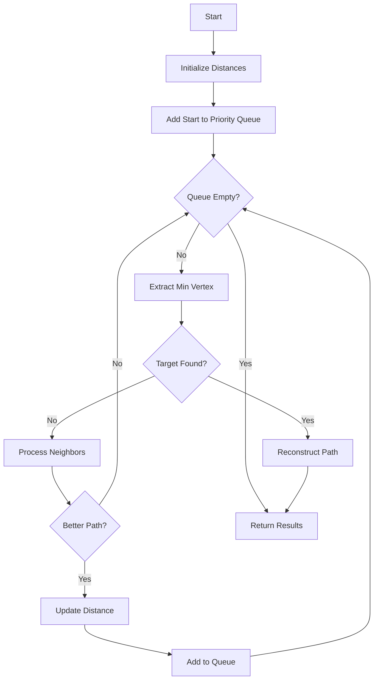

# Dijkstra's Shortest Path

**Difficulty:** Advanced  
**Time to Solve:** 30-35 min  
**Category:** Advanced Python

---

## Problem Description

Implement Dijkstra's algorithm to find shortest paths from a source vertex to all other vertices in a weighted graph. Dijkstra's algorithm works for graphs with non-negative edge weights and uses a priority queue (min-heap) to efficiently find the shortest paths.

This problem demonstrates understanding of:
- Greedy algorithms
- Priority queues (heaps)
- Shortest path algorithms
- Path reconstruction

---

## Input Specification

- **Type:** `Dict[int, List[Tuple[int, float]]]`, `int`, `Optional[int]`
- **Format:**
  - `graph`: Weighted adjacency list {vertex: [(neighbor, weight), ...]}
  - `start`: Source vertex
  - `target`: Optional target vertex (None for all shortest paths)
- **Constraints:**
  - `1 ≤ len(graph) ≤ 1000`
  - `0 ≤ vertex ≤ 1000`
  - `weight ≥ 0` (non-negative)
  - Graph can be directed or undirected

---

## Output Specification

- **Type:** `Union[Dict[int, float], Tuple[List[int], float]]`
- **Format:**
  - If target is None: Dictionary of {vertex: shortest_distance}
  - If target provided: Tuple of (path, distance) or ([], inf) if no path
- **Requirements:**
  - Distances must be shortest possible
  - Path must be valid sequence of vertices

---

## Examples

### Example 1: Shortest Path to Target
**Input:**
```python
graph = {
    0: [(1, 4), (2, 1)],
    1: [(3, 1)],
    2: [(1, 2), (3, 5)],
    3: []
}
start = 0
target = 3
```

**Output:**
```python
([0, 2, 1, 3], 4)
```

**Explanation:**  
Shortest path: 0→2→1→3 with total distance 1+2+1=4
(Alternative path 0→1→3 has distance 4+1=5, longer)

---

### Example 2: All Shortest Paths
**Input:**
```python
graph = {
    0: [(1, 4), (2, 1)],
    1: [(3, 1)],
    2: [(1, 2), (3, 5)],
    3: []
}
start = 0
target = None
```

**Output:**
```python
{0: 0, 1: 3, 2: 1, 3: 4}
```

**Explanation:**  
Shortest distances from vertex 0 to all vertices.

---

## Edge Cases to Consider

1. **No path exists:**
   - Expected behavior: Return ([], inf) or distance = inf

2. **Start equals target:**
   - Expected behavior: Return ([start], 0)

3. **Negative weights:**
   - Expected behavior: Raise ValueError

4. **Isolated vertex:**
   - Expected behavior: Distance remains inf

---

## Constraints

- Must use priority queue (heap)
- Must handle non-negative weights only
- Must reconstruct path when target specified
- Must be efficient for large graphs

---

## Solution Approach

### Dijkstra's Algorithm

1. **Initialize**: Distance[start] = 0, all others = inf
2. **Priority Queue**: Add (0, start) to min-heap
3. **While queue not empty**:
   - Extract vertex with minimum distance
   - For each neighbor:
     - Calculate new distance
     - If better, update distance and add to queue
4. **Reconstruction**: Trace back using previous pointers

### Algorithm Flow



---

## Complexity Requirements

- **Target Time Complexity:** O((V + E) log V)
- **Target Space Complexity:** O(V)
- **Justification:** Priority queue operations are O(log V), done for each vertex/edge

---

## Additional Notes

- Classic shortest path algorithm
- Greedy approach - always processes closest unvisited vertex
- Cannot handle negative weights (use Bellman-Ford instead)
- Used in routing, network analysis, GPS navigation

---

## Related Concepts

- Greedy Algorithms
- Priority Queues
- Shortest Path Problems
- Graph Algorithms

---

## Testing Hints

1. Test with simple graph first
2. Verify path reconstruction is correct
3. Test with no path exists
4. Test with start = target
5. Verify distances are optimal

---

## Success Criteria

Your solution should:
- [ ] Find shortest paths correctly
- [ ] Use priority queue (heap)
- [ ] Reconstruct paths when needed
- [ ] Handle edge cases (no path, negative weights)
- [ ] Include comprehensive docstrings
- [ ] Have proper type hints
- [ ] Include example usage in main()

