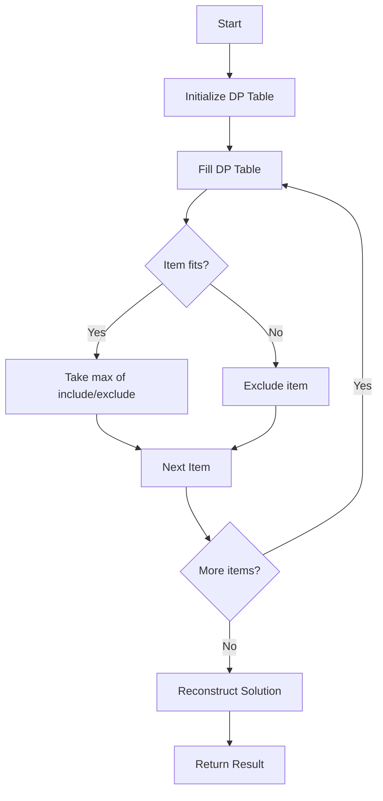

# 0/1 Knapsack Problem

**Difficulty:** Advanced  
**Time to Solve:** 25-30 min  
**Category:** Advanced Python

---

## Problem Description

Solve the classic 0/1 Knapsack problem using dynamic programming. Given a set of items, each with a weight and a value, determine the maximum value that can be obtained by selecting items such that the total weight does not exceed a given capacity. Each item can be selected at most once (0/1).

This problem demonstrates understanding of:
- Dynamic programming with tabulation
- Optimal substructure property
- Solution reconstruction from DP table

---

## Input Specification

- **Type:** `List[int]`, `List[int]`, `int`
- **Format:**
  - `weights`: List of item weights (non-negative integers)
  - `values`: List of item values (non-negative integers)
  - `capacity`: Maximum weight capacity (non-negative integer)
- **Constraints:**
  - `len(weights) == len(values)`
  - `1 ≤ len(weights) ≤ 1000`
  - `0 ≤ weights[i] ≤ 1000`
  - `0 ≤ values[i] ≤ 1000`
  - `0 ≤ capacity ≤ 10000`

---

## Output Specification

- **Type:** `Tuple[int, List[int]]`
- **Format:**
  - First element: Maximum value achievable
  - Second element: List of indices of selected items
- **Requirements:**
  - Selected items must fit within capacity
  - Solution must be optimal

---

## Examples

### Example 1: Basic Case
**Input:**
```python
weights = [1, 3, 4, 5]
values = [1, 4, 5, 7]
capacity = 7
```

**Output:**
```python
(9, [0, 1, 2])
```

**Explanation:**  
Selecting items at indices 0, 1, and 2 gives:
- Total weight: 1 + 3 + 4 = 8 (exceeds capacity 7)
- Wait, let me recalculate: items 0, 1, 2 have weights 1, 3, 4 = 8
- Actually, selecting items 0, 1, 2: weights 1+3+4=8 > 7
- Correct selection: items 0, 1 (weights 1+3=4 ≤ 7, values 1+4=5)
- Or items 0, 2 (weights 1+4=5 ≤ 7, values 1+5=6)
- Best: items 1, 2 (weights 3+4=7 ≤ 7, values 4+5=9) ✓

---

### Example 2: Single Item
**Input:**
```python
weights = [5]
values = [10]
capacity = 3
```

**Output:**
```python
(0, [])
```

**Explanation:**  
The single item (weight 5) exceeds capacity (3), so no items can be selected.

---

### Example 3: All Items Fit
**Input:**
```python
weights = [2, 3, 1]
values = [10, 20, 5]
capacity = 10
```

**Output:**
```python
(35, [0, 1, 2])
```

**Explanation:**  
All items fit within capacity, so select all for maximum value.

---

## Edge Cases to Consider

1. **Empty input:**
   - Expected behavior: Return (0, [])

2. **Capacity is 0:**
   - Expected behavior: Return (0, []) - no items can be selected

3. **All items exceed capacity:**
   - Expected behavior: Return (0, [])

4. **Single item fits:**
   - Expected behavior: Return (value, [0])

5. **Weights and values have different lengths:**
   - Expected behavior: Raise ValueError

---

## Constraints

- Must use dynamic programming (tabulation or memoization)
- Must reconstruct the solution path (which items were selected)
- Must handle edge cases gracefully
- Solution must be optimal

---

## Solution Approach

### Dynamic Programming Strategy

1. **State Definition**: `dp[i][w]` = maximum value achievable with first `i` items and capacity `w`
2. **Base Case**: `dp[0][w] = 0` for all `w` (no items)
3. **Recurrence Relation**:
   - If `weights[i-1] <= w`: `dp[i][w] = max(dp[i-1][w], dp[i-1][w-weights[i-1]] + values[i-1])`
   - Otherwise: `dp[i][w] = dp[i-1][w]`
4. **Reconstruction**: Trace back through DP table to find selected items

### Algorithm Flow



---

## Complexity Requirements

- **Target Time Complexity:** O(n * capacity)
- **Target Space Complexity:** O(n * capacity) for tabulation
- **Optimization:** Can be optimized to O(capacity) space using 1D array
- **Justification:** Must consider each item and each possible capacity

---

## Additional Notes

- Classic DP problem demonstrating optimal substructure
- Can be optimized to O(capacity) space by using rolling array
- Solution reconstruction requires O(n) additional time
- Consider space-time tradeoff for large capacity values

---

## Related Concepts

- Dynamic Programming
- Optimal Substructure
- Knapsack Variants (Unbounded, Fractional)
- Resource Allocation
- Optimization Problems

---

## Testing Hints

1. Test with small examples first
2. Verify solution reconstruction is correct
3. Test edge cases (empty, capacity 0, all items too heavy)
4. Test with items that have same weight but different values
5. Test with items that have same value but different weights

---

## Success Criteria

Your solution should:
- [ ] Solve knapsack problem correctly
- [ ] Use dynamic programming approach
- [ ] Reconstruct solution path
- [ ] Handle all edge cases
- [ ] Include comprehensive docstrings
- [ ] Have proper type hints
- [ ] Include example usage in main()

