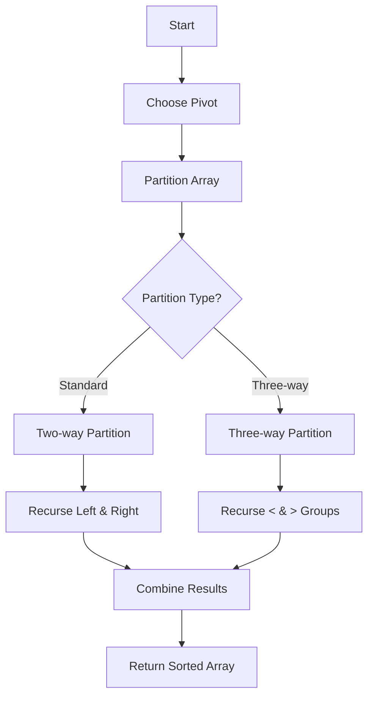

# Quick Sort Implementation

**Difficulty:** Medium-Advanced  
**Time to Solve:** 25-30 minutes  
**Category:** Advanced Python

---

## Problem Description

Implement a comprehensive quick sort system that handles multiple sorting scenarios and variations. The system should support standard quicksort, randomized quicksort, three-way partition for duplicates, and custom comparator functions. This demonstrates advanced understanding of divide-and-conquer algorithms, pivot selection strategies, and optimization techniques.

The problem requires implementing:
1. Standard quicksort (in-place)
2. Randomized quicksort (with random pivot selection)
3. Three-way partition quicksort (for arrays with many duplicates)
4. Quicksort with custom comparator
5. Finding kth smallest element using quicksort partition
6. Performance comparison utilities

---

## Input Specification

### Standard Quick Sort

**Type:** `List[int]` or `List[Any]`  
**Format:**
- `arr`: Array of comparable elements

**Constraints:**
- `1 ≤ len(arr) ≤ 10^6`
- Elements must be comparable (support `<`, `>`, `==`)

### Randomized Quick Sort

**Type:** `List[int]`  
**Format:** Same as standard quicksort  
**Constraints:** Same as standard

### Three-Way Partition

**Type:** `List[int]`  
**Format:** Array that may contain many duplicates  
**Constraints:** Same as standard

### Custom Comparator

**Type:** `List[Any]`, `Callable`  
**Format:**
- `arr`: Array of elements
- `comparator`: Function that takes two elements and returns comparison result

**Constraints:**
- Comparator function must return: `-1` (first < second), `0` (equal), `1` (first > second)

### Kth Smallest Element

**Type:** `List[int]`, `int`  
**Format:**
- `arr`: Array of integers
- `k`: Position (1-indexed)

**Constraints:**
- `1 ≤ k ≤ len(arr)`
- Array may contain duplicates

---

## Output Specification

### Standard/Randomized/Three-Way Quick Sort

**Type:** `List[int]` (modified in-place)  
**Returns:** Sorted array (same reference, modified in-place)

### Custom Comparator Sort

**Type:** `List[Any]` (modified in-place)  
**Returns:** Sorted array according to comparator

### Kth Smallest Element

**Type:** `int`  
**Returns:** The kth smallest element in the array

---

## Examples

### Example 1: Standard Quick Sort

**Input:**
```python
arr = [64, 34, 25, 12, 22, 11, 90]
```

**Output:**
```python
[11, 12, 22, 25, 34, 64, 90]
```

**Explanation:**  
Array is sorted in ascending order using quicksort algorithm.

---

### Example 2: Randomized Quick Sort

**Input:**
```python
arr = [5, 2, 8, 1, 9, 3]
```

**Output:**
```python
[1, 2, 3, 5, 8, 9]
```

**Explanation:**  
Array is sorted using randomized pivot selection to avoid worst-case O(n²) performance.

---

### Example 3: Three-Way Partition

**Input:**
```python
arr = [2, 1, 2, 1, 2, 1, 2]
```

**Output:**
```python
[1, 1, 1, 2, 2, 2, 2]
```

**Explanation:**  
Three-way partition efficiently handles many duplicates by grouping equal elements together.

---

### Example 4: Custom Comparator

**Input:**
```python
arr = [("apple", 3), ("banana", 2), ("cherry", 5)]
comparator = lambda a, b: -1 if a[1] < b[1] else (1 if a[1] > b[1] else 0)
```

**Output:**
```python
[("banana", 2), ("apple", 3), ("cherry", 5)]
```

**Explanation:**  
Array is sorted by the second element (count) in ascending order.

---

### Example 5: Kth Smallest Element

**Input:**
```python
arr = [7, 10, 4, 3, 20, 15]
k = 3
```

**Output:**
```python
7
```

**Explanation:**  
The 3rd smallest element is 7 (sorted: [3, 4, 7, 10, 15, 20]).

---

## Edge Cases to Consider

1. **Empty array**: Should handle gracefully or raise ValueError
2. **Single element**: Should return as-is
3. **Already sorted**: Should handle efficiently
4. **Reverse sorted**: Should handle efficiently
5. **All elements identical**: Should handle efficiently
6. **Large array**: Should complete in reasonable time
7. **Invalid k**: For kth smallest, should raise ValueError if k out of range

---

## Constraints

- Must use quicksort algorithm (divide-and-conquer)
- Average time complexity: O(n log n)
- Space complexity: O(log n) for recursion stack
- In-place sorting preferred (minimal extra space)
- Handle edge cases gracefully
- No external libraries except standard library

---

## Solution Approach

### Standard Quick Sort
1. Choose a pivot element
2. Partition array: elements < pivot, pivot, elements > pivot
3. Recursively sort left and right partitions

### Randomized Quick Sort
1. Randomly select pivot to avoid worst-case
2. Same partition and recursive process

### Three-Way Partition
1. Partition into three groups: < pivot, = pivot, > pivot
2. Only recursively sort the < and > groups

### Kth Smallest Element
1. Use partition to find pivot position
2. If pivot position == k-1, return pivot
3. Otherwise, recurse on appropriate partition

### Suggested Algorithm Flow



---

## Complexity Requirements

- **Average Time Complexity:** O(n log n)
- **Worst Case Time Complexity:** O(n²) for standard, O(n log n) for randomized
- **Space Complexity:** O(log n) for recursion stack
- **Justification:** 
  - Average case: Each partition divides array roughly in half
  - Worst case: Already sorted array with bad pivot choice
  - Randomized pivot avoids worst case with high probability

---

## Additional Notes

- Use Hoare or Lomuto partition scheme
- For three-way partition, use Dutch National Flag algorithm
- Consider iterative implementation to reduce stack space
- Random pivot selection improves average performance
- Three-way partition is optimal for arrays with many duplicates

---

## Related Concepts

- Divide and conquer algorithms
- Partition algorithms
- Randomized algorithms
- In-place sorting
- Recursion and iteration
- Pivot selection strategies

---

## Testing Hints

1. Test with arrays of size 1, 2, and large arrays
2. Test with already sorted arrays (ascending and descending)
3. Test with arrays containing many duplicates
4. Test with arrays containing all identical elements
5. Test kth smallest with various k values
6. Test custom comparator with different data types
7. Test edge cases (empty, single element)

---

## Success Criteria

Your solution should:
- [ ] Implement all 6 quicksort variations
- [ ] Handle all edge cases correctly
- [ ] Achieve O(n log n) average time complexity
- [ ] Use O(log n) space complexity
- [ ] Include proper error handling
- [ ] Have comprehensive docstrings with complexity analysis
- [ ] Include type hints
- [ ] Be well-tested with example usage

