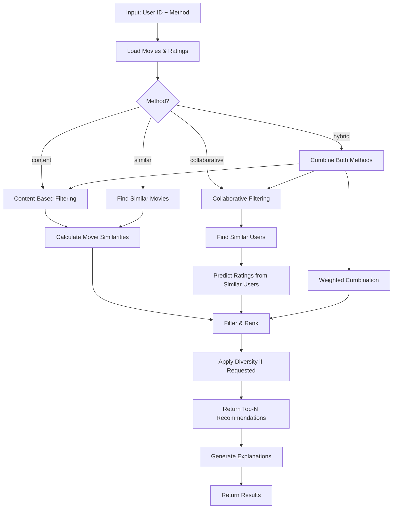

# Movie Recommendation System

**Difficulty:** Advanced  
**Time to Solve:** 35-40 minutes  
**Category:** Advanced Python

---

## Problem Description

Recommendation systems are crucial components in modern applications like e-commerce, streaming platforms, and social media. This problem simulates building a recommendation engine for a movie streaming platform, demonstrating both content-based and collaborative filtering approaches.

Build a comprehensive movie recommendation system that:
1. Implements **content-based filtering** using movie features (genres, directors, actors, ratings)
2. Implements **collaborative filtering** using user preferences and similarity metrics
3. Combines both approaches for hybrid recommendations
4. Handles cold start problems (new users, new movies)
5. Provides personalized recommendations with confidence scores

The system should:
- Calculate similarity between movies based on content features
- Calculate similarity between users based on rating patterns
- Generate recommendations using both filtering approaches
- Handle missing data and sparse user-item matrices
- Support different recommendation strategies (top-N, diverse, similar items)
- Provide explanation for recommendations
- Handle edge cases (new users, new movies, no ratings)

---

## Input Specification

### Movie Data

**Type:** List of Dictionaries  
**Format:**
```python
[
    {
        "movie_id": int,  # Unique movie identifier
        "title": str,  # Movie title
        "genres": list[str],  # List of genres (e.g., ["Action", "Adventure", "Sci-Fi"])
        "director": str,  # Director name
        "actors": list[str],  # List of main actors
        "year": int,  # Release year
        "rating": float,  # Average rating (0.0-10.0)
        "description": str  # Movie description (optional)
    }
]
```

### User Ratings Data

**Type:** List of Dictionaries  
**Format:**
```python
[
    {
        "user_id": int,  # Unique user identifier
        "movie_id": int,  # Movie identifier
        "rating": float  # User rating (1.0-5.0)
    }
]
```

### Recommendation Request

**Type:** Dictionary/JSON Object  
**Format:**
```python
{
    "user_id": int (required),  # User ID for personalized recommendations
    "method": str (optional),  # "content", "collaborative", "hybrid" (default: "hybrid")
    "top_n": int (optional),  # Number of recommendations (default: 10)
    "min_rating": float (optional),  # Minimum rating threshold (default: 3.0)
    "exclude_rated": bool (optional),  # Exclude already rated movies (default: True)
    "diversity": bool (optional),  # Include diversity in recommendations (default: False)
    "movie_id": int (optional)  # For "similar movies" recommendation
}
```

**Constraints:**
- `user_id`: Valid user ID in ratings data
- `method`: One of ["content", "collaborative", "hybrid", "similar"]
- `top_n`: Integer between 1-100
- `min_rating`: Float between 1.0-5.0
- `movie_id`: Valid movie ID (required for "similar" method)

---

## Output Specification

### Recommendation Response

**Type:** Dictionary/JSON Object  
**Format:**
```python
{
    "user_id": int,
    "method": str,  # Method used for recommendations
    "recommendations": [
        {
            "movie_id": int,
            "title": str,
            "predicted_rating": float,  # Predicted rating for user
            "confidence_score": float,  # Confidence in recommendation (0.0-1.0)
            "reason": str,  # Explanation for recommendation
            "similarity_score": float  # Similarity score (for content-based)
        }
    ],
    "metadata": {
        "total_candidates": int,  # Total movies considered
        "filtered_candidates": int,  # Movies after filtering
        "computation_time": float,  # Time taken in seconds
        "cold_start": bool  # Whether cold start handling was used
    },
    "warnings": list[str]
}
```

### Similar Movies Response

**Type:** Dictionary/JSON Object  
**Format:**
```python
{
    "movie_id": int,
    "title": str,
    "similar_movies": [
        {
            "movie_id": int,
            "title": str,
            "similarity_score": float,  # Similarity score (0.0-1.0)
            "common_features": list[str]  # Shared features (genres, actors, etc.)
        }
    ],
    "metadata": {
        "total_movies": int,
        "computation_time": float
    }
}
```

---

## Examples

### Example 1: Content-Based Recommendations

**Input:**
```python
movies = [
    {
        "movie_id": 1,
        "title": "The Matrix",
        "genres": ["Action", "Sci-Fi"],
        "director": "Wachowski Brothers",
        "actors": ["Keanu Reeves", "Laurence Fishburne"],
        "year": 1999,
        "rating": 8.7
    },
    {
        "movie_id": 2,
        "title": "Inception",
        "genres": ["Action", "Sci-Fi", "Thriller"],
        "director": "Christopher Nolan",
        "actors": ["Leonardo DiCaprio", "Marion Cotillard"],
        "year": 2010,
        "rating": 8.8
    },
    {
        "movie_id": 3,
        "title": "The Godfather",
        "genres": ["Crime", "Drama"],
        "director": "Francis Ford Coppola",
        "actors": ["Marlon Brando", "Al Pacino"],
        "year": 1972,
        "rating": 9.2
    }
]

ratings = [
    {"user_id": 1, "movie_id": 1, "rating": 5.0},
    {"user_id": 1, "movie_id": 2, "rating": 4.5}
]

request = {
    "user_id": 1,
    "method": "content",
    "top_n": 5
}
```

**Output:**
```python
{
    "user_id": 1,
    "method": "content",
    "recommendations": [
        {
            "movie_id": 2,
            "title": "Inception",
            "predicted_rating": 4.75,
            "confidence_score": 0.85,
            "reason": "Similar genres: Action, Sci-Fi. Similar director style.",
            "similarity_score": 0.75
        },
        {
            "movie_id": 3,
            "title": "The Godfather",
            "predicted_rating": 3.2,
            "confidence_score": 0.45,
            "reason": "Different genre, but high overall rating.",
            "similarity_score": 0.25
        }
    ],
    "metadata": {
        "total_candidates": 3,
        "filtered_candidates": 2,
        "computation_time": 0.05,
        "cold_start": False
    },
    "warnings": []
}
```

### Example 2: Collaborative Filtering Recommendations

**Input:**
```python
ratings = [
    {"user_id": 1, "movie_id": 1, "rating": 5.0},
    {"user_id": 1, "movie_id": 2, "rating": 4.0},
    {"user_id": 2, "movie_id": 1, "rating": 4.5},
    {"user_id": 2, "movie_id": 2, "rating": 5.0},
    {"user_id": 2, "movie_id": 3, "rating": 4.5},
    {"user_id": 3, "movie_id": 1, "rating": 3.0},
    {"user_id": 3, "movie_id": 3, "rating": 4.0}
]

request = {
    "user_id": 1,
    "method": "collaborative",
    "top_n": 3
}
```

**Output:**
```python
{
    "user_id": 1,
    "method": "collaborative",
    "recommendations": [
        {
            "movie_id": 3,
            "title": "The Godfather",
            "predicted_rating": 4.5,
            "confidence_score": 0.78,
            "reason": "Users with similar preferences (user_id: 2) rated this highly.",
            "similarity_score": 0.0
        }
    ],
    "metadata": {
        "total_candidates": 3,
        "filtered_candidates": 1,
        "computation_time": 0.08,
        "cold_start": False
    },
    "warnings": []
}
```

### Example 3: Hybrid Recommendations

**Input:**
```python
request = {
    "user_id": 1,
    "method": "hybrid",
    "top_n": 5,
    "min_rating": 3.5
}
```

**Output:**
```python
{
    "user_id": 1,
    "method": "hybrid",
    "recommendations": [
        {
            "movie_id": 3,
            "title": "The Godfather",
            "predicted_rating": 4.2,
            "confidence_score": 0.82,
            "reason": "Combined: Similar users liked it (collaborative) + High quality content (content-based).",
            "similarity_score": 0.35
        }
    ],
    "metadata": {
        "total_candidates": 3,
        "filtered_candidates": 1,
        "computation_time": 0.12,
        "cold_start": False
    },
    "warnings": []
}
```

### Example 4: Similar Movies (Content-Based)

**Input:**
```python
request = {
    "movie_id": 1,
    "method": "similar",
    "top_n": 5
}
```

**Output:**
```python
{
    "movie_id": 1,
    "title": "The Matrix",
    "similar_movies": [
        {
            "movie_id": 2,
            "title": "Inception",
            "similarity_score": 0.75,
            "common_features": ["Action", "Sci-Fi"]
        },
        {
            "movie_id": 3,
            "title": "The Godfather",
            "similarity_score": 0.15,
            "common_features": []
        }
    ],
    "metadata": {
        "total_movies": 3,
        "computation_time": 0.03
    }
}
```

### Example 5: Cold Start Problem (New User)

**Input:**
```python
request = {
    "user_id": 999,  # New user with no ratings
    "method": "hybrid",
    "top_n": 10
}
```

**Output:**
```python
{
    "user_id": 999,
    "method": "hybrid",
    "recommendations": [
        {
            "movie_id": 3,
            "title": "The Godfather",
            "predicted_rating": 4.5,
            "confidence_score": 0.65,
            "reason": "Popular item: High average rating (9.2). Cold start fallback.",
            "similarity_score": 0.0
        }
    ],
    "metadata": {
        "total_candidates": 3,
        "filtered_candidates": 3,
        "computation_time": 0.15,
        "cold_start": True
    },
    "warnings": [
        "User has no ratings. Using popularity-based recommendations."
    ]
}
```

---

## Edge Cases

1. **New user (cold start)** - No ratings available, use popularity-based recommendations
2. **New movie (cold start)** - No ratings available, use content-based similarity
3. **Sparse ratings matrix** - Very few ratings, handle gracefully with similarity thresholds
4. **User with all movies rated** - No recommendations possible, return empty list
5. **No similar users** - Fallback to content-based or popularity
6. **Identical movies** - Handle duplicate or near-duplicate content
7. **Missing movie features** - Handle missing genres, actors, etc.
8. **Zero ratings** - Handle movies/users with no ratings
9. **Extreme ratings** - Handle users who rate everything 1 or 5
10. **Single genre movies** - Handle movies with only one genre
11. **Large dataset** - Efficient computation for large user-item matrices
12. **Invalid user/movie IDs** - Handle gracefully with appropriate errors

---

## Constraints

- Must implement both content-based and collaborative filtering algorithms
- Use cosine similarity or Jaccard similarity for feature-based comparisons
- Use Pearson correlation or cosine similarity for user-based collaborative filtering
- Handle sparse matrices efficiently
- Support at least 1000 movies and 100 users
- Provide confidence scores for recommendations
- Include explanation/reasoning for each recommendation
- Handle cold start problems gracefully
- Include example usage in `main()` function
- Optimize for reasonable performance (recommendations in < 1 second for typical datasets)

---

## Solution Approach

### High-Level Flow



### Key Components

1. **Content-Based Filtering**
   - Feature extraction from movie metadata (genres, actors, director, year)
   - Vectorization of movie features
   - Cosine similarity calculation between movies
   - Recommendation based on user's rated movies

2. **Collaborative Filtering**
   - User-item rating matrix construction
   - User similarity calculation (Pearson correlation or cosine similarity)
   - Rating prediction using weighted average of similar users' ratings
   - Handling sparse matrices

3. **Hybrid Approach**
   - Combine content-based and collaborative scores
   - Weighted combination (configurable weights)
   - Fallback strategies for cold start

4. **Cold Start Handling**
   - New user: Use popularity-based recommendations
   - New movie: Use content-based similarity
   - Hybrid: Combine both fallback strategies

5. **Similarity Metrics**
   - Cosine similarity for feature vectors
   - Jaccard similarity for set-based features (genres, actors)
   - Pearson correlation for user ratings
   - Weighted combinations for multiple features

6. **Recommendation Ranking**
   - Score calculation (predicted rating × confidence)
   - Diversity filtering (optional)
   - Top-N selection

---

## Complexity Requirements

- **Time Complexity:** O(n × m) where n = number of movies, m = number of users
- **Space Complexity:** O(n × m) for rating matrix, O(n × f) for feature matrix (f = features)
- **Optimization:** Use sparse matrices and efficient similarity calculations

---

## Implementation Notes

### Content-Based Filtering
- Extract features: genres (set), actors (set), director (string), year (numeric)
- Create feature vectors for each movie
- Calculate similarity using cosine similarity or Jaccard index
- Recommend movies similar to user's highly-rated movies

### Collaborative Filtering
- Build user-item rating matrix
- Calculate user-user similarity (Pearson correlation or cosine)
- Predict ratings: weighted average of similar users' ratings
- Handle missing ratings (sparse matrix)

### Similarity Calculations
- **Cosine Similarity**: For feature vectors
  - Formula: cos(θ) = (A · B) / (||A|| × ||B||)
- **Jaccard Similarity**: For sets (genres, actors)
  - Formula: J(A, B) = |A ∩ B| / |A ∪ B|
- **Pearson Correlation**: For user ratings
  - Formula: r = Σ((x - x̄)(y - ȳ)) / √(Σ(x - x̄)² × Σ(y - ȳ)²)

### Cold Start Strategies
- **New User**: Recommend popular movies (highest average ratings)
- **New Movie**: Recommend to users who liked similar movies
- **Both New**: Use popularity + content similarity

---

## Testing Strategy

Test with:
1. Small dataset (10 movies, 5 users) for validation
2. Medium dataset (100 movies, 50 users) for performance
3. Sparse ratings (few ratings per user)
4. Dense ratings (many ratings per user)
5. Cold start scenarios (new users, new movies)
6. Edge cases (all movies rated, no similar users, etc.)

---

## Success Criteria

Your solution should:
- ✅ Implements content-based filtering correctly
- ✅ Implements collaborative filtering correctly
- ✅ Combines both approaches in hybrid mode
- ✅ Handles cold start problems gracefully
- ✅ Provides confidence scores and explanations
- ✅ Handles sparse data efficiently
- ✅ Supports different recommendation strategies
- ✅ Includes comprehensive example usage in main()
- ✅ Handles edge cases without errors

---

## Use Cases

1. **Movie Streaming Platform**: Recommend movies to users based on viewing history
2. **E-commerce**: Recommend products based on purchase history and product features
3. **Music Streaming**: Recommend songs based on listening history and audio features
4. **News Aggregation**: Recommend articles based on reading history and content
5. **Social Media**: Recommend friends or content based on connections and interests
6. **Job Matching**: Recommend jobs based on skills and similar users' preferences
7. **Learning Platforms**: Recommend courses based on completed courses and content similarity
8. **Restaurant Recommendations**: Recommend restaurants based on cuisine preferences and similar users

---

## Algorithm Details

### Content-Based Filtering Algorithm

```
1. For each movie, create feature vector:
   - Genres: Binary vector or set
   - Actors: Binary vector or set
   - Director: String similarity or exact match
   - Year: Normalized numeric value
   - Rating: Average rating

2. For user's rated movies:
   - Extract feature vectors
   - Calculate weighted average (weighted by rating)

3. For each candidate movie:
   - Calculate similarity to user's preference vector
   - Predict rating based on similarity

4. Rank movies by predicted rating
5. Return top-N recommendations
```

### Collaborative Filtering Algorithm

```
1. Build user-item rating matrix R (users × movies)

2. For target user u:
   - Find k most similar users (using Pearson/cosine)
   - For each unrated movie m:
     - Predict rating: weighted average of similar users' ratings
     - Weight = similarity score

3. Rank movies by predicted rating
4. Return top-N recommendations
```

### Hybrid Approach

```
1. Get content-based recommendations (score_cb)
2. Get collaborative recommendations (score_cf)
3. Combine: score_hybrid = α × score_cb + (1 - α) × score_cf
4. Rank by hybrid score
5. Return top-N recommendations
```

---

## Data Structures

- **Movie Dictionary**: `{movie_id: movie_data}`
- **Rating Matrix**: `{user_id: {movie_id: rating}}`
- **Feature Matrix**: `{movie_id: feature_vector}`
- **User Profile**: `{user_id: {rated_movies: [movie_ids], avg_rating: float}}`

---

## Performance Considerations

- Use sparse matrices for large datasets (scipy.sparse)
- Cache similarity calculations
- Precompute user-user similarities
- Use vectorized operations (NumPy) for efficiency
- Consider incremental updates for new ratings

