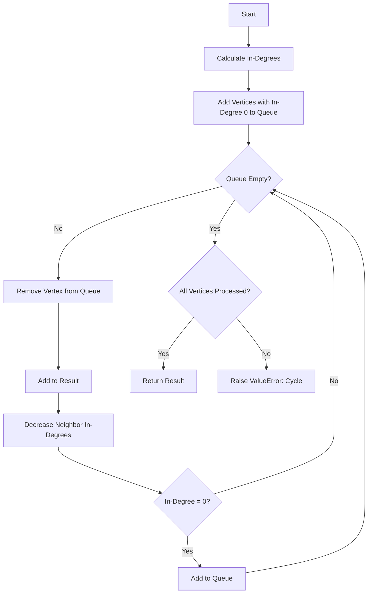

# Topological Sort

**Difficulty:** Advanced  
**Time to Solve:** 25-30 min  
**Category:** Advanced Python

---

## Problem Description

Perform topological sorting on a directed acyclic graph (DAG). Topological sort orders vertices such that for every directed edge (u, v), vertex u comes before v in the ordering. This is useful for task scheduling, dependency resolution, and build systems.

This problem demonstrates understanding of:
- Directed graphs
- Kahn's algorithm
- In-degree tracking
- Cycle detection

---

## Input Specification

- **Type:** `Dict[int, List[int]]`
- **Format:**
  - `graph`: Directed adjacency list {vertex: [neighbors]}
- **Constraints:**
  - `1 ≤ len(graph) ≤ 1000`
  - `0 ≤ vertex ≤ 1000`
  - Graph must be directed
  - Graph must be acyclic (DAG)

---

## Output Specification

- **Type:** `List[int]`
- **Format:**
  - List of vertices in topological order
- **Requirements:**
  - For every edge (u, v), u appears before v
  - Multiple valid orders may exist
  - All vertices must be included

---

## Examples

### Example 1: Basic DAG
**Input:**
```python
graph = {
    0: [1, 2],
    1: [3],
    2: [3],
    3: []
}
```

**Output:**
```python
[0, 1, 2, 3] or [0, 2, 1, 3]
```

**Explanation:**  
Valid topological orders where:
- 0 comes before 1 and 2
- 1 and 2 come before 3
- Order between 1 and 2 doesn't matter

---

### Example 2: Linear DAG
**Input:**
```python
graph = {
    0: [1],
    1: [2],
    2: [3],
    3: []
}
```

**Output:**
```python
[0, 1, 2, 3]
```

**Explanation:**  
Only one valid order exists for linear graph.

---

## Edge Cases to Consider

1. **Graph with cycle:**
   - Expected behavior: Raise ValueError

2. **Empty graph:**
   - Expected behavior: Return empty list

3. **Single vertex:**
   - Expected behavior: Return [vertex]

4. **Disconnected components:**
   - Expected behavior: Return valid order for all components

---

## Constraints

- Must use Kahn's algorithm or DFS-based approach
- Must detect cycles
- Must handle disconnected graphs
- Must include all vertices

---

## Solution Approach

### Kahn's Algorithm

1. **Calculate in-degrees**: Count incoming edges for each vertex
2. **Initialize queue**: Add vertices with in-degree 0
3. **While queue not empty**:
   - Remove vertex from queue
   - Add to result
   - Decrease in-degree of neighbors
   - Add neighbors with in-degree 0 to queue
4. **Check**: If result length != total vertices, cycle exists

### Algorithm Flow



---

## Complexity Requirements

- **Target Time Complexity:** O(V + E)
- **Target Space Complexity:** O(V)
- **Justification:** Visit each vertex and edge once

---

## Additional Notes

- Classic graph algorithm
- Used in build systems (Make, Maven), task scheduling
- Multiple valid orders may exist
- Can be implemented with DFS (post-order traversal)

---

## Related Concepts

- Directed Graphs
- DAG (Directed Acyclic Graph)
- Kahn's Algorithm
- Cycle Detection
- Dependency Resolution

---

## Testing Hints

1. Test with simple DAG first
2. Test with cycle (should raise error)
3. Test with disconnected components
4. Verify ordering constraints are satisfied
5. Test with single vertex

---

## Success Criteria

Your solution should:
- [ ] Perform topological sort correctly
- [ ] Use Kahn's algorithm or DFS approach
- [ ] Detect cycles and raise error
- [ ] Handle edge cases
- [ ] Include comprehensive docstrings
- [ ] Have proper type hints
- [ ] Include example usage in main()

