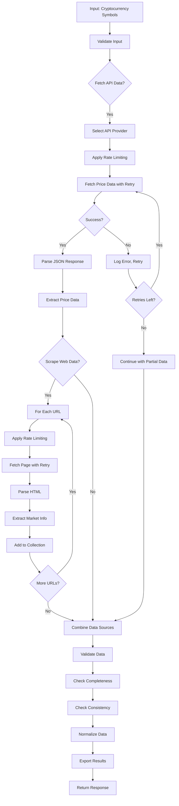

# Cryptocurrency Price Data Collection System

**Difficulty:** Advanced  
**Time to Solve:** 30-35 minutes  
**Category:** Advanced Python

---

## Problem Description

Web scraping and API integration are essential skills for data collection and analysis in modern data pipelines. This problem simulates fetching cryptocurrency price data from public APIs and scraping additional market information, demonstrating practical data retrieval and processing skills.

Build a comprehensive cryptocurrency data collection system that:
1. Fetches real-time price data from public cryptocurrency APIs (e.g., CoinGecko, CoinCap)
2. Scrapes additional market information from web sources when needed
3. Implements robust error handling with retry logic and timeout management
4. Processes and validates all collected data for consistency and completeness

The system should:
- Fetch cryptocurrency price data from multiple public APIs
- Handle API rate limits and implement intelligent retry mechanisms
- Scrape additional market information (news, trends, market cap) from web sources
- Validate and normalize collected data across different sources
- Handle missing or inconsistent data gracefully
- Export collected data to structured formats (JSON, CSV)
- Support batch collection for multiple cryptocurrencies
- Implement data consistency checks and completeness validation

---

## Input Specification

### Cryptocurrency Price API Request

**Type:** Dictionary/JSON Object  
**Format:**
```python
{
    "symbols": ["string"] (required),  # List of cryptocurrency symbols (e.g., ["bitcoin", "ethereum"])
    "api_provider": "string (optional)",  # API provider: "coingecko", "coincap" (default: "coingecko")
    "include_market_data": "boolean (optional)",  # Include market cap, volume, etc. (default: True)
    "timeout": "int (optional)",  # Request timeout in seconds (default: 10)
    "retry_count": "int (optional)",  # Number of retry attempts (default: 3)
    "rate_limit": "float (optional)"  # Delay between requests in seconds (default: 1.0)
}
```

### Web Scraping Request for Market Information

**Type:** Dictionary/JSON Object  
**Format:**
```python
{
    "url": "string (required)",  # URL to scrape for market information
    "selectors": "dict (required)",  # CSS selectors for data extraction
    "headers": "dict (optional)",  # Custom HTTP headers
    "timeout": "int (optional)",  # Request timeout in seconds (default: 10)
    "retry_count": "int (optional)",  # Number of retry attempts (default: 3)
    "rate_limit": "float (optional)"  # Delay between requests in seconds (default: 1.0)
}
```

### Combined Data Collection Request

**Type:** Dictionary/JSON Object  
**Format:**
```python
{
    "symbols": ["string"] (required),  # List of cryptocurrency symbols
    "fetch_api_data": "boolean (optional)",  # Fetch from API (default: True)
    "scrape_market_info": "boolean (optional)",  # Scrape web sources (default: False)
    "scrape_urls": "list[string] (optional)",  # URLs to scrape for additional info
    "scrape_selectors": "dict (optional)",  # Selectors for web scraping
    "validate_data": "boolean (optional)",  # Validate collected data (default: True)
    "timeout": "int (optional)",
    "retry_count": "int (optional)",
    "rate_limit": "float (optional)"
}
```

**Constraints:**
- `symbols`: List of valid cryptocurrency symbols (e.g., "bitcoin", "ethereum", "solana")
- `api_provider`: One of ["coingecko", "coincap"]
- `timeout`: Integer between 1-60 seconds
- `retry_count`: Integer between 0-10
- `rate_limit`: Float >= 0.0

---

## Output Specification

### API Price Data Response

**Type:** Dictionary/JSON Object  
**Format:**
```python
{
    "success": bool,
    "source": str,  # API provider name
    "timestamp": str,  # ISO format timestamp
    "data": [
        {
            "symbol": str,  # Cryptocurrency symbol
            "name": str,  # Full name
            "price_usd": float,  # Current price in USD
            "market_cap_usd": float | None,  # Market capitalization
            "volume_24h_usd": float | None,  # 24h trading volume
            "price_change_24h_percent": float | None,  # 24h price change %
            "last_updated": str  # Last update timestamp
        }
    ],
    "metadata": {
        "total_symbols": int,
        "successful_fetches": int,
        "failed_fetches": int,
        "fetch_time": float
    },
    "errors": list[str],
    "warnings": list[str]
}
```

### Web Scraping Response

**Type:** Dictionary/JSON Object  
**Format:**
```python
{
    "success": bool,
    "url": str,  # Scraped URL
    "data": dict,  # Extracted market information
    "metadata": {
        "status_code": int,
        "scraping_time": float,
        "elements_found": dict
    },
    "errors": list[str],
    "warnings": list[str]
}
```

### Combined Collection Response

**Type:** Dictionary/JSON Object  
**Format:**
```python
{
    "success": bool,
    "timestamp": str,
    "api_data": dict,  # API price data response
    "scraped_data": list[dict],  # List of scraped data responses
    "validated_data": dict,  # Validated and normalized data
    "validation_report": {
        "total_records": int,
        "complete_records": int,
        "incomplete_records": int,
        "consistency_checks_passed": bool,
        "missing_fields": list[str]
    },
    "metadata": {
        "total_collection_time": float,
        "api_fetch_time": float,
        "scraping_time": float,
        "validation_time": float
    },
    "errors": list[str],
    "warnings": list[str]
}
```

---

## Examples

### Example 1: Fetch Bitcoin Price from API

**Input:**
```python
{
    "symbols": ["bitcoin"],
    "api_provider": "coingecko",
    "include_market_data": True
}
```

**Output:**
```python
{
    "success": True,
    "source": "coingecko",
    "timestamp": "2025-01-27T10:30:00Z",
    "data": [
        {
            "symbol": "bitcoin",
            "name": "Bitcoin",
            "price_usd": 43250.50,
            "market_cap_usd": 850000000000,
            "volume_24h_usd": 25000000000,
            "price_change_24h_percent": 2.5,
            "last_updated": "2025-01-27T10:29:45Z"
        }
    ],
    "metadata": {
        "total_symbols": 1,
        "successful_fetches": 1,
        "failed_fetches": 0,
        "fetch_time": 1.2
    },
    "errors": [],
    "warnings": []
}
```

### Example 2: Fetch Multiple Cryptocurrencies

**Input:**
```python
{
    "symbols": ["bitcoin", "ethereum", "solana"],
    "api_provider": "coingecko"
}
```

**Output:**
```python
{
    "success": True,
    "source": "coingecko",
    "timestamp": "2025-01-27T10:30:00Z",
    "data": [
        {
            "symbol": "bitcoin",
            "name": "Bitcoin",
            "price_usd": 43250.50,
            "market_cap_usd": 850000000000,
            "volume_24h_usd": 25000000000,
            "price_change_24h_percent": 2.5,
            "last_updated": "2025-01-27T10:29:45Z"
        },
        {
            "symbol": "ethereum",
            "name": "Ethereum",
            "price_usd": 2650.75,
            "market_cap_usd": 320000000000,
            "volume_24h_usd": 12000000000,
            "price_change_24h_percent": -1.2,
            "last_updated": "2025-01-27T10:29:50Z"
        },
        {
            "symbol": "solana",
            "name": "Solana",
            "price_usd": 98.25,
            "market_cap_usd": 45000000000,
            "volume_24h_usd": 2000000000,
            "price_change_24h_percent": 5.8,
            "last_updated": "2025-01-27T10:29:55Z"
        }
    ],
    "metadata": {
        "total_symbols": 3,
        "successful_fetches": 3,
        "failed_fetches": 0,
        "fetch_time": 2.5
    },
    "errors": [],
    "warnings": []
}
```

### Example 3: API Error Handling with Retry

**Input:**
```python
{
    "symbols": ["invalid-coin"],
    "api_provider": "coingecko",
    "retry_count": 3
}
```

**Output:**
```python
{
    "success": False,
    "source": "coingecko",
    "timestamp": "2025-01-27T10:30:00Z",
    "data": [],
    "metadata": {
        "total_symbols": 1,
        "successful_fetches": 0,
        "failed_fetches": 1,
        "fetch_time": 8.5
    },
    "errors": [
        "Symbol 'invalid-coin' not found (attempt 1)",
        "Symbol 'invalid-coin' not found (attempt 2)",
        "Symbol 'invalid-coin' not found (attempt 3)"
    ],
    "warnings": []
}
```

### Example 4: Combined API and Web Scraping

**Input:**
```python
{
    "symbols": ["bitcoin", "ethereum"],
    "fetch_api_data": True,
    "scrape_market_info": True,
    "scrape_urls": ["https://example-crypto-news.com/trending"],
    "scrape_selectors": {
        "trending_coins": ".trending-coin-name",
        "news_headlines": "h2.news-title",
        "market_sentiment": ".sentiment-score"
    },
    "validate_data": True
}
```

**Output:**
```python
{
    "success": True,
    "timestamp": "2025-01-27T10:30:00Z",
    "api_data": {
        "success": True,
        "source": "coingecko",
        "data": [
            {
                "symbol": "bitcoin",
                "name": "Bitcoin",
                "price_usd": 43250.50,
                "market_cap_usd": 850000000000,
                "volume_24h_usd": 25000000000,
                "price_change_24h_percent": 2.5,
                "last_updated": "2025-01-27T10:29:45Z"
            },
            {
                "symbol": "ethereum",
                "name": "Ethereum",
                "price_usd": 2650.75,
                "market_cap_usd": 320000000000,
                "volume_24h_usd": 12000000000,
                "price_change_24h_percent": -1.2,
                "last_updated": "2025-01-27T10:29:50Z"
            }
        ]
    },
    "scraped_data": [
        {
            "success": True,
            "url": "https://example-crypto-news.com/trending",
            "data": {
                "trending_coins": ["Bitcoin", "Ethereum", "Solana"],
                "news_headlines": ["Bitcoin reaches new high", "Ethereum upgrade announced"],
                "market_sentiment": "Bullish"
            }
        }
    ],
    "validated_data": {
        "bitcoin": {
            "price_usd": 43250.50,
            "market_cap_usd": 850000000000,
            "volume_24h_usd": 25000000000,
            "price_change_24h_percent": 2.5,
            "trending": True,
            "sentiment": "Bullish"
        },
        "ethereum": {
            "price_usd": 2650.75,
            "market_cap_usd": 320000000000,
            "volume_24h_usd": 12000000000,
            "price_change_24h_percent": -1.2,
            "trending": True,
            "sentiment": "Bullish"
        }
    },
    "validation_report": {
        "total_records": 2,
        "complete_records": 2,
        "incomplete_records": 0,
        "consistency_checks_passed": True,
        "missing_fields": []
    },
    "metadata": {
        "total_collection_time": 4.2,
        "api_fetch_time": 2.5,
        "scraping_time": 1.5,
        "validation_time": 0.2
    },
    "errors": [],
    "warnings": []
}
```

### Example 5: Data Validation and Completeness Check

**Input:**
```python
{
    "symbols": ["bitcoin", "ethereum"],
    "fetch_api_data": True,
    "validate_data": True
}
```

**Output:**
```python
{
    "success": True,
    "timestamp": "2025-01-27T10:30:00Z",
    "api_data": {
        "success": True,
        "data": [
            {
                "symbol": "bitcoin",
                "price_usd": 43250.50,
                "market_cap_usd": 850000000000,
                "volume_24h_usd": 25000000000,
                "price_change_24h_percent": 2.5
            },
            {
                "symbol": "ethereum",
                "price_usd": 2650.75,
                "market_cap_usd": None,  # Missing data
                "volume_24h_usd": None,  # Missing data
                "price_change_24h_percent": -1.2
            }
        ]
    },
    "validated_data": {
        "bitcoin": {
            "price_usd": 43250.50,
            "market_cap_usd": 850000000000,
            "volume_24h_usd": 25000000000,
            "price_change_24h_percent": 2.5,
            "is_complete": True
        },
        "ethereum": {
            "price_usd": 2650.75,
            "market_cap_usd": None,
            "volume_24h_usd": None,
            "price_change_24h_percent": -1.2,
            "is_complete": False
        }
    },
    "validation_report": {
        "total_records": 2,
        "complete_records": 1,
        "incomplete_records": 1,
        "consistency_checks_passed": True,
        "missing_fields": ["ethereum.market_cap_usd", "ethereum.volume_24h_usd"]
    },
    "errors": [],
    "warnings": [
        "Ethereum record missing market_cap_usd",
        "Ethereum record missing volume_24h_usd"
    ]
}
```

---

## Edge Cases

1. **Invalid cryptocurrency symbol** - Should return error with retry attempts
2. **API rate limiting** - Should implement exponential backoff and respect rate limits
3. **Network timeout** - Should retry with exponential backoff
4. **API endpoint unavailable** - Should fallback to alternative provider or return error
5. **Missing API data fields** - Should handle gracefully, mark as incomplete
6. **Inconsistent data formats** - Should normalize across different API providers
7. **Web scraping failures** - Should continue with API data, log warnings
8. **Partial data collection** - Should validate what's available, report missing fields
9. **Data validation failures** - Should report inconsistencies, continue processing
10. **Empty response from API** - Should handle gracefully, return empty data structure
11. **Malformed JSON from API** - Should handle parsing errors, retry or skip
12. **Concurrent requests** - Should handle rate limiting properly
13. **Data type mismatches** - Should normalize types (string to float, etc.)

---

## Constraints

- Must use standard library `urllib` or `requests` library for HTTP requests
- Must handle JSON parsing for API responses
- Must use `html.parser` or `BeautifulSoup` for web scraping
- Implement proper error handling for network, API, and parsing errors
- Include intelligent retry mechanism with exponential backoff
- Respect API rate limits and implement delays between requests
- Support multiple cryptocurrency symbols in batch requests
- Validate and normalize data across different sources
- Export collected data to JSON and CSV formats
- Include example usage in `main()` function
- Handle data consistency checks and completeness validation

---

## Solution Approach

### High-Level Flow



### Key Components

1. **API Client** - Fetch cryptocurrency price data from public APIs (CoinGecko, CoinCap)
2. **HTTP Client** - Fetch web pages with headers, timeout, and redirect handling
3. **Retry Mechanism** - Intelligent retry with exponential backoff for transient errors
4. **Rate Limiting** - Implement configurable delays between requests
5. **Data Parser** - Parse JSON API responses and HTML web content
6. **Data Validator** - Validate collected data for consistency and completeness
7. **Data Normalizer** - Normalize data formats across different sources
8. **Error Handler** - Handle network, API, parsing, and validation errors gracefully
9. **Data Exporter** - Export collected data to JSON and CSV formats
10. **Collection Orchestrator** - Coordinate API fetching and web scraping workflows

---

## Complexity Requirements

- **Time Complexity:** O(n) where n = number of symbols/URLs
- **Space Complexity:** O(m) where m = collected data size
- **Network Complexity:** O(1) per request + retry overhead

---

## Implementation Notes

### API Integration
- Use CoinGecko API (free tier): `https://api.coingecko.com/api/v3/simple/price`
- Use CoinCap API (free tier): `https://api.coincap.io/v2/assets`
- Handle API rate limits (CoinGecko: 10-50 calls/minute, CoinCap: 200 calls/minute)
- Parse JSON responses and extract required fields

### Error Handling
- Network errors: Connection timeout, DNS failure
- API errors: 404, 429 (rate limit), 500, etc.
- Parsing errors: Malformed JSON, missing fields
- Validation errors: Inconsistent data, missing required fields

### Rate Limiting
- Implement delay between API requests
- Respect API response headers (if present)
- Configurable rate limit per provider

### Retry Mechanism
- Exponential backoff for retries
- Configurable retry count
- Different strategies for different error types (don't retry 404, retry 429)

### Data Validation
- Check for required fields (symbol, price_usd)
- Validate data types (price should be float, not string)
- Check data consistency (price > 0, market_cap >= 0)
- Report missing or incomplete records

---

## Testing Strategy

Test with:
1. Valid cryptocurrency symbols (bitcoin, ethereum, solana)
2. Invalid symbols and API errors
3. Network timeout scenarios
4. Rate limiting scenarios
5. Missing data fields
6. Data validation and normalization
7. Combined API and web scraping workflows

---

## Success Criteria

Your solution should:
- ✅ Fetches cryptocurrency price data from public APIs successfully
- ✅ Handles API errors gracefully with retry logic and timeout management
- ✅ Scrapes additional market information from web sources when needed
- ✅ Validates collected data for consistency and completeness
- ✅ Normalizes data across different sources
- ✅ Implements intelligent retry mechanism with exponential backoff
- ✅ Respects API rate limits to avoid service disruption
- ✅ Handles errors gracefully without stopping entire collection
- ✅ Exports collected data to JSON and CSV formats
- ✅ Includes comprehensive example usage in main()

---

## Use Cases

1. **Real-time Price Monitoring**: Track cryptocurrency prices for trading decisions
2. **Market Analysis**: Collect price data and market information for analysis
3. **Portfolio Tracking**: Monitor multiple cryptocurrencies in a portfolio
4. **Data Pipeline Integration**: Feed cryptocurrency data into data pipelines
5. **Research and Reporting**: Collect data for research reports and analysis
6. **Price Alerts**: Build systems that trigger alerts based on price changes
7. **Market Sentiment Analysis**: Combine price data with news and sentiment data
8. **Historical Data Collection**: Collect data over time for trend analysis
9. **Multi-Source Aggregation**: Combine data from APIs and web sources
10. **Data Quality Assurance**: Validate and ensure data completeness

---

## Legal and Ethical Considerations

- Always respect API rate limits and terms of service
- Use public APIs that allow free tier access
- Implement appropriate rate limiting to avoid overloading APIs
- Check website terms of service before scraping
- Use appropriate User-Agent headers
- Consider API alternatives when available
- Don't abuse free API tiers
- Handle API keys securely if using authenticated endpoints

---

## API Endpoints Reference

### CoinGecko API (Free Tier)
- **Base URL**: `https://api.coingecko.com/api/v3`
- **Price Endpoint**: `/simple/price?ids={symbols}&vs_currencies=usd&include_market_cap=true&include_24hr_vol=true&include_24hr_change=true`
- **Rate Limit**: 10-50 calls/minute (varies)
- **Example**: `https://api.coingecko.com/api/v3/simple/price?ids=bitcoin,ethereum&vs_currencies=usd&include_market_cap=true&include_24hr_vol=true&include_24hr_change=true`

### CoinCap API (Free Tier)
- **Base URL**: `https://api.coincap.io/v2`
- **Assets Endpoint**: `/assets?ids={symbols}`
- **Rate Limit**: 200 calls/minute
- **Example**: `https://api.coincap.io/v2/assets?ids=bitcoin,ethereum`

**Note**: These are public APIs that don't require authentication for basic price data. Always check current API documentation for any changes.
