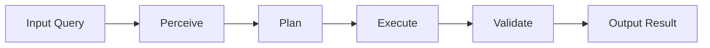
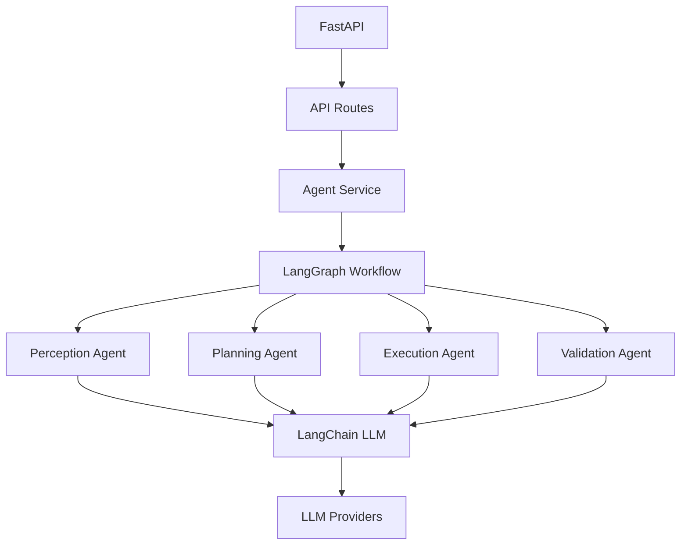

# [Use Case Name] - Agentic System

## Overview

[Brief description of what this agentic system does and why it's useful]

This agentic system demonstrates multi-step reasoning, planning, and acting capabilities to [describe purpose]. It uses LLM-powered agents to perceive user queries, reason about the best approach, execute actions, and reflect on results.

---

## Features

- **Multi-Step Agent Workflow**: Perception → Planning → Execution → Validation (LangGraph)
- **LLM Provider Flexibility**: Supports OpenAI, Anthropic, Google Gemini, Azure OpenAI
- **Environment-Based Configuration**: Uses LLM_PROVIDER env var for provider selection
- **LangGraph Orchestration**: Stateful workflow management with conditional routing
- **RESTful API**: Clean, documented endpoints
- **Comprehensive Logging**: Full observability of agent decisions
- **Error Handling**: Graceful failure handling at each step
- **Proper FastAPI Structure**: Organized with api/, core/, models/, services/ directories

---

## Architecture

### Directory Structure

```
<usecase_name>/
├── main.py                      # FastAPI application entry point
├── api/                         # API layer
│   ├── __init__.py
│   └── routes.py               # API routes and endpoints
├── core/                        # Core agent components
│   ├── __init__.py
│   ├── agent_state.py          # LangGraph state model
│   ├── agents.py                # Individual agent nodes
│   ├── llm_adapter.py          # LangChain adapter for LLMClientManager
│   └── config.py               # Configuration management
├── models/                      # Data models
│   ├── __init__.py
│   └── schemas.py              # Pydantic models/schemas
├── services/                    # Business logic layer
│   ├── __init__.py
│   └── agent_service.py        # Agent orchestration service
├── question_<usecase_name>.md   # Problem description
├── env.example                  # Environment variables template
└── README.md                    # This file
```

### Agent Workflow (LangGraph)



### System Components



---

## Installation

### Prerequisites
- Python 3.12 (required)
- pip or conda
- API keys for LLM providers

### Setup

1. **Clone the repository**
```bash
git clone <repository-url>
cd thinkcraft
```

2. **Create virtual environment (from repository root)**
```bash
python3.12 -m venv venv
source venv/bin/activate  # On Windows: venv\Scripts\activate
```

3. **Install dependencies (from repository root)**
```bash
# All dependencies are managed via root requirements.in
pip install -r requirements.txt
```

4. **Configure environment variables**
```bash
# Create .env file (or use root .env)
cp env.example .env

# Edit .env and set LLM_PROVIDER and corresponding API key
LLM_PROVIDER=openai  # Options: openai, anthropic, gemini, claude, azure
OPENAI_API_KEY=your_openai_key
# OR
ANTHROPIC_API_KEY=your_anthropic_key
# etc.
```

---

## Usage

### Starting the Server

```bash
# Development mode with auto-reload
uvicorn main:app --reload --port 8000

# Production mode
uvicorn main:app --host 0.0.0.0 --port 8000 --workers 4
```

The API will be available at `http://localhost:8000`

### API Documentation

Once the server is running, access:
- **Swagger UI**: http://localhost:8000/docs
- **ReDoc**: http://localhost:8000/redoc

---

## API Endpoints

### 1. Execute Agent (Sync)

Execute the agent workflow synchronously.

**Endpoint:** `POST /api/v1/execute/`

**Request:**
```json
{
  "query": "Your query here",
  "context": "Optional context",
  "parameters": {
    "format": "json",
    "detail_level": "high"
  }
}
```

**Response:**
```json
{
  "result": "Agent execution result",
  "status": "success",
  "metadata": {
    "steps_executed": 4,
    "execution_time": "2.5s"
  },
  "timestamp": "2024-01-01T12:00:00"
}
```

**Example:**
```bash
curl -X POST http://localhost:8000/api/v1/execute/ \
  -H "Content-Type: application/json" \
  -d '{
    "query": "Analyze customer feedback trends",
    "context": "Last 30 days",
    "parameters": {"detail_level": "high"}
  }'
```

---

### 2. Execute Agent (Async)

Queue agent execution in background.

**Endpoint:** `POST /api/v1/execute-async/`

**Request:** Same as sync execute

**Response:**
```json
{
  "task_id": "abc-123-def",
  "status": "queued",
  "message": "Agent execution queued. Use /status/{task_id} to check progress."
}
```

**Example:**
```bash
curl -X POST http://localhost:8000/api/v1/execute-async/ \
  -H "Content-Type: application/json" \
  -d '{"query": "Long running task"}'
```

---

### 3. Get Agent Status

Get current status of the agent system.

**Endpoint:** `GET /api/v1/status/`

**Response:**
```json
{
  "is_active": true,
  "current_task": "Analyzing data",
  "tasks_completed": 42,
  "uptime": "2h 30m"
}
```

**Example:**
```bash
curl http://localhost:8000/api/v1/status/
```

---

### 4. Get Task Status

Get status of a specific async task.

**Endpoint:** `GET /api/v1/status/{task_id}`

**Response:**
```json
{
  "task_id": "abc-123-def",
  "status": "completed",
  "query": "Original query",
  "result": "Task result",
  "timestamp": "2024-01-01T12:00:00"
}
```

**Example:**
```bash
curl http://localhost:8000/api/v1/status/abc-123-def
```

---

### 5. Get Capabilities

List agent capabilities.

**Endpoint:** `GET /api/v1/capabilities/`

**Response:**
```json
{
  "capabilities": [
    "Query understanding and parsing",
    "Multi-step reasoning and planning",
    "Task execution and action",
    "Result validation and refinement"
  ],
  "supported_providers": ["openai", "azure", "gemini", "claude"],
  "max_steps": 10,
  "supports_async": true
}
```

---

### 6. Reset Agent

Reset agent to initial state.

**Endpoint:** `POST /api/v1/reset/`

**Response:**
```json
{
  "status": "success",
  "message": "Agent reset to initial state"
}
```

---

## Configuration

### Environment Variables

| Variable | Description | Required | Default |
|----------|-------------|----------|---------|
| `OPENAI_API_KEY` | OpenAI API key | No | - |
| `AZURE_OPENAI_API_KEY` | Azure OpenAI key | No | - |
| `AZURE_OPENAI_ENDPOINT` | Azure endpoint | No | - |
| `GOOGLE_API_KEY` | Google Gemini key | No | - |
| `ANTHROPIC_API_KEY` | Anthropic Claude key | No | - |
| `OPENROUTER_API_KEY` | OpenRouter key | No | - |

At least one LLM provider API key is required.

### Agent Configuration

Edit `solution.py` to configure:
- Default LLM provider
- Model selection
- Temperature settings
- Max steps
- Timeout values

---

## Agent Workflow Details

### 1. Perception Step
- **Purpose**: Understand and parse the input query
- **Temperature**: 0.3 (low for accurate parsing)
- **Output**: Structured perception data with intent and entities

### 2. Reasoning Step
- **Purpose**: Plan the approach to solve the task
- **Temperature**: 0.7 (moderate for creative planning)
- **Output**: Execution plan with steps and strategy

### 3. Action Step
- **Purpose**: Execute the planned approach
- **Temperature**: 0.5 (balanced)
- **Output**: Task execution results

### 4. Reflection Step
- **Purpose**: Validate and refine the results
- **Temperature**: 0.3 (low for accurate validation)
- **Output**: Final, validated result

---

## Examples

### Example 1: Data Analysis

```python
import requests

response = requests.post(
    "http://localhost:8000/api/v1/execute/",
    json={
        "query": "Analyze sales trends and identify top 3 products",
        "context": "Q4 2024 sales data",
        "parameters": {"format": "json"}
    }
)

print(response.json())
```

### Example 2: Content Generation

```python
import requests

response = requests.post(
    "http://localhost:8000/api/v1/execute/",
    json={
        "query": "Generate a product description for a smartwatch",
        "context": "Target audience: fitness enthusiasts",
        "parameters": {"detail_level": "high"}
    }
)

print(response.json()["result"])
```

---

## Error Handling

The API returns standard HTTP status codes:

- `200`: Success
- `400`: Bad request (invalid input)
- `404`: Resource not found
- `500`: Internal server error

Error response format:
```json
{
  "detail": "Error message describing what went wrong"
}
```

---

## Logging

Logs are written to stdout with the following format:
```
2024-01-01 12:00:00 - module_name - LEVEL - message
```

Log levels:
- `INFO`: General information about agent execution
- `DEBUG`: Detailed debug information (prompts, responses)
- `WARNING`: Non-critical issues
- `ERROR`: Errors that occurred during execution

---

## Performance Considerations

- **Latency**: Typical execution takes 2-5 seconds depending on LLM provider
- **Concurrency**: FastAPI handles concurrent requests efficiently
- **Rate Limits**: Respect LLM provider rate limits
- **Caching**: Consider caching for repeated queries (not implemented in template)

---

## Troubleshooting

### Issue: "Provider not registered" error
**Solution**: Ensure API key is set in environment variables

### Issue: Slow response times
**Solution**: 
- Check LLM provider status
- Consider using faster models (e.g., gpt-3.5-turbo)
- Implement caching for common queries

### Issue: Agent produces incorrect results
**Solution**:
- Review prompt templates in `solution.py`
- Adjust temperature settings
- Add more context in queries
- Check reflection step validation logic

---

## Development

### Running Tests
```bash
pytest tests/
```

### Code Quality
```bash
# Format code
black *.py

# Lint code
flake8 *.py
pylint *.py

# Type checking
mypy *.py
```

---

## Contributing

See the main repository's [CONTRIBUTING.md](/.github/CONTRIBUTING.md) for guidelines.

---

## License

[Your License Here]

---

## Contact

For questions or issues, please open an issue in the repository.

