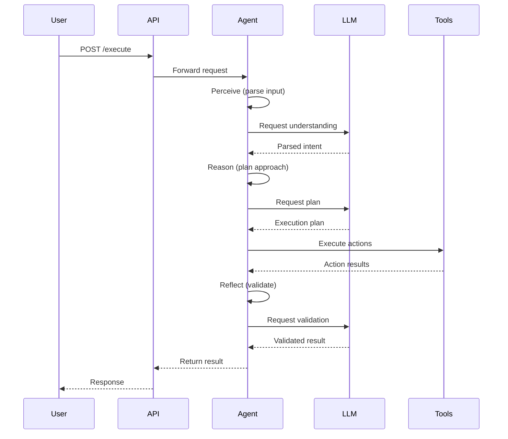
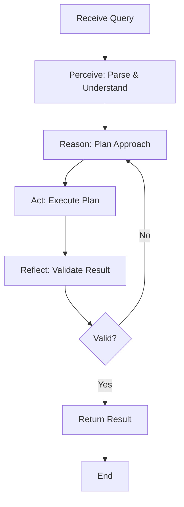

# [Use Case Name] - Agentic System

**Difficulty:** [Medium/Advanced]  
**Time to Solve:** [30-45 minutes]  
**Category:** Agentic Systems

---

## Use Case Description

[Provide a clear description of the agentic use case. Explain what the agent needs to accomplish, what multi-step reasoning is required, and why an agentic approach is appropriate.]

[Example: "Build an intelligent research assistant agent that can receive a research topic, break it down into subtopics, gather information from multiple sources, synthesize findings, and generate a comprehensive research report. The agent should demonstrate perception (understanding the topic), reasoning (planning the research strategy), and action (executing research and compilation)."]

---

## Agent Capabilities

The agent should be able to:

1. **Perceive:** [What the agent needs to understand]
   - [Capability 1: e.g., "Parse and understand research queries"]
   - [Capability 2: e.g., "Extract key concepts and entities"]

2. **Reason:** [How the agent should think and plan]
   - [Capability 1: e.g., "Break down complex topics into subtopics"]
   - [Capability 2: e.g., "Prioritize information sources"]

3. **Act:** [What actions the agent should take]
   - [Capability 1: e.g., "Query information sources"]
   - [Capability 2: e.g., "Synthesize and format results"]

4. **Reflect:** [How the agent validates its work]
   - [Capability 1: e.g., "Verify completeness of research"]
   - [Capability 2: e.g., "Check for consistency and accuracy"]

---

## Input Specification

### API Endpoint
```
POST /api/v1/execute/
```

### Request Body
```json
{
  "query": "string (required)",
  "context": "string (optional)",
  "parameters": {
    "key": "value"
  }
}
```

### Input Fields
- **query** (required): [Description of what the query should contain]
  - Type: `string`
  - Min length: 1
  - Max length: 5000
  - Example: `"Research the impact of AI on healthcare"`

- **context** (optional): [Description of context field]
  - Type: `string`
  - Max length: 10000
  - Example: `"Focus on last 5 years, include case studies"`

- **parameters** (optional): [Description of parameters]
  - Type: `object`
  - Allowed keys: [list allowed parameter keys]
  - Example: `{"format": "json", "detail_level": "high"}`

---

## Output Specification

### Response Body
```json
{
  "result": "string",
  "status": "string",
  "metadata": {
    "steps_executed": "integer",
    "execution_time": "string",
    "tokens_used": "integer"
  },
  "timestamp": "datetime"
}
```

### Output Fields
- **result**: [Description of result content]
- **status**: Execution status (`success`, `failed`, `partial`)
- **metadata**: Additional execution information
- **timestamp**: When result was generated

---

## Examples

### Example 1: [Typical Use Case]

**Request:**
```json
{
  "query": "Analyze customer feedback and identify top 3 pain points",
  "context": "Last 30 days of support tickets and reviews",
  "parameters": {
    "format": "json",
    "detail_level": "high"
  }
}
```

**Expected Response:**
```json
{
  "result": "Analysis complete. Top 3 pain points identified:\n1. Slow response time (mentioned in 45% of feedback)\n2. Complex user interface (32% of feedback)\n3. Limited mobile functionality (23% of feedback)\n\nDetailed analysis: [...]",
  "status": "success",
  "metadata": {
    "steps_executed": 4,
    "execution_time": "3.2s",
    "tokens_used": 2500
  },
  "timestamp": "2024-01-01T12:00:00"
}
```

**Explanation:**  
[Explain the agent's workflow for this example]
1. Perception: Agent understands it needs to analyze feedback and identify pain points
2. Reasoning: Agent plans to categorize feedback, count mentions, and rank by frequency
3. Action: Agent processes feedback data and generates analysis
4. Reflection: Agent validates that top 3 pain points are clearly identified

---

### Example 2: [Complex Scenario]

**Request:**
```json
{
  "query": "[Another example query]",
  "context": "[Example context]",
  "parameters": {}
}
```

**Expected Response:**
```json
{
  "result": "[Expected result]",
  "status": "success",
  "metadata": {},
  "timestamp": "2024-01-01T12:00:00"
}
```

**Explanation:**  
[Explain the workflow]

---

## Agent Workflow

### Architecture Diagram



### Step-by-Step Flow



---

## Edge Cases to Handle

1. **Empty or Invalid Query**
   - Expected behavior: Return 400 error with clear message

2. **Query Exceeds Complexity**
   - Expected behavior: Break down into subtasks or request clarification

3. **LLM API Failure**
   - Expected behavior: Retry with exponential backoff, return 500 if all retries fail

4. **Ambiguous Query**
   - Expected behavior: Agent should reason about ambiguity and make reasonable assumptions

5. **Long-Running Task**
   - Expected behavior: Support async execution with status endpoint

---

## Technical Requirements

### FastAPI Structure
```
/app/agentic/<usecase_name>/
├── main.py           # FastAPI app initialization
├── router.py         # API routes
├── solution.py       # Agent orchestration logic
├── models.py         # Pydantic models
├── question_<usecase_name>.md
└── README.md
```

### Required Components

1. **main.py**
   - Initialize FastAPI app
   - Configure CORS and middleware
   - Include routers
   - Health check endpoints

2. **router.py**
   - `/execute/` - Main execution endpoint
   - `/execute-async/` - Async execution
   - `/status/` - Agent status
   - `/status/{task_id}` - Task status
   - `/capabilities/` - List capabilities

3. **solution.py**
   - `AgentOrchestrator` class
   - Perception, reasoning, action, reflection methods
   - LLMClientManager integration
   - State management

4. **models.py**
   - `InputData` - Request validation
   - `OutputData` - Response format
   - `AgentStatus` - Status information
   - `ErrorResponse` - Error handling

---

## Complexity Analysis

### Time Complexity
- **Per Request**: O(k) where k is number of agent steps (typically 3-5)
- **Perception Step**: O(1) - Single LLM call
- **Reasoning Step**: O(1) - Single LLM call
- **Action Step**: O(m) where m is number of actions
- **Reflection Step**: O(1) - Single LLM call

### Space Complexity
- **Per Request**: O(n) where n is total data size (query + context + responses)
- **State Management**: O(h) where h is history size (configurable)

---

## Implementation Guidelines

### 1. Agent Design
- Clear separation of perception, reasoning, action, reflection
- Modular and testable components
- Proper error handling at each step
- Logging for observability

### 2. LLM Integration
- Use `LLMClientManager` for all LLM calls
- Support multiple providers (OpenAI, Claude, Gemini)
- Appropriate temperature settings per step
- Token usage tracking

### 3. API Design
- RESTful endpoints
- Proper HTTP status codes
- Pydantic validation
- Comprehensive error messages
- API documentation with examples

### 4. State Management
- Track execution history
- Support async execution
- Task registry for background jobs
- Clean state reset capability

---

## Testing Strategy

### Manual Testing
```bash
# Start server
cd app/agentic/<usecase_name>
uvicorn main:app --reload --port 8000

# Test execute endpoint
curl -X POST http://localhost:8000/api/v1/execute/ \
  -H "Content-Type: application/json" \
  -d '{"query": "test query", "context": "test context"}'

# Test status endpoint
curl http://localhost:8000/api/v1/status/

# Test capabilities
curl http://localhost:8000/api/v1/capabilities/
```

### Unit Testing
- Test each agent step independently
- Mock LLM responses
- Test error handling
- Test edge cases

---

## Success Criteria

Your agentic system should:
- [ ] Implement all four agent steps (perceive, reason, act, reflect)
- [ ] Use LLMClientManager for all LLM interactions
- [ ] Follow FastAPI best practices
- [ ] Include comprehensive Pydantic models
- [ ] Handle all edge cases gracefully
- [ ] Provide clear error messages
- [ ] Include proper logging
- [ ] Support async execution
- [ ] Have complete API documentation
- [ ] Pass all manual test cases

---

## Additional Resources

- [FastAPI Documentation](https://fastapi.tiangolo.com/)
- [LangGraph for Agent Orchestration](https://github.com/langchain-ai/langgraph)
- [Agentic Systems Guide](/docs/agentic_systems.md)
- [LLMClientManager Guide](/docs/llm_client_manager.md)

---

## Notes

- Keep agent steps focused and single-purpose
- Use appropriate LLM temperatures (low for parsing, higher for creativity)
- Implement proper timeout handling for long-running tasks
- Consider rate limiting for production use
- Monitor token usage and costs
- Log all agent decisions for debugging and improvement

