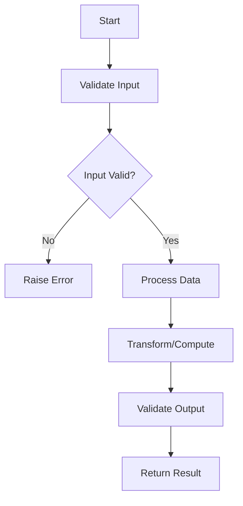

# [Problem Title]

**Difficulty:** [Simple/Medium/Advanced]  
**Time to Solve:** [15-20 min / 20-35 min / 30-45 min]  
**Category:** [Basic Python / Advanced Python / MLOps / GenAI / Agentic]

---

## Problem Description

[Provide a clear, concise description of the problem. Explain what needs to be accomplished and why it's relevant. Use real-world context when possible.]

[Example: "You are building a text processing system that needs to identify and extract email addresses from unstructured text. The system should handle various email formats and validate them according to RFC standards."]

---

## Input Specification

- **Type:** [e.g., `str`, `List[int]`, `Dict[str, Any]`]
- **Format:** [Describe the input format]
- **Constraints:**
  - [Constraint 1: e.g., "1 ≤ length ≤ 10,000"]
  - [Constraint 2: e.g., "All characters are ASCII"]
  - [Constraint 3: e.g., "Input is non-empty"]

---

## Output Specification

- **Type:** [e.g., `List[str]`, `int`, `Dict[str, float]`]
- **Format:** [Describe the expected output format]
- **Requirements:**
  - [Requirement 1: e.g., "Return sorted list"]
  - [Requirement 2: e.g., "Remove duplicates"]

---

## Examples

### Example 1: [Normal Case]
**Input:**
```python
input_data = [example input here]
```

**Output:**
```python
[expected output here]
```

**Explanation:**  
[Explain step-by-step why this output is correct]

---

### Example 2: [Edge Case or Different Scenario]
**Input:**
```python
input_data = [example input here]
```

**Output:**
```python
[expected output here]
```

**Explanation:**  
[Explain step-by-step why this output is correct]

---

### Example 3: [Another Important Case]
**Input:**
```python
input_data = [example input here]
```

**Output:**
```python
[expected output here]
```

**Explanation:**  
[Explain step-by-step why this output is correct]

---

## Edge Cases to Consider

1. **[Edge Case 1]:** [e.g., "Empty input"]
   - Expected behavior: [e.g., "Raise ValueError"]

2. **[Edge Case 2]:** [e.g., "Single element"]
   - Expected behavior: [e.g., "Return the element as-is"]

3. **[Edge Case 3]:** [e.g., "All elements identical"]
   - Expected behavior: [e.g., "Return single element"]

4. **[Edge Case 4]:** [e.g., "Invalid input type"]
   - Expected behavior: [e.g., "Raise TypeError"]

---

## Constraints

- [Constraint 1: e.g., "Must handle inputs up to 10,000 elements efficiently"]
- [Constraint 2: e.g., "Memory usage should be O(1) or O(n) at most"]
- [Constraint 3: e.g., "Solution must be thread-safe"]
- [Constraint 4: e.g., "No external libraries except standard library"]

---

## Solution Approach

[Optional: Provide hints or high-level guidance without giving away the solution]

[Example: "Consider using a two-pointer technique to optimize space complexity. Think about how you can process the data in a single pass."]

### Suggested Algorithm Flow



---

## Complexity Requirements

- **Target Time Complexity:** [e.g., O(n) or better]
- **Target Space Complexity:** [e.g., O(1) or O(n)]
- **Justification:** [Brief explanation of why these targets are appropriate]

---

## Additional Notes

[Optional: Any additional context, tips, or considerations]

- [Note 1: e.g., "Consider using built-in functions for better performance"]
- [Note 2: e.g., "Pay attention to Unicode handling"]
- [Note 3: e.g., "Think about how to handle concurrent requests"]

---

## Related Concepts

[Optional: List related topics or concepts that might be helpful]

- [Concept 1: e.g., "Hash tables"]
- [Concept 2: e.g., "Binary search"]
- [Concept 3: e.g., "Dynamic programming"]

---

## Testing Hints

[Optional: Suggestions for testing the solution]

1. Test with minimum input size
2. Test with maximum input size
3. Test with all edge cases listed above
4. Test with invalid inputs
5. Test with boundary values

---

## Success Criteria

Your solution should:
- [ ] Pass all provided examples
- [ ] Handle all edge cases correctly
- [ ] Meet complexity requirements
- [ ] Include proper error handling
- [ ] Have comprehensive docstrings
- [ ] Include type hints
- [ ] Be well-tested with example usage
